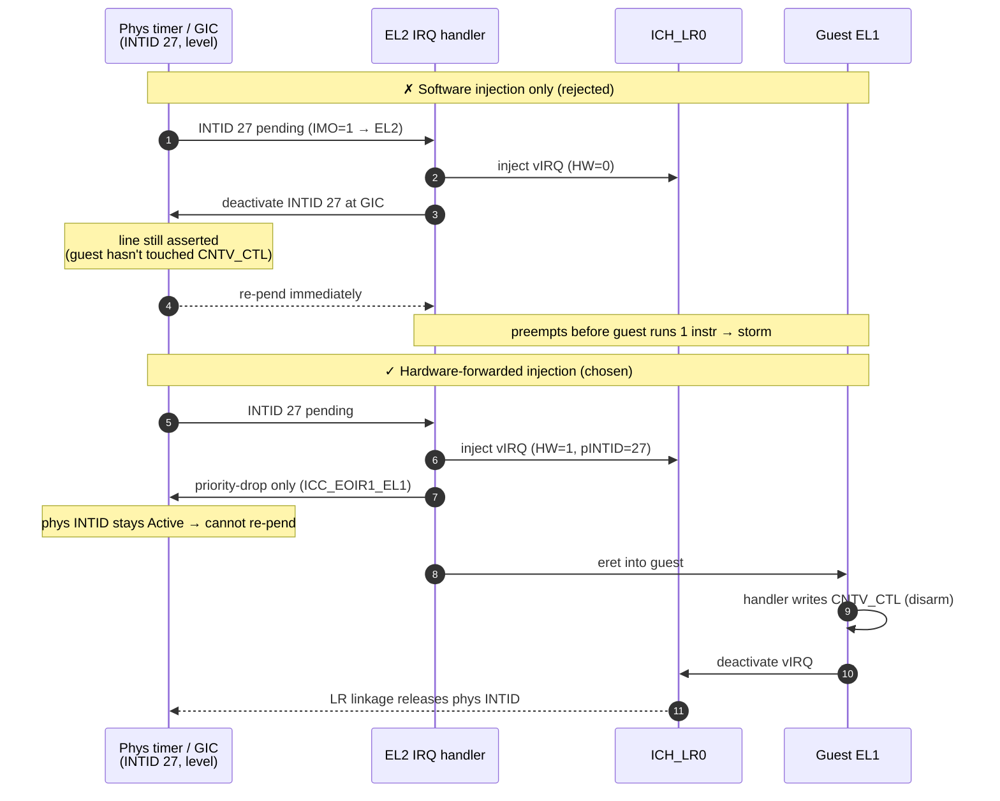

# Forward the virtual-timer PPI with ICH_LR.HW=1, do not deactivate it at EL2

> **Status:** Accepted. **Milestone: M2.5** (physical timer + GIC + HW-forwarding).
> Originally written for the combined M2; that milestone was split on 2026-06-01 and
> this decision now belongs to M2.5. Not relevant to M2 (vGIC software injection),
> which uses `vgic_inject_sw` and takes no physical interrupt.

The EL1 virtual-timer interrupt (INTID 27) is level-sensitive: its line stays
asserted until the guest writes `CNTV_CTL`. If the EL2 IRQ handler deactivates it at
the GIC after injecting the virtual interrupt, the still-asserted line re-pends it
immediately; because INTID 27 is routed to EL2 (`HCR_EL2.IMO=1`), it preempts the
guest *before the guest executes a single EL1 instruction* (a lower EL's `PSTATE.I`
does not mask an EL2-targeted interrupt) — a re-pend storm in which the guest never
reaches its handler to disarm the timer.

**Decision:** inject the timer PPI as a *hardware-forwarded* virtual interrupt
(`ICH_LR0.HW=1`, physical INTID in the pINTID field). EL2 performs **priority-drop
only** (`ICC_EOIR1_EL1`) and leaves the physical INTID **Active** so it cannot
re-pend; the guest's deactivate of the *virtual* interrupt releases the physical one
through the LR linkage. This requires `ICC_CTLR_EL1.EOImode = 1` at EL2.

A second, software injection path (`ICH_LR.HW=0`, `vgic_inject_sw`) is retained for
future virtual sources that have no physical INTID to forward (virtio, SGIs/IPIs).

### Why software-only re-pends (the storm), and how HW-forwarding breaks it

## Considered Options

- **Software injection only** — rejected: causes the storm above for any
  level-sensitive forwarded interrupt.
- **Software injection + mask INTID 27 at the redistributor across the guest
  window** — rejected: works for a one-shot test but does not generalize and smears
  GIC enable/disable state across the HVC-done return path.

## Consequences

- `gic_init` must set `ICC_CTLR_EL1.EOImode = 1`. This affects only EL2's physical
  CPU interface; the guest's virtual interface EOI behaviour is governed
  independently by `ICH_VMCR_EL2.VEOIM`.
- The vGIC API carries two inject entry points (`vgic_inject_sw` /
  `vgic_inject_hw`); the EL2 timer path uses the HW variant.
