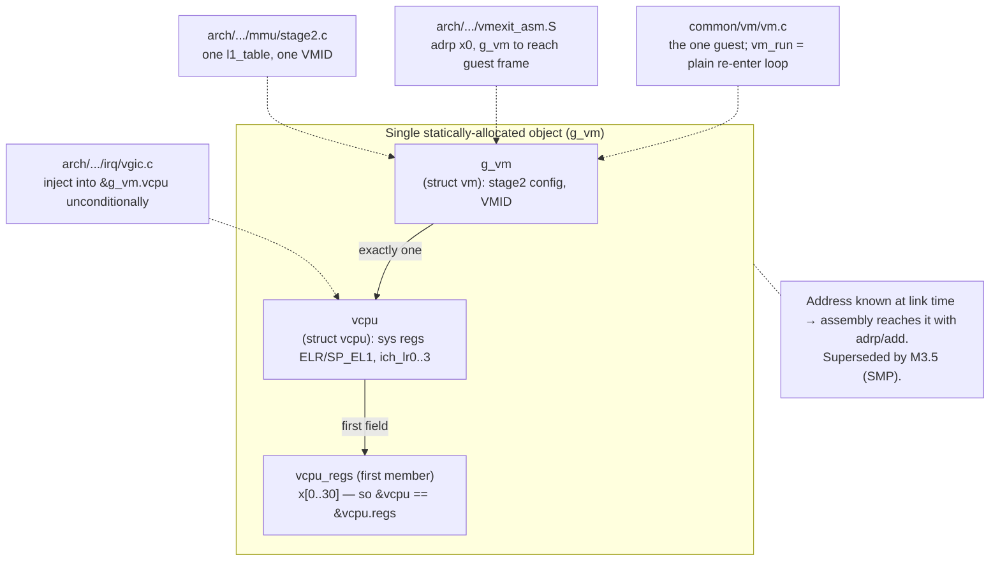

# Model the guest as a single global VM with a single vCPU

> **Status:** Accepted. **Milestone:** M1 (introduced); in force through M3.4.

The milestones up to M3.4 boot exactly one guest — an unmodified UP Linux on
QEMU `virt` with `-smp 1`. A general multi-VM / multi-vCPU object model
(allocation, lookup tables, per-vCPU scheduling, locking) would be substantial
infrastructure with no consumer yet, and would obscure the parts that matter for
learning the EL2 mechanics. The design philosophy of this repo is to move in the
smallest practical increments.

**Decision:** Represent the guest as a single statically-allocated global,
`struct vm g_vm`, containing exactly one `struct vcpu`. There is no VM table, no
vCPU array, no allocator, and no scheduler. Code may refer to the guest by the
`g_vm` symbol directly, including from assembly.

### The single global object and its load-bearing consumers

## Considered Options

- **Single global `g_vm` (chosen)** — zero allocation, the address is known at
  link time so assembly can reach it with `adrp`/`add`, and the entire guest
  state is one contiguous object that is trivial to inspect under GDB. Cost: it
  is a hard ceiling at one vCPU.
- **Dynamic VM/vCPU objects with a registry** — rejected for now: real
  hypervisor structure (ACRN/Xvisor have it), but it is dead weight until there
  is a second vCPU to schedule, and it would force a pointer-indirection and
  locking discipline onto code that currently has neither.

## Consequences

- The single-vCPU assumption is **load-bearing in multiple subsystems**, not
  just `vm.c`:
  - `hypervisor/common/vm/vm.c` — `g_vm` is the one and only guest.
  - `hypervisor/arch/arm64/vmexit/vmexit_asm.S` — `el1_sync_handler` reaches the
    guest register frame via `adrp x0, g_vm` (the regs are the first field of the
    first field, so `&g_vm == &g_vm.vcpu.regs`). This shortcut only works because
    there is exactly one vCPU and its address is static.
  - `hypervisor/arch/arm64/mmu/stage2.c` — one static `l1_table`, one VMID.
  - `hypervisor/arch/arm64/irq/vgic.c` — one redistributor's worth of `ICH_*`
    state, and `el2_irq_handler` injects into `&g_vm.vcpu` unconditionally.
- There is no scheduler: `vm_run` is a plain loop that re-enters the one vCPU.
- **This decision will be superseded by M3.5 (SMP).** PSCI `CPU_ON`, per-pCPU
  vCPUs, SGI virtualization and a scheduler all require breaking the single-`g_vm`
  assumption. When that work lands it should introduce a superseding ADR and flip
  this one to `Superseded by ADR-NNNN`. Until then, treat the `g_vm` symbol
  reference from assembly (see [[0003-asm-c-vcpu-offset-coupling]]) and the
  single-redistributor vGIC as the first things SMP must generalise.
