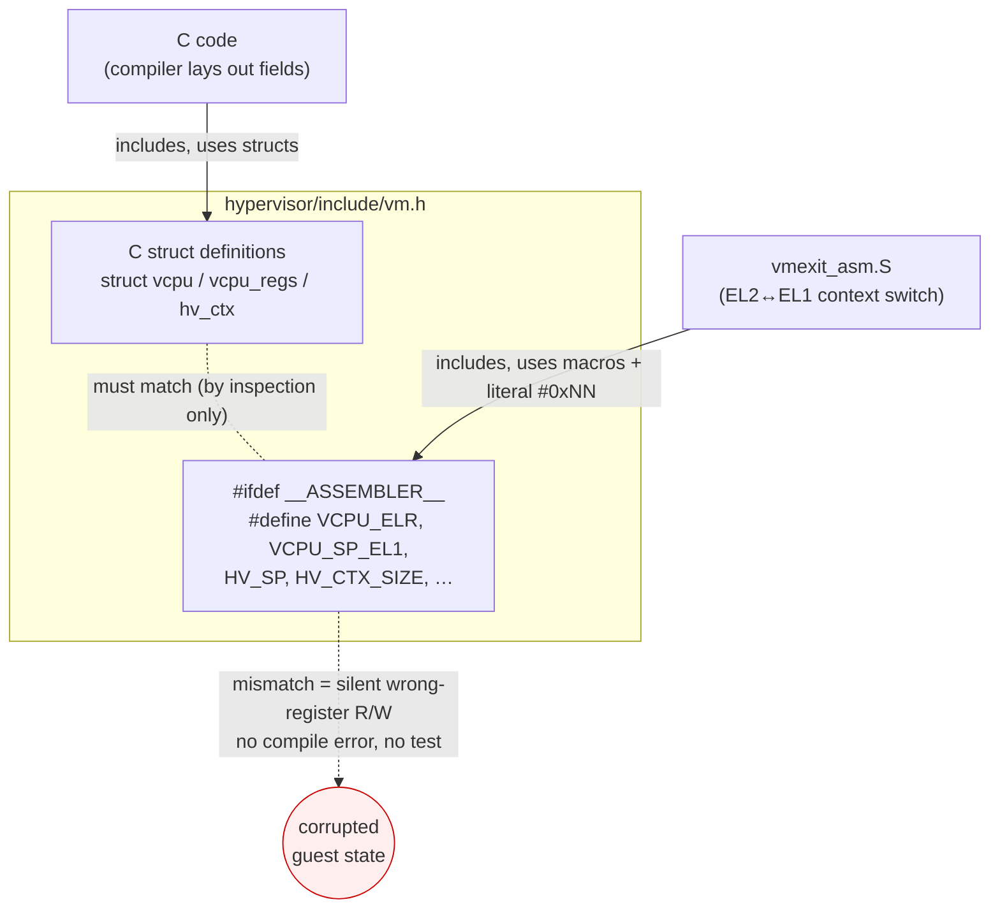

# Couple assembly to the vCPU layout via hand-maintained offset macros

> **Status:** Accepted. **Milestone:** M1.

The EL2↔EL1 context switch is written in assembly (`vmexit_asm.S`): it saves and
restores the guest's general-purpose and system registers directly into
`struct vcpu`/`struct vcpu_regs`, which are C types. Assembly cannot see C struct
layout, so it must address fields by numeric byte offset. Those offsets must
agree with what the C compiler actually lays out, or the context switch silently
reads and writes the wrong registers — with no compile error and no obvious
crash, just corrupted guest state.

**Decision:** Keep the C struct definitions and a parallel set of
`#define`d byte offsets in the **same header** (`hypervisor/include/vm.h`),
guarded by `#ifdef __ASSEMBLER__`. Assembly includes `vm.h` and uses the macros
(`VCPU_ELR`, `VCPU_SP_EL1`, `HV_SP`, `HV_CTX_SIZE`, …); C uses the structs.
Register slots within `vcpu_regs.x[]` are addressed by their literal `#0x08`,
`#0x10`, … offsets in the save/restore sequences.

### One header, two views — the unenforced contract

## Considered Options

- **Hand-maintained offset macros co-located with the structs (chosen)** — no
  build tooling, no generated files, and a reader sees the struct and its
  assembly contract side by side. Cost: correctness is by inspection, not
  enforced; reordering a struct field is a silent footgun.
- **Generated offsets (Linux-style `asm-offsets.c` + `OFFSETOF`)** — rejected for
  now: it is the production-grade answer and removes the footgun, but it adds a
  build step and a generated artifact for a struct that is currently tiny and
  rarely changes. Worth revisiting if the vCPU layout starts churning.
- **Pure-C context switch (no assembly)** — rejected: `eret`, banked-register
  and `ELR_EL2`/`SPSR_EL2` handling, and saving x0 before it can be clobbered all
  require precise control the compiler will not give us under
  `-mgeneral-regs-only`.

## Consequences

- **Invariant (unenforced):** the offset macros in the `__ASSEMBLER__` block of
  `vm.h` must match the C layout of `struct vcpu` / `struct vcpu_regs` /
  `struct hv_ctx` exactly. The header comments annotate each struct field with
  its offset to make divergence visible during review.
- Anyone reordering, inserting, or resizing a field in those structs **must**
  update the macros in the same change, and re-derive the literal `#0xNN` GPR
  offsets in `vmexit_asm.S`. There is no test that will catch a mistake — see the
  repo's verification policy (build + `readelf` + observe `make run`).
- `struct vcpu_regs` is deliberately the **first** member of `struct vcpu`, so
  `&vcpu == &vcpu.regs`. **Through M3.4** `el1_sync_handler` relied on this *and*
  on the single-global model to load the guest frame via the `g_vm` symbol
  (`adrp x0, g_vm`; see [[0002-single-global-vm-single-vcpu]]).
- **M3.5 (SMP) upgrades this coupling.** The asm no longer names `g_vm` (which is
  wrong on a second core). Each pCPU's `TPIDR_EL2` holds `&percpu[id]`, and the
  four entry sites (`el1_sync_handler` and `el1_irq_handler_asm`, save + restore)
  now do `mrs x0, tpidr_el2 ; ldr x0, [x0, #PERCPU_CUR_VCPU]`. This adds a
  **second** hand-maintained offset, `PERCPU_CUR_VCPU` (the byte offset of
  `cur_vcpu` within `struct percpu`), defined in `hypervisor/include/percpu.h`.
  Unlike the `vm.h` GPR offsets, this one **is** enforced: a `_Static_assert`
  pins `offsetof(struct percpu, cur_vcpu) == PERCPU_CUR_VCPU`, so a struct-field
  reorder is a build error, not a silent footgun. The zero-offset
  `&vcpu == &vcpu.regs` property is still relied on (the loaded `cur_vcpu` is used
  directly as the regs base). See
  [[0013-smp-per-cpu-tpidr-guest-driven-bringup]].
- If the layout begins to change often, prefer migrating to a generated
  `asm-offsets` mechanism and supersede this ADR rather than continuing to widen
  the hand-maintained surface.
