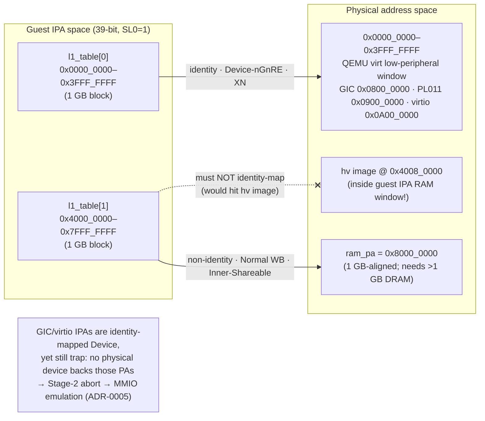

# Map guest Stage-2 with two static 1 GB block descriptors

> **Status:** Accepted. **Milestone:** M1 (introduced); refined through M3.x;
> first validated by a real Linux boot on 2026-06-19 (which corrected the
> `ram_pa` alignment — see below).

The single Linux guest needs a Stage-2 (IPA→PA) translation that gives it RAM and
lets it reach the low-address peripheral window of QEMU `virt`. A full
demand-paged page-table walker (L1→L2→L3, per-page descriptors, fault-driven
population) is real hypervisor machinery, but for one guest with a fixed memory
map it is far more than the milestones up to M3.4 need, and it would bury the
EL2/Stage-2 mechanics under allocator and walker code.

**Decision:** Use a single statically-allocated L1 table (`l1_table[512]`,
4 KB-aligned) with the translation **starting at L1** (`VTCR_EL2.SL0=1`,
`T0SZ=25` → 39-bit IPA, 4 KB granule). Populate exactly **two 1 GB block
descriptors**, no L2/L3 tables:

- `l1_table[0]`: IPA `0x0000_0000–0x3FFF_FFFF` → **identity**, Device-nGnRE, XN.
  Covers the QEMU `virt` low-peripheral window (PL011 @ `0x0900_0000`,
  GIC @ `0x0800_0000`, virtio-mmio @ `0x0A00_0000`).
- `l1_table[1]`: IPA `0x4000_0000–0x7FFF_FFFF` → **non-identity** to `ram_pa`,
  Normal Write-Back, Inner-Shareable. Guest RAM. An L1 block is 1 GB, so its
  output PA **must be 1 GB-aligned** (low 30 bits zero); `ram_pa`
  (`0x8000_0000`) is.

  > **Correction (2026-06-19, first real QEMU boot).** This slot originally used
  > `ram_pa = 0x4800_0000`, which is **not** 1 GB-aligned. The code masks the
  > output with `& 0xFFFF_C000_0000`, which silently rounded `0x4800_0000` down
  > to `0x4000_0000` — the hypervisor's own image — so the guest executed the hv's
  > `head.S` instead of Linux (it printed `!EL`). The bug was invisible until the
  > guest was actually booted because every milestone up to M3.4 was verified
  > statically only. Fixed by moving guest RAM to the 1 GB-aligned PA
  > `0x8000_0000`. See `docs/debug/m3-boot-debug-walkthrough.md`.

VMID goes in `VTTBR_EL2[63:48]`; the L1 table base in the low bits (the table is
4 KB-aligned so `VTTBR_EL2[11:0]` are zero as required).

### The two-descriptor IPA→PA map

## Considered Options

- **Two static 1 GB blocks, L1 only (chosen)** — two writes, no walker, no
  allocation; the whole guest address space is two lines of code and is trivial
  to reason about under GDB. Cost: coarse — a 1 GB block is the smallest unit, so
  per-page permissions or carving sub-regions is impossible without subdividing.
- **Full multi-level page table with demand paging** — rejected for now: the
  production answer (ACRN/Xvisor have it) but unjustified for one guest with a
  static map; revisit when there are multiple VMs or memory regions that need
  page-granular control.
- **Identity-map RAM as well** — rejected: the hypervisor image loads at PA
  `0x4008_0000`, inside the guest's IPA RAM window `0x4000_0000+`. RAM is
  therefore mapped **non-identity** to a dedicated `ram_pa` (`0x8000_0000`) that
  does not overlap the hv image.
- **Keep `ram_pa` at `0x4800_0000` and subdivide to L2 (2 MB blocks)** — the
  other way to fix the alignment bug above: a 2 MB block *can* map a 128 MB-aligned
  base, so RAM could stay at `0x4800_0000` inside 1 GB of DRAM. Rejected for now to
  keep the two-block L1-only design; the cost is that the chosen 1 GB-aligned base
  forces the guest to be backed by **>1 GB** of physical DRAM (see Consequences).

## Consequences

- **The whole low 1 GB is identity-mapped Device, including the GIC and virtio
  IPAs — yet those still trap and get emulated.** Trapping does *not* come from
  leaving those IPAs unmapped; it comes from there being **no physical device
  behind those PAs for the guest** (the hypervisor owns the physical GIC; there
  is no physical virtio-console). A guest access faults and is taken to EL2 as a
  Stage-2 data abort, which the MMIO bus then dispatches. PL011's PA *does* back
  a real device, so its identity mapping is genuine passthrough. This split is
  the subject of [[0005-device-passthrough-vs-emulation]].
- Granularity is 1 GB. If a future need requires page-granular Stage-2 (e.g.
  protecting a sub-region, or true MMIO "holes"), `l1_table[0]` must be
  subdivided into an L2/L3 subtree. That work is not yet present.
- **Guest RAM must be backed by >1 GB of DRAM.** Because `ram_pa = 0x8000_0000`
  (1 GB-aligned, as the L1 block requires) and QEMU `virt` DRAM starts at
  `0x4000_0000`, the backing PA is only inside memory when QEMU is given **more
  than 1 GB** (`-m 2G` in `scripts/run-qemu.sh`). With `-m 1G` DRAM ends exactly
  at `0x8000_0000` and the guest Image fetch external-aborts. This is the direct
  cost of choosing a 1 GB-aligned base over subdividing to L2.
- **Doc drift to fix in a later task:** `docs/reference/stage2.md` §5 predicted that M3.1
  would "carve a hole" by splitting the L1 block into L2/L3 so GIC accesses
  fault. The code did **not** take that path — it relies on the absent-PA-device
  fault described above and the two blocks are unchanged. `docs/reference/stage2.md` should
  be reconciled with this ADR.
- Single L1 table ↔ single VMID ↔ single guest; this is one of the load-bearing
  consequences of [[0002-single-global-vm-single-vcpu]].
- **M5 (multi-VM) generalizes this to one L1/L2 table pair per VM**, indexed
  by `vm->id` (`l1_table[NR_VMS][512]`, `l2_dev[NR_VMS][512]`), each with its
  own VMID in `VTTBR_EL2[63:48]` — see
  [[0014-multi-vm-static-partition-el2-console]]. The two-block design itself
  is unchanged per VM; VM1 simply gets its own pair of blocks, with its 1 GB
  RAM block backed by a second 1 GB-aligned PA (`0xC000_0000`, requiring
  `-m 4G`). M5 also punches a third hole in `l2_dev` — the PL011's 2 MB
  entry — using the exact mechanism this ADR's "GIC/virtio IPAs are
  identity-mapped Device, yet still trap" note describes, now applied to a
  device that used to be genuine passthrough (see ADR-0005/ADR-0014).
