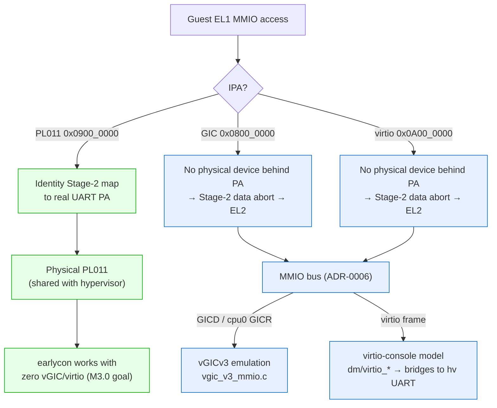

# Split devices into passthrough (PL011) vs trap-and-emulate (GIC, virtio)

> **Status:** Accepted. **Milestone:** M3.0–M3.3.

The guest touches three classes of MMIO device on QEMU `virt`: the PL011 UART,
the GICv3 (distributor + redistributor), and virtio-mmio frames. Each needs a
deliberate answer to "does the guest talk to real hardware, or to an emulation in
the hypervisor?" Getting this wrong is either a correctness bug (two owners of
one device) or unnecessary trap overhead.

**Decision:** Decide per device:

- **PL011 UART — passthrough.** The guest's IPA for PL011 (`0x0900_0000`) is
  identity-mapped Device-nGnRE by the Stage-2 device block (see
  [[0004-stage2-static-1gb-block-mapping]]). Guest reads/writes hit the real
  UART; no trap. This is what lets Linux earlycon print before any vGIC exists
  (the M3.0 goal). The hypervisor and guest share the physical UART.
- **GICv3 (GICD/GICR) — trap-and-emulate.** The hypervisor owns the *physical*
  GIC; the guest must never touch it. Guest accesses to the GIC IPAs trap to EL2
  and are serviced by the vGICv3 emulation (`vgic_v3_mmio.c`), which registers
  `GICD` and the cpu0 `GICR` on the MMIO bus.
- **virtio-mmio (console) — trap-and-emulate (fully virtual).** There is no
  physical virtio device; the frame at `0x0A00_0000` is a pure software model
  (`dm/virtio_*`) registered on the MMIO bus, with a backend that bridges to the
  hypervisor's own UART for console I/O.

The dispatch mechanism for the emulated devices is the MMIO bus + Stage-2
data-abort decoder (to be recorded by Task 4's ADR).

### Where a guest MMIO access lands, per device

## Considered Options

- **Passthrough only** — rejected: the guest cannot be given the physical GIC
  (the hypervisor needs it for interrupt virtualization and would lose control),
  and there is no physical virtio device to pass through at all.
- **Emulate everything, including the UART** — rejected for the boot console: a
  full PL011 emulation is more code than M3.0 needs, and passthrough is what
  makes earlycon work with zero vGIC/virtio infrastructure. (A future
  multi-VM world may need to *stop* sharing the physical UART and emulate it
  per-guest; that would supersede the PL011 half of this decision.)

## Consequences

- The passthrough vs emulation choice is realised through **two cooperating
  layers**: the Stage-2 device block decides which IPAs reach real hardware, and
  the MMIO bus decides which IPAs are claimed by an emulation. They must agree —
  see [[0004-stage2-static-1gb-block-mapping]] for why a benign identity mapping
  over the GIC/virtio IPAs does not break emulation (no physical device backs
  those PAs, so the access still faults to EL2).
- **PL011 is shared between hypervisor and guest.** Both write the same FIFO;
  output can interleave. Acceptable for a single learning guest, but it is the
  first thing a multi-VM design must revisit.
- Adding a new device requires an explicit decision here: passthrough means an
  identity Stage-2 mapping to a real PA; emulation means an `mmio_bus_register`
  and a handler, and *not* mapping a real device behind it. There is no default —
  record the choice.
- On M4 (RK3588) the device set and their physical addresses change entirely;
  this split (and the QEMU-specific bases) will need re-deriving for real
  hardware and DT/ACPI discovery.
