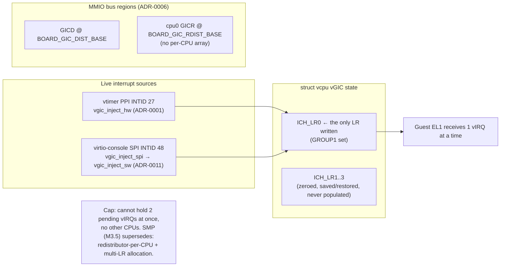

# Scope the vGICv3 to one cpu0 redistributor, one list register, Group 1

> **Status:** Accepted. **Milestone:** M2 (interface) / M3.2 (GICD/GICR emulation).

The GICv3 architecture is large: up to 16 list registers per CPU interface, a
redistributor per PE, and two interrupt groups. A faithful vGIC would model all
of it. But the single UP Linux guest (see [[0002-single-global-vm-single-vcpu]])
only ever has a handful of interrupt sources live, and at any given moment at
most one virtual interrupt is in flight to inject — the EL1 virtual-timer PPI
(INTID 27) or the virtio-console SPI (INTID 48). Modelling the full GIC would be
code with no exerciser.

**Decision:** Keep the virtual GIC deliberately minimal:

- **One redistributor.** `vgicv3_mmio_init` registers only `GICD`
  (`BOARD_GIC_DIST_BASE`) and the **cpu0** `GICR` (`BOARD_GIC_RDIST_BASE`) on the
  MMIO bus — no per-CPU redistributor array.
- **One list register.** `vgic_init` zeroes `ich_lr[0..3]`, but every injection
  path (`vgic_inject_sw`, `vgic_inject_hw`, and the `vgic_inject_spi` wrapper)
  writes **only `ICH_LR0`**. LR1–3 exist in `struct vcpu` and are
  saved/restored, but are never populated.
- **Group 1 only.** Injected interrupts set `ICH_LR_GROUP1`; the guest drives
  Group-1 enable/priority through its own `ICC_IGRPEN1_EL1`/`ICC_PMR_EL1`.

### Minimal vGIC: every source funnels through LR0

## Considered Options

- **Single LR0, cpu0-only, Group 1 (chosen)** — sufficient because the guest's
  live interrupts are serviced fast enough that they do not need to be pending
  simultaneously; one LR carries whichever one is being injected. Minimal state,
  trivial save/restore. Cost: it cannot hold two pending vIRQs at once, and it
  has no notion of other CPUs.
- **Full multi-LR, multi-redistributor model** — rejected for now: correct and
  general (and what SMP will need), but unjustified for one vCPU with one
  in-flight interrupt; it would be largely untested code.

## Consequences

- The two injection entry points established by
  [[0001-vtimer-hardware-forwarding]] (`vgic_inject_sw` / `vgic_inject_hw`) both
  funnel through LR0. If a second interrupt needs to be pending while LR0 is
  occupied, it is currently lost — acceptable only because the workload never
  does this in practice.
- **SMP and concurrent interrupts will break this on two axes:** multiple CPUs
  need a redistributor each, and bursty/simultaneous interrupts need more than
  one list register (with LR allocation/overflow handling). Both are squarely in
  M3.5 territory and should supersede this ADR.
- The cpu0-only redistributor is one of the load-bearing single-vCPU assumptions
  flagged in [[0002-single-global-vm-single-vcpu]]; generalising it is a
  prerequisite for SGI/IPI virtualization.
- **M3.5 (SMP) partially overtakes this** (see
  [[0013-smp-per-cpu-tpidr-guest-driven-bringup]]): the redistributor is now
  emulated **per vCPU** (`g_vgicr[NR_CPUS]`, with a correct 64-bit `GICR_TYPER`
  affinity so a secondary matches its own redistributor), and injection now uses
  **LR0 (vtimer), LR1 (PL011 SPI) and LR2 (SGIs)** rather than LR0 alone. What is
  **still** scoped per this ADR: only Group 1, and there is still no general LR
  allocation/overflow handling (the three sources have fixed LRs and a fourth
  simultaneous pending interrupt would be lost). Status stays `Accepted` for that
  remaining scope.
- **M5 (multi-VM) generalizes the redistributor array one dimension further**
  (see [[0014-multi-vm-static-partition-el2-console]]): both `g_vgicd` and
  `g_vgicr` become per-VM (`g_vgicd[NR_VMS]`, `g_vgicr[NR_VMS][VCPUS_PER_VM]`),
  keyed by `current_vcpu()->owner->id`. M5 also exposed that same-core LR1
  writes are insufficient once a VM's console-owning vCPU can run on a pCPU
  other than the one draining the physical UART: PL011 SPI injection
  (`vgic_inject_spi`) gained a shadow/kick/reload cross-core path alongside
  the existing SGI mechanism. LR0/LR1/LR2/Group-1-only scoping is otherwise
  unchanged by M5.
