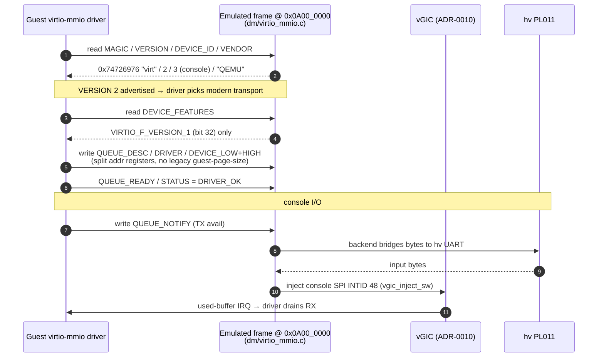

# Implement virtio-mmio as modern (VERSION 2) only, no legacy

> **Status:** Accepted. **Milestone:** M3.3.

virtio-mmio has two incompatible transport layouts: the legacy interface
(VERSION 1, with a guest-page-size register and a different queue-address ABI)
and the modern interface (VERSION 2, split queue descriptor/driver/device
address registers, mandatory `VIRTIO_F_VERSION_1` feature). Supporting both
roughly doubles the register-decode surface. A modern Linux guest negotiates the
modern interface whenever the device advertises VERSION 2, so legacy support
would be dead code on this target.

**Decision:** Implement the modern transport only. The emulated device reports
`VIRTIO_MMIO_VERSION` = `2` (`VIRTIO_MMIO_VERS`), magic `0x74726976` ("virt"),
and vendor id `0x554D4551` ("QEMU"), and the console backend advertises
`VIRTIO_F_VERSION_1` (bit 32) as its only feature. The register map in
`hypervisor/dm/virtio_mmio.c` is the VERSION 2 layout (split
`QUEUE_DESC/DRIVER/DEVICE_LOW/HIGH` registers); no legacy registers are decoded.
Exactly **one** device is instantiated: a single virtio-console
(`VIRTIO_CONSOLE_DEVICE_ID` = 3) at frame `0x0A00_0000`, INTID 48.

### Modern (VERSION 2) console: probe → queue setup → I/O

## Considered Options

- **Modern (VERSION 2) only (chosen)** — cleaner, well-specified register ABI;
  it is what a modern Linux guest selects anyway, so the legacy path would never
  execute. Less code to emulate and to get right.
- **Legacy + modern** — rejected: extra decode logic and a second queue-address
  ABI for zero benefit on this guest. Only worth it for an old guest that cannot
  speak VERSION 2, which is out of scope.

## Consequences

- The QEMU vendor id (`"QEMU"`) and `"virt"` magic make the emulated frame look
  like QEMU's own virtio-mmio to the guest driver, so the stock Linux
  virtio-mmio driver binds without special-casing.
- virtio is the fully-virtual device class in
  [[0005-device-passthrough-vs-emulation]]: there is no physical virtio device,
  so this transport is pure trap-and-emulate over the MMIO bus, and the console
  backend bridges to the hypervisor's PL011 for actual I/O.
- **One console device, for now.** The design generalises to more virtio devices
  (net, block) by instantiating additional frames, but only the console exists at
  M3.4. Adding devices does not change this transport decision.
- The console SPI (INTID 48) is delivered through the minimal vGIC of
  [[0010-vgic-scope-cpu0-lr0-group1]] via the software-injection path.
