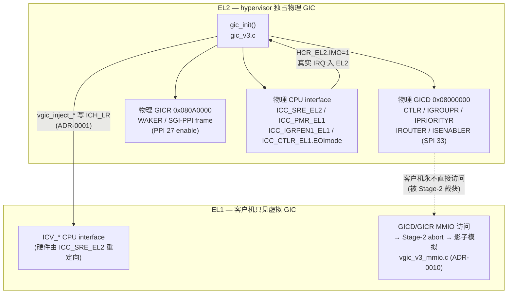

# Let the hypervisor own the physical GICv3; the guest sees only a virtual GIC

> **Status:** Accepted. **Milestone:** M2.5 (physical GICv3 bring-up) — extended in
> M3.0/M3.2 (PL011 SPI passthrough + vGICv3 emulation).

ARM 的虚拟化扩展把中断控制器一分为二：一个**物理 GIC**（distributor / redistributor /
物理 CPU interface）必须由某个特权层独占初始化并路由真实硬件中断，另一套**虚拟 CPU
interface**（`ICV_*` 寄存器 + `ICH_*` 控制接口）由硬件在 EL1 透明呈现给客户机。两者不能
同时由客户机直接驱动：如果让 Linux 客户机直接写物理 GICD/GICR，它就能把中断路由到任意
物理 PE、关掉 hypervisor 赖以运行的定时器，破坏隔离。但 hypervisor 又必须接收真实中断
（定时器 PPI、串口 SPI）才能虚拟化它们。

**决策（Decision）：** hypervisor 在 EL2 **独占**物理 GICv3——`gic_init()` 是唯一直接读写
物理 GICD（`0x08000000`）/ GICR（`0x080A0000`）/ 物理 CPU interface（`ICC_*_EL1/EL2`
系统寄存器）的代码。客户机看到的是一个**全虚拟 GIC**：它的 `ICC_*` CPU-interface 访问被
硬件经 `ICC_SRE_EL2` 重定向到 `ICV_*`；它的 GICD/GICR **内存映射**访问触发 Stage-2 data
abort，被影子模型 `vgic_v3_mmio.c` 模拟（ADR-0010），从不落到真实硬件。该 trap 由 Stage-2
punch-hole 落实：`stage2_init`（`mmu/stage2.c`）把覆盖 GICD/GICR 的那个 2 MB L2 entry 设为
invalid（见 `docs/superpowers/specs/2026-06-21-stage2-gic-punch-hole-design.md`、
`docs/reference/stage2-l1-to-l2.md` 与实证记录
`docs/reference/2026-06-21-gicd-gicr-trap-investigation.md`），否则 `l1_table[0]` 的 identity
Device 直通会让访问命中物理 GIC、模拟永不触发。唯一穿透到客户机
的真实中断（vtimer PPI 27、PL011 SPI 33）由 EL2 接收后注入虚拟中断（ADR-0001）。
`HCR_EL2.{IMO,FMO,AMO}=1` 把所有物理 IRQ/FIQ/SError 路由到 EL2 是这一切的前提。

## 物理 GICv3 寄存器逐项说明

下表覆盖 `gic_init()` 与运行期访问器（`gic_v3.c`）触碰的每一个物理寄存器。分三组：
**distributor（GICD，内存映射）**、**redistributor（GICR，内存映射）**、**物理 CPU
interface（系统寄存器）**。

### A. Distributor — GICD（基址 `0x08000000`，处理 SPI ≥ 32）

| 寄存器 | 偏移 | 本项目的用法 | 作用说明 |
| --- | --- | --- | --- |
| `GICD_CTLR` | `0x0000` | 写 `ARE_NS | ENGRP1NS` | distributor 总控。`ARE_NS`(bit4)=Affinity Routing Enable：启用基于亲和性（Aff3.2.1.0）的 SPI 路由，GICv3 必需；`ENGRP1NS`(bit1)=使能 Non-secure Group 1 转发。不置位则 SPI 永不送达任何 PE。 |
| `GICD_IGROUPR` | `0x0080` | 给 SPI 33 置位 | 每 INTID 1 bit（32 个/字）。bit=1 → 该 INTID 属 Group 1 NS（普通 IRQ）；bit=0 → Group 0（FIQ/安全）。PL011 必须是 Group 1 才能走 `ICC_IAR1`/`IGRPEN1` 路径。 |
| `GICD_IPRIORITYR` | `0x0400` | SPI 33 写 `0xA0` | 每 INTID 1 字节优先级（数值越小越高）。`0xA0` 低于 `ICC_PMR_EL1=0xFF` 的屏蔽阈值，故可被转发。 |
| `GICD_IROUTER` | `0x6000` | SPI 33 写 `0`（Aff=0→CPU0） | 每 INTID 64 位（从 INTID 32 起），编码目标 PE 的 Aff3.Aff2.Aff1.Aff0。需要 `ARE_NS=1` 才生效。`0` = 路由到 affinity 全 0 的 CPU0。 |
| `GICD_ISENABLER` | `0x0100` | SPI 33 对应位写 1 | 每 INTID 1 bit 的“置位使能”寄存器（写 1 使能、写 0 无效；停用用配套的 `ICENABLER`）。使能后该 SPI 才会被 distributor 转发。 |

### B. Redistributor — GICR（RD_base `0x080A0000`，处理本 PE 的 SGI 0–15 + PPI 16–31）

| 寄存器 | 偏移 | 本项目的用法 | 作用说明 |
| --- | --- | --- | --- |
| `GICR_WAKER` | `0x0014`（RD frame） | 清 `ProcessorSleep`，轮询 `ChildrenAsleep`=0 | 唤醒握手。复位后 redistributor 处于睡眠、不转发任何中断。清 `ProcessorSleep`(bit1) 后须自旋等 `ChildrenAsleep`(bit2) 变 0，表示 redistributor 已上电就绪。这是访问 SGI/PPI 帧前的强制前置步骤。 |
| `GICR_IGROUPR0` | `0x0080`（SGI/PPI 帧，RD_base+`0x10000`） | PPI 27 置位 | 与 GICD_IGROUPR 同义，但作用于本 PE 私有的 INTID 0–31。把 vtimer PPI 27 标为 Group 1 NS。 |
| `GICR_IPRIORITYR` | `0x0400`（SGI/PPI 帧） | PPI 27 写 `0xA0` | 私有 INTID 的逐字节优先级，含义同 GICD_IPRIORITYR。 |
| `GICR_ISENABLER0` | `0x0100`（SGI/PPI 帧） | PPI 27 对应位写 1 | 私有 INTID（SGI/PPI）的置位使能。使能 vtimer PPI 27，使其能被转发到 EL2。 |

> `GICR_CTLR`(`0x0000`)、`GICR_SGI_OFFSET`(`0x10000`) 等宏在 `gic_v3.h` 中定义；`SGI_OFFSET`
> 不是寄存器，而是 SGI/PPI 帧相对 RD_base 的 64 KiB 偏移。

### C. 物理 CPU interface — 系统寄存器（`ICC_*`，每 PE 一份）

| 寄存器 | 本项目的用法 | 作用说明 |
| --- | --- | --- |
| `ICC_SRE_EL2` | 写 `0xF`（`SRE|DFB|DIB|Enable`） | System Register Enable (EL2)。`SRE`(bit0)=用系统寄存器接口而非 MMIO 访问 CPU interface；`Enable`(bit3)=允许 EL1 使用 `ICC_SRE_EL1`，**这是把客户机 `ICC_*` 重定向到 `ICV_*` 的开关**——本 ADR 隔离性的硬件基础。`vgic_init()` 亦会再设一次。 |
| `ICC_PMR_EL1` | 写 `0xFF` | Priority Mask。只有优先级数值 < PMR 的中断才会被转发。`0xFF`=放行所有优先级，故 `0xA0` 的定时器/串口中断可达 EL2。 |
| `ICC_IGRPEN1_EL1` | 写 `1` | 使能本 PE 的 Group 1 中断转发。不置位则 `ICC_IAR1_EL1` 永远读到 1023（spurious）。 |
| `ICC_CTLR_EL1` | 置位 `EOImode`(bit1) | **拆分** priority-drop 与 deactivate：`EOImode=1` 时 `ICC_EOIR1_EL1` 只做优先级下放、`ICC_DIR_EL1` 才真正 deactivate。ADR-0001 的 HW-forward 链路依赖此分离，让 level-sensitive 线保持 Active 以防 re-pend 风暴。 |
| `ICC_IAR1_EL1` | `gic_ack_irq()` 读 | Interrupt Acknowledge (Group 1)。读取并 ack 当前最高优先级待处理 Group-1 中断，返回其 INTID（取低 24 位），并把它置为 Active。`1023` 表示无中断/spurious。 |
| `ICC_EOIR1_EL1` | `gic_priority_drop()` 写 | End Of Interrupt (Group 1)。`EOImode=1` 下**只做** priority-drop（恢复运行优先级），不 deactivate——INTID 仍为 Active。 |
| `ICC_DIR_EL1` | `gic_deactivate()` 写 | Deactivate Interrupt。在 `EOImode=1` 下显式 deactivate 一个 INTID。vtimer/PL011 路径**故意不**在 EL2 调用它（交给客户机经 ICH_LR HW 链路释放，ADR-0001）；仅非预期/spurious 中断在 EL2 走 drop+deactivate。 |

## Considered Options

- **hypervisor 独占物理 GIC + 客户机全虚拟 GIC（已选）** —— 唯一能同时满足“EL2
  必须收到真实中断”与“客户机不得操纵真实路由”的方案，且与 ARM 虚拟化扩展的硬件
  `ICC→ICV` 重定向天然契合。
- **把物理 GICR/部分 GICD 直通给客户机** —— 否决：客户机即可改写 `IROUTER` 把中断打到
  其他 PE、或关掉 hypervisor 的 vtimer，破坏隔离；且 GICv3 的 distributor 是全系统共享，
  无法按 VM 分区直通。
- **纯软件模拟全部 GIC（含 CPU interface），不用硬件虚拟接口** —— 否决：每次客户机 ack/EOI
  都要陷入 EL2，开销极高，且放弃了 `ICH_LR` 硬件转发（ADR-0001）这一防风暴机制。

## Consequences

- `gic_init()` 成为物理 GIC 的**唯一**写者；任何其他模块若直接碰 `0x08000000`/`0x080A0000`
  即破坏本不变式（影子模拟一律走 `vgic_v3_mmio.c`，注入一律走 `vgic_inject_*`）。
- 依赖 `HCR_EL2.{IMO,FMO,AMO}=1`（在 `vm_init` 设置 `hcr_el2`）与 `ICC_SRE_EL2.Enable=1`；
  二者缺一，真实中断要么不入 EL2、要么客户机直接看到物理 CPU interface。
- 物理侧只使能了 hypervisor 实际消费的两条线（PPI 27、SPI 33）。新增需要 EL2 介入的
  passthrough 设备（如未来真实硬件的更多 SPI）必须在 `gic_init()` 中按同样的
  IGROUPR/IPRIORITYR/IROUTER/ISENABLER 四步登记，并在 `el2_irq_handler()` 增加路由分支。
- 与 ADR-0010（vGICv3 影子范围：cpu0/LR0/Group1）、ADR-0001（HW-forward 不 deactivate）、
  ADR-0005（PL011 直通 vs GIC 模拟）共同构成完整的中断虚拟化模型。
- **M3.5（SMP）将重访本决策**：多 PE 时每个物理 redistributor 都需唤醒，SGI/IPI 需要
  在物理与虚拟两侧建立映射，`IROUTER` 的目标亲和性也不再恒为 CPU0。
