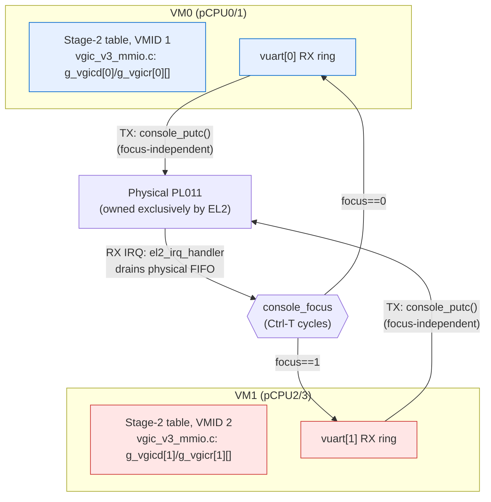

# Objectify the VM, statically partition 2 VMs across 4 pCPUs, and move the console under EL2

> **Status:** Accepted. **Milestone:** M5 (multi-VM foundation). Amends
> [[0005-device-passthrough-vs-emulation]], [[0010-vgic-scope-cpu0-lr0-group1]],
> [[0012-physical-gicv3-ownership]], [[0004-stage2-static-1gb-block-mapping]];
> extends [[0013-smp-per-cpu-tpidr-guest-driven-bringup]].

M3.5 gave one Linux guest two vCPUs pinned to two pCPUs, but the whole
hypervisor still assumed exactly one VM: a single global `g_vm`, one Stage-2
table, one vGIC distributor, and a PL011 shared by cooperative passthrough
between EL2 and that one guest (ADR-0005 explicitly flagged this as "the
first thing a multi-VM design must revisit"). M5's goal is a second, fully
isolated Linux guest coexisting on the same 4-pCPU QEMU `virt` machine. That
forces three interlocking decisions: how the VM is represented in code, how
the one physical UART is shared when there are two guests instead of one, and
how pCPUs are statically handed out.

**Decision:**

1. **Objectify the VM.** `struct vm g_vm` becomes `struct vm vm[NR_VMS]`
   (`NR_VMS` a compile-time constant, 1 or 2 depending on build profile).
   Every subsystem's file-static single-VM state (Stage-2 tables, vGIC
   dist/redist arrays) becomes an `[NR_VMS]`-indexed array keyed by
   `vm->id`. `struct vcpu` gains an `owner` back-pointer to its `struct vm`
   and a VM-local `vcpu_idx`; trap handlers navigate via
   `current_vcpu()->owner` instead of a global.
2. **EL2 takes exclusive ownership of the physical PL011.** The passthrough
   half of ADR-0005 is retired: the guest's PL011 IPA window is punched out
   of Stage-2 (same mechanism already used for the GIC), and every VM gets a
   trap-and-emulate PL011 model (`hypervisor/dm/vuart.c`) instead. EL2 alone
   drains the physical RX FIFO and multiplexes it to whichever VM currently
   holds console *input* focus (a Ctrl-T-cycled `console_focus`); TX from any
   VM is focus-independent and always reaches the wire, serialized under the
   same lock as EL2's own `printk`.
3. **Static 2+2 partitioning, not dynamic placement.** `struct vm_config`
   gains `pcpu_base`: VM *i*'s vCPU *j* always runs on pCPU
   `i * VCPUS_PER_VM + j`. VM0 owns pCPU0/1, VM1 owns pCPU2/3. VM1's boot
   vCPU is **hypervisor-driven** (CPU0 fires a fire-and-forget physical
   `PSCI_CPU_ON` at hv-init time, since no guest exists yet to ask for it);
   every VM's *second* vCPU stays **guest-driven** via that VM's own PSCI
   `CPU_ON`, exactly as ADR-0013 already established — now re-scoped per-VM
   instead of assumed singular.
4. **PSCI power-down becomes VM-scoped.** `SYSTEM_OFF`/`CPU_OFF` mark only
   the calling vCPU's own VM `off`, kick only that VM's other pCPU(s) via the
   existing SGI kick mechanism, and park them — never touching another VM's
   state. This is the milestone's actual isolation proof: VM1 shutting down
   must not stop VM0.

## Considered Options

- **Objectify with an owner backpointer (chosen)** vs **thread a `struct vm *`
  through every call site** — the backpointer keeps existing single-vCPU-arg
  call sites (`vgic_inject_spi(&vcpu, ...)`, MMIO handlers) unchanged; only the
  handlers that need "which VM" resolve it via `current_vcpu()->owner` at the
  point of use, rather than every function signature growing a parameter.
- **EL2-owned vuart for every VM (chosen)** vs **keep VM0 on passthrough,
  emulate only for VM1** — rejected: an asymmetric console model (one VM
  gets real hardware, the other gets emulation) means two code paths to
  maintain and no clean way to switch focus, since VM0's passthrough would
  bypass EL2 entirely and never route through a focus check.
- **Static `pcpu_base = vm_index * VCPUS_PER_VM` (chosen)** vs **an arbitrary
  per-VM pCPU list** — rejected for now: arbitrary placement would need a
  real allocator and doesn't serve M5's static-partitioning goal; the
  structural formula also lets `secondary_main` derive (VM, vCPU) from a raw
  pCPU id with no lookup table, at the cost of a boot-time assertion that
  every configured VM's `pcpu_base` actually agrees with that formula.
- **VM-scoped PSCI power-down via the existing SGI kick (chosen)** vs **a new
  dedicated cross-VM stop mechanism** — reusing the kick-SGI infrastructure
  from ADR-0013 was strictly additive: `vgic_kick_vm_other_pcpus` sends the
  same physical kick, just scoped to one VM's pCPU set, and deliberately
  never touches the pending-SGI bitmap so it cannot interfere with another
  VM's ordinary IPI traffic.

## Consequences

- **`NR_CPUS` is now a fixed platform ceiling (4), decoupled from `NR_VMS`.**
  `_Static_assert(NR_VMS * VCPUS_PER_VM <= NR_CPUS, ...)` in `vm.h` catches a
  VM's pCPU slot overrunning the platform budget at compile time; it is `<=`
  rather than `==` specifically so single-VM build profiles (the `svm`/
  `svm2`/`svm3` regression tests, `NR_VMS=1`) can still compile using only 2
  of the 4 provisioned pCPUs.
- **Cross-core vGIC injection is no longer trivially same-core.** Once a
  VM's console-owning vCPU can live on a pCPU other than the one draining the
  physical UART (true the instant console focus can point away from pCPU0's
  VM), a direct live-LR write from the wrong core is a no-op. The PL011 SPI
  injection path (`vgic_set_spi_shadow` / `vgic_kick_pcpu` /
  `vgic_reload_spi_lr`) mirrors the existing SGI shadow/kick/drain pattern:
  write a shadow, kick the owning pCPU into EL2, let it write its own live
  register. A `spi_shadow_pending` flag per vCPU guards against a stale
  shadow being replayed by an unrelated, later kick-SGI.
- **A second, VM-1-only latent bug surfaced by real dual-pCPU-pair
  concurrency**: `g_hv_ctx`, a single shared BSS slot used by the M0-era HVC
  debug-restore path, had no per-core isolation and could be corrupted once
  two pCPUs were genuinely concurrent inside `vcpu_run`/`hv_restore` for the
  first time (M3.5's two pCPUs were still one VM's cooperating vCPUs and
  never hit this window in practice; M5's two independent VMs did). Fixed by
  indexing `g_hv_ctx[NR_CPUS]` by pCPU id, same derivation as
  `current_vcpu_id()`.
- **One guest DTB template serves every VM.** Because Stage-2 already
  separates guest IPA from backing PA (true since M3, per `vm_config.h`'s
  `mem_base`/`ram_pa` split), VM1 needs no DTB of its own: it sees the exact
  same IPA map as VM0 (`BOARD_LINUX_RAM_IPA`, `BOARD_LINUX_DTB_IPA`, ...) and
  only its Stage-2-backing PA differs (`BOARD_LINUX2_RAM_PA`, the next
  1 GB-aligned block). The same reasoning applies to the dual-SVM test guest:
  it must link at the identical address as the single-VM SVM guest, since
  Stage-2 — not the guest binary — is what makes the same IPA resolve to
  different physical RAM per VM.
- **Known gap, deliberately out of scope for M5:** if console focus is left
  on a VM that has since called `SYSTEM_OFF`, keystrokes are still pushed
  into that VM's (now-idle) vuart and injected toward a parked pCPU that will
  never observe the pending LR — harmless (the pCPU sits in `wfi`), but the
  user gets no feedback that focus is pointed at a dead VM. Left for a later
  milestone since it is a UX rough edge, not a correctness or isolation bug.
- **No automated regression exercises Ctrl-T focus switching or VM-scoped
  power-down isolation end-to-end** — both are verified by the milestone's
  manual QEMU dual-boot session (documented in the M5 plan's gate), not by
  `make test`. The dual-SVM scenario (`svm4`) added by this milestone does
  regress the underlying mechanism (independent VM boot, independent
  Stage-2/VMID/vGIC, cross-VM non-interference) but does not itself drive
  Ctrl-T or PSCI power-down. A future milestone that touches this console or
  PSCI path should budget for closing that gap.
- M6 (vCPU scheduler) inherits this static `pcpu_base` partitioning as its
  starting point and is expected to be the first milestone to break the
  1:1 vCPU:pCPU assumption this ADR still relies on.
