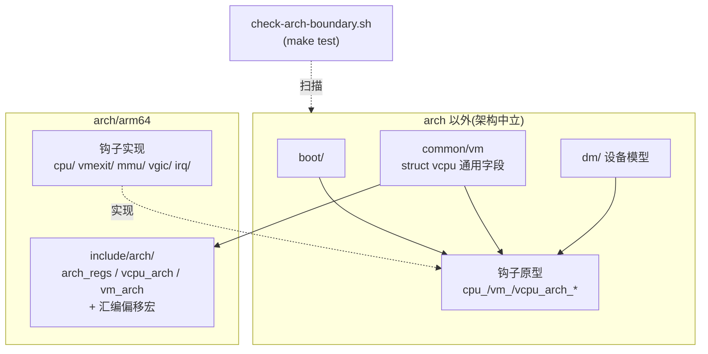

# arch/ 以外的代码只能通过 `*_arch_*` 钩子访问架构层

> **Status:** Accepted. **Milestone:** M11 前置重构(arch-boundary)。修订
> [[0003-asm-c-vcpu-offset-coupling]] 中"偏移宏放在哪个头文件"这一点。

这个 hypervisor 的目标是多架构:现在是 ARM64(QEMU `virt`,之后 RK3588),将来
要能加入 x86 等架构。目录仿照 ACRN 分成 `arch/` 和 `common/`,但到 M10 为止这个
划分只停留在名字上:`common/` 里放着 ARM 专有的 PSCI;VM 模块直接写 `vmpidr_el2`,
直接调用 Stage-2 和 vGIC;`struct vcpu` 直接包含 EL2/ICH 字段;启动入口和 vuart
直接读 `BOARD_*`、调用 `gic_*`/`vgic_*`。于是加入第二个架构时,几乎每个"通用"文件
都要改。而且 M11 会大幅扩充 `struct vcpu`,拖得越久代价越大。更关键的是,没有任何
机制能阻止新的架构代码继续流进 `common/`。

**Decision:** 采用 bao-hypervisor 的 core/arch 划分,并用构建检查强制执行:

1. `hypervisor/arch/` **以外**的代码(不只 `common/`,也包括启动入口、设备模型、
   调试、库和通用头文件)**禁止**:内联汇编、`.S` 文件、系统寄存器名(`*_ELn`、
   `ICH_*`、`ICC_*`)、PSCI 符号、直接调用 `vgic_*`/`stage2_*`/`gic_*`/`vtimer_*`、
   `BOARD_*` 常量和 `board.h`。唯一例外是静态 VM 配置表,它本身就是板级配置
   (ADR-0008)。
2. 访问架构层只有两种途径:`<对象>_arch_<动词>` 钩子(`cpu_`、`vm_`、`vcpu_`),
   以及 `<arch/xxx.h>` 命名空间头文件(由构建系统按 `ARCH` 解析)。
3. 钩子原型由**通用头文件**声明,每个 arch 都必须实现,**不提供 weak 默认实现**,
   缺实现在链接时就报错。钩子**按需增长**:由真实调用点引入,不预先设计完整 HAL。
4. 通用结构体嵌入 arch 结构体(`struct vcpu` ⊃ `struct arch_regs` + `struct
   vcpu_arch`,`struct vm` ⊃ `struct vm_arch`)。汇编偏移宏跟着 arch 结构体
   **移到 arch 头文件**。这一点修订了 ADR-0003:"结构体和偏移宏放在同一头文件、
   由 `check-offsets` 校验"的约定不变,变的只是位置,从 `include/vm.h` 移到了 arch。
5. `scripts/check-arch-boundary.sh` 在 `make test` 中执行这些规则。尚未迁移的违规
   列在 `scripts/arch-boundary.allow` 里,这份白名单**只减不增**:新违规会失败,
   白名单里已修复却没删的条目也会失败。
6. **设备相关不等于架构相关**:模拟的设备(vuart = PL011)留在 `dm/`,物理驱动放在
   `drivers/`;它们只需要切断和 vGIC、`BOARD_*` 的直接耦合。

## Considered Options

- **bao 风格:中性钩子 + `<arch/>` 头文件 + 构建期棘轮检查。** 选用。理由:x86
  移植只需新增 `arch/x86/`,通用代码不用动;而且规则由 `make test` 强制,不依赖
  review 记忆。
- **只把 PSCI 移出 `common/`,允许 `common/` 继续调用 `stage2_*`/`vgic_*`。** 否决。
  这样加 x86 时 VM 模块照样得改,只是换了个地方越界。
- **现在就建一个 `arch/x86` stub 构建来证明 `common/` 能编译。** 暂不采用。每加一个
  钩子都要同步维护 stub,还需要 x86 工具链。等真正开始移植时,再作为第二道检查加入。
- **一次性设计完整 HAL(包括 M11 要用的 save/restore)。** 否决。接口形状应该由真实
  调用点决定,现在猜大概率会猜错。
- **`arch_<对象>_<动词>`(ACRN/Linux 风格)命名。** 否决。和选定的参考实现 bao 保持
  一致。
- **weak 默认钩子(bao 的 `vm_arch_allow_mmio_access` 用法)。** 否决。它会把"忘了
  实现"推迟到运行时才发现。

## Consequences

- 加入新架构的工作量是"实现一组已命名的钩子,再加上 `arch/<new>/include/arch/`",
  通用代码保持不变。
- 物理 GIC / vGIC 的拆分规则(CLAUDE.md)仍然有效,它位于本边界之内。
- 检查基于 grep,只能发现**写法**上的越界,发现不了**语义**上的耦合,比如通用代码
  假设 IPA 按 1 GB 对齐。语义耦合仍然要靠 review。
- `CPU_OFF` 杀掉整个 VM 的已知缺陷在迁移中保持原样。电源策略(`vm->off`、kick
  其它 pCPU)随 guest PSCI 模拟进入 arch,把它抽成通用 API 由 M11 负责。
- M11 调度器新增的运行状态放进通用 `struct vcpu`,EL1 系统寄存器块放进
  `struct vcpu_arch`。
- 历史 spec、plan、ADR 中引用的旧路径(`common/psci/` 等)不做修改。
