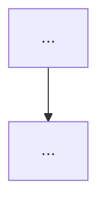

# <Imperative one-line decision title>

> **Status:** Proposed. **Milestone:** M<x>.

<2–5 sentences describing the forces at play: the problem, the constraint, or the
tension that made a decision necessary. State it so a reader who has never seen
the code understands why a choice had to be made.>

**Decision:** <What we chose, stated plainly in one or two sentences.>

<!--
Include at least one Mermaid diagram (a picture is worth a thousand words).
Pick the type that fits the decision:
  - sequenceDiagram   — for a flow/protocol over time (e.g. trap → emulate → resume)
  - flowchart / graph — for dispatch trees, address maps, per-device routing
  - classDiagram      — for object/struct relationships and ownership
Put it right after the Decision (or inside Considered Options to contrast
chosen vs rejected). 0001/0006 (sequence), 0004/0005/0007 (flowchart) and
0002 (class) are worked examples.
-->

## Considered Options

- **<Chosen option>** — chosen because <reason>.
- **<Alternative>** — rejected because <reason>.

## Consequences

- <What this makes easier or harder downstream.>
- <Any invariant the code now relies on, and where it is enforced (or not).>
- <Forward reference: which future milestone is likely to revisit this.>
