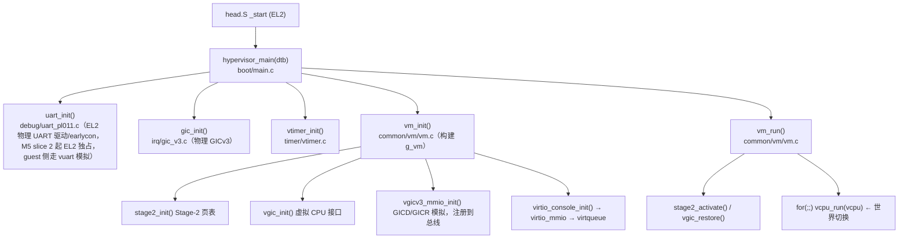
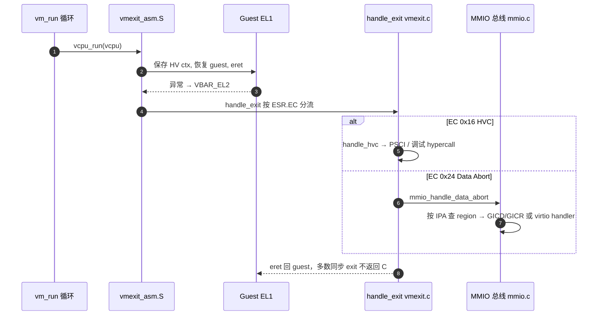
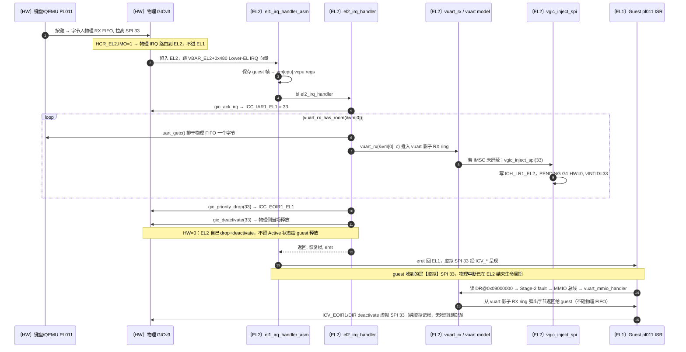

# 架构鸟瞰 / Architecture Zoom-Out（2026-06-21）

> **M5 更新提示（2026-07-20）：** 本文写于 M3.x 时代，仍以"单 VM、单 vCPU"为整体框架
> （见下方 §0、§5 模块表中的 `g_vm`）。M5 之后 `g_vm` 已重构为 `vm[NR_VMS]`（每 VM 独立
> Stage-2/vGIC/vuart），且 §4 的键盘输入 trace 已不完整：它只覆盖 `vm[0]` 单目标注入，
> 未描述 M5 新增的 `console_focus` 切换键与跨核 vGIC shadow/kick/reload 注入路径（VM 的
> 控制台 vCPU 可能运行在与拥有物理 UART 的 pCPU0 不同的核上）。完整现状见
> [[../../adr/0014-multi-vm-static-partition-el2-console]] 及其 Mermaid 图；本文其余章节
> （GIC 子系统本体、Stage-2 机制）在单 VM 视角下仍然准确，只是需要按"每 VM 一份"重新
> 理解。全文按 M5 现状重写留作后续任务。

本文是一次「拉高一层」的整体梳理：从顶层调用链 → GIC 子系统 → 一次键盘输入端到端
trace，三层逐步放大，用项目术语把各模块和调用者串成一张图。面向「不熟悉某块代码、想
先看清它在大局里的位置」的读者。

配套精读：[vcpu-run-world-switch.md](vcpu-run-world-switch.md)、
[handle-exit-dispatch.md](handle-exit-dispatch.md)、[stage2.md](stage2.md)、
[vgic-injection.md](vgic-injection.md)；决策依据见 `docs/adr/`。

---

## 0. 一句话定位

单 VM、单 vCPU（UP）的 Type-1 ARM64 hypervisor。全局只有一个 guest（`g_vm`）、一个
`vcpu`，跑在 EL2，把一个未修改的 Linux 引导到 EL1 的 busybox shell。整套系统围绕**一个
循环**组织：**进 guest → 取一次 exit → 模拟 → 再进 guest**。

---

## 1. 顶层骨架（调用链）

关键术语 **MMIO trap-and-emulate 总线**（`vmexit/mmio.c`，ADR-0006）：一张固定 8 槽的
表。每个被模拟的设备在 init 时调用 `mmio_bus_register(base, len, handler, ctx)`。Stage-2
data abort 触发时，总线用 `FAR_EL2`+`HPFAR_EL2` 重建 IPA、解析 ISS（访问宽度/寄存器/方向）、
查到 region、调它的 handler，再把 `ELR_EL2` 推过出错指令。

---

## 2. 世界切换 + 退出分发（心脏）

运行期实际会见到的三类 exit：

1. **Data abort（EC 0x24）** —— guest 访问被模拟的 MMIO（GIC 或 virtio）→ 总线 → 设备
   handler。**最常见**。
2. **HVC（EC 0x16）** —— guest 调 PSCI（真实 Linux）或 M2 调试 hypercall。
3. **Timer IRQ** —— 唯一会返回 C 并在 `vm_run` 里循环的 exit；PPI 经 vgic 重新注入。

---

## 3. 放大：GIC 子系统

GIC 工作拆成**三个互不混淆**的关注点：

| 关注点 | 文件 | 拥有什么 |
| --- | --- | --- |
| **物理 GICv3**（host 侧） | `irq/gic_v3.c` | 真实 distributor/redistributor + EL2 CPU 接口。hypervisor 独占。 |
| **vGIC CPU 接口**（硬件虚拟化） | `irq/vgic.c` + `vgic.h` | `ICH_*` 列表寄存器机制，向 guest **呈现**虚拟 IRQ。 |
| **vGIC distributor/redistributor**（模拟） | `irq/vgic_v3_mmio.c` | 影子 GICD/GICR 寄存器——纯 trap-and-emulate，从不碰真实硬件。 |

核心框架：**guest 看到的是全虚拟 GIC**。它的 `ICC_*` CPU 接口访问被硬件经
`ICC_SRE_EL2` 重定向到 `ICV_*`；它的 GICD/GICR **内存**访问以 Stage-2 data abort 陷入，命中
影子模型。只有**一个真实中断**穿透：vtimer PPI（INTID 27），硬件转发。详见
[[adr-0012]]（物理 GICv3 独占 + 逐寄存器说明）与 [[adr-0010]]（vGIC 影子范围）。

三种注入（关键区别是 HW 位与用哪条 LR）：

| 函数 | LR | HW 位 | 调用者 | 为什么 |
| --- | --- | --- | --- | --- |
| `vgic_inject_hw(vintid, pintid)` | **LR0** | HW=1 | `el2_irq_handler`（vtimer 27） | guest deactivate vIRQ 经 LR 链路释放物理定时器线（ADR-0001） |
| `vgic_inject_spi(intid)` | **LR1** | HW=0（M5 slice 2 起） | `vuart_rx`（`irq_handler.c` 的 PL011 33 分支经由 vuart 模型调用）、virtio-console | LR1 避免被 LR0 每 tick 的 vtimer 覆盖；HW=0 是因为 EL2 现在自己 drop+deactivate 物理 PL011 中断，没有 Active 状态留给 HW 链接去释放 |
| `vgic_inject_sw(vintid, prio)` | LR0 | HW=0 | `handle_hvc`（M2 调试钩子） | 纯软件注入，无物理线 |

> `vgic.h` 把 `vgic_inject_spi` 描述为 `vgic_inject_sw` 的薄封装——M5 slice 2 起这与
> 实现（`vgic.c`）一致：HW=0/LR1。（M3.3–M5 slice 1 期间它曾是 HW=1/LR1，服务于当时
> PL011 直通设计下的 LR 释放链接；该阶段已结束，见下方 §4。）

---

## 4. 端到端 trace：一次 `ttyAMA0` 键盘输入

前提（M5 slice 2 起，取代此前的直通设计）：guest 控制台仍是 `console=ttyAMA0`，但物理
PL011（`0x09000000`）现在由 **EL2 独占**——hypervisor 在 Stage-2 把 UART 所在的 2 MB 窗口
标记为 invalid（`stage2.c` 的 `stage2_init`），guest 对 DR/FR/IMSC 等寄存器的每一次访问都
不再直达硬件，而是触发 Stage-2 data abort，陷入 MMIO 总线，命中 `dm/vuart.c` 注册的
`vuart_mmio_handler` trap-and-emulate 模型。数据面因此拆成两段：guest **TX** 一个字符是
对 vuart `DR` 的 MMIO store，处理函数在 printk 锁下调用 `console_putc()` 把字节转发到真实
UART；guest **RX** 一个字符要先由物理中断把字节交到 EL2，再由 EL2 注入虚拟中断通知 guest
去 vuart 的影子 FIFO 里取。三个地址/中断锚点不变：PL011 基址 `0x09000000`；PL011 RX 是
**SPI 33**（DTS `<0 1 4>` → 32+1）；SPI 33 已在 `gic_init` 时登记进物理 GICD（Group 1、
prio 0xA0、路由 Aff=0、enable）——变的是这条 SPI 落地guest的路径，不再是硬件直通。

参与者前缀标注了运行的特权级：`〔HW〕`=硬件、`〔EL2〕`=hypervisor、`〔EL1〕`=客户机。
**注意 `el1_irq_handler_asm` / `el2_irq_handler` 都运行在 EL2**——函数名里的 `el1` 指
「来自 EL1 的异常」（Lower EL），不是它的运行级别。

> 这里本想用 `box` 泳道分组直接画出 EL2/EL1 分层，但本地 `mermaid@11` 对 `box` 报
> `Option is not defined`，故改用别名前缀。详见 [mermaid-gotchas.md](../mermaid-gotchas.md) 坑 3。

**值得记住的对称性变化：** 此前的直通设计里，**输出**是对直通 `DR` 的普通 MMIO
store（从不陷入），**输入**才是 hypervisor 唯一介入的方向（只为中断，数据直连）。
M5 slice 2 起两个方向都会陷入：TX 陷入 vuart 后同步转发给 `console_putc()`；RX 由
物理中断异步灌入 vuart 的影子 FIFO，guest 再通过 trap-and-emulate 的 `DR` 读取取走。
hypervisor 从「纯中断路由器 + 恒等映射直通」变成了「完整的 trap-and-emulate 控制台
设备模型」，换取了 EL2 对物理 UART 的独占（为多 VM 场景下的控制台复用打基础，
M5 slice 3+）。ADR-0005 记录的是旧的直通决策，已被本 slice 的独占+模拟设计取代。

PL011 RX 分支在 EL2 里 `gic_priority_drop` **且** `gic_deactivate`（不再是 EOImode=1
拆分留 Active）：因为 guest 不再有驱动直接触达物理寄存器，没有「等 guest 处理完才能
释放物理线」的时序需求，EL2 排干 FIFO 后立刻可以让物理侧完全清零。这与 vtimer PPI 27
的处理（仍然 HW=1、只 drop 不 deactivate，ADR-0001）不同——vtimer 依然是唯一保留硬件
转发+留 Active 语义的中断源。

---

## 5. 模块速查表

| 模块 | 角色 | 调用者 / 依据 ADR |
| --- | --- | --- |
| `boot/main.c`, `boot/head.S` | EL2 bring-up、引导序列 | reset 向量 |
| `common/vm/vm.c`（`g_vm`） | 单 VM + run loop | `main.c`；ADR-0002 |
| `vmexit/vmexit.c`（`handle_exit`） | 按 ESR.EC 分流 | `vmexit_asm.S`；ADR-0007 |
| `vmexit/mmio.c` | MMIO 总线 | 各模拟设备；ADR-0006 |
| `arch/.../mmu/stage2.c` | Stage-2 GPA→PA 隔离 | `vm_init`；ADR-0004 |
| `arch/.../irq/gic_v3.c` | 物理 GICv3（host） | `main.c`；ADR-0012 |
| `arch/.../irq/vgic.c` | vGIC CPU 接口（ICH_*、LR） | `vm_init`、`vmexit.c`、timer |
| `arch/.../irq/vgic_v3_mmio.c` | GICD/GICR 模拟 | 注册到 MMIO 总线；ADR-0010 |
| `arch/.../timer/vtimer.c` | 虚拟定时器、PPI 注入 | `main.c`、IRQ handler；ADR-0001 |
| `common/psci/psci.c` | PSCI 电源管理 | `handle_hvc` |
| `dm/virtio_mmio.c`+`virtqueue.c`+`virtio_console.c` | 设备模型：virtio-mmio v2、virtqueue、console | `vm_init`、MMIO 总线；ADR-0011 |
| `dm/gpa.c` | GPA（guest-physical）访问器 | virtio 缓冲区 |
| `debug/uart_pl011.c` | PL011 物理驱动，EL2 独占（M5 slice 2 起） | `main.c`；ADR-0005（旧决策，已被 vuart 取代） |
| `dm/vuart.c` | VM0 guest 控制台 trap-and-emulate 模型 | 注册到 MMIO 总线；`irq_handler.c` 的 PL011 RX 分支 |

---

## 延伸阅读

- 世界切换汇编：[vcpu-run-world-switch.md](vcpu-run-world-switch.md)
- 退出分发：[handle-exit-dispatch.md](handle-exit-dispatch.md)
- Stage-2 / vGIC：[stage2.md](stage2.md)、[vgic-injection.md](vgic-injection.md)
- 决策：ADR-0001（HW 转发）、ADR-0005（直通 vs 模拟）、ADR-0006（MMIO 总线）、
  ADR-0010（vGIC 范围）、ADR-0012（物理 GICv3 独占 + 逐寄存器）
- 实测启动：`docs/debug/m3-boot-debug-walkthrough.md`
