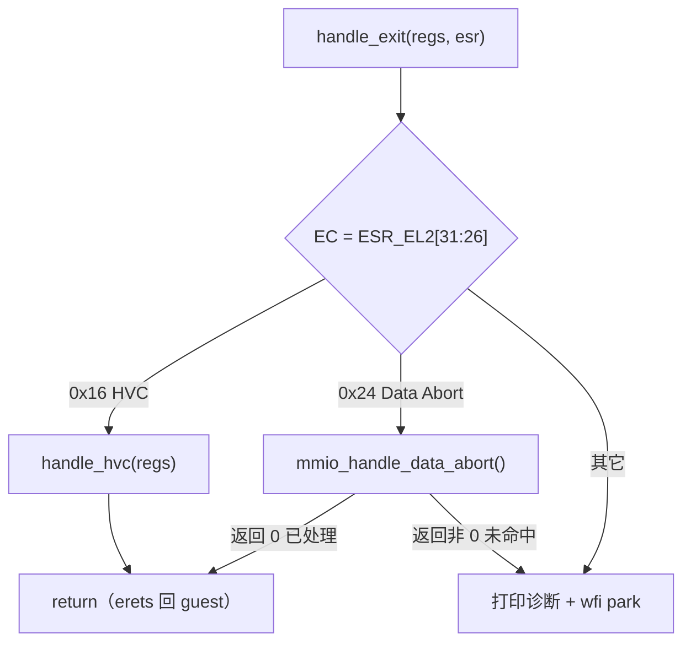
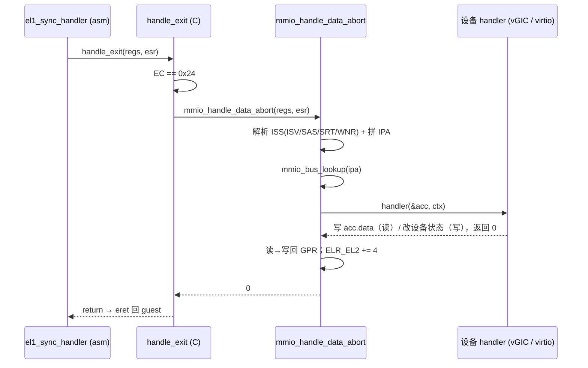

# handle_exit 退出分发逻辑

本文解释 guest「出 guest」之后，hypervisor 在 EL2 侧怎么判断「到底发生了什么、
怎么处理」。源码：

- `hypervisor/arch/arm64/vmexit/vmexit.c` — `handle_exit` 顶层分发 + `handle_hvc`。
- `hypervisor/arch/arm64/vmexit/mmio.c` — Stage-2 data abort → MMIO trap-and-emulate。
- `hypervisor/arch/arm64/vmexit/mmio.h` — MMIO 总线接口与 `struct mmio_access`。

配套阅读：进 / 出 guest 的汇编闭环见 [vcpu-run-world-switch.md](vcpu-run-world-switch.md)；
`handle_exit` 正是 `el1_sync_handler` 存好 guest 现场后调用的那个 C 函数。

常见疑问：

1. `handle_exit` 是怎么知道 guest 为什么退出的？
2. HVC 和 MMIO 两条路各自怎么走？
3. MMIO trap-and-emulate 是怎么把一条 load/store「替 guest 做掉」的？

---

## 1. 顶层分发：看 ESR_EL2 的 EC 字段

```c
void handle_exit(struct vcpu_regs *regs, u64 esr)
{
    u32 ec = (u32)(esr >> 26) & 0x3FU;   /* Exception Class */
    ...
}
```

guest 触发同步异常时，硬件把**原因码**写进 `ESR_EL2`（Exception Syndrome Register）。
`el1_sync_handler` 已经 `mrs x1, esr_el2` 把它当第二个参数传进来。`handle_exit`
只做一件事：取出 `ESR_EL2[31:26]` 的 **EC（Exception Class）**，据此分两类：

| EC | 含义 | 处理 |
|------|------|------|
| `0x16` | AArch64 EL1 发来的 **HVC**（hypercall） | `handle_hvc(regs)` |
| `0x24` | 来自低 EL 的 **Data Abort**（Stage-2 缺页 / MMIO） | `mmio_handle_data_abort(regs, esr)` |
| 其它 | 未预期 | 打印诊断后 `wfi` 死循环 park |

注意 `0x24` 那条 case 的写法：MMIO 处理**返回非 0（未命中 / 不支持）时故意 fall
through 到 default**，打印 `EC/ESR/ELR` 诊断后停机。这是「未知 MMIO 直接暴露问题」
的刻意设计，而不是默默忽略。



---

## 2. HVC 路径：`handle_hvc`

guest 执行 `hvc #0` 主动陷入。功能号约定放在 `x0`（SMCCC 风格），返回值写回 `x0`。

```c
u32 func_id = (u32)regs->x[0];
u8  svc     = (u8)(func_id >> 24);     /* SMCCC service 字节 */

if (svc == 0x84 || svc == 0xC4) {       /* 32-bit / 64-bit PSCI 范围 */
    psci_handle(regs);
    return;
}
```

先看高字节判断是不是 **PSCI** 调用（`0x84` = 32 位，`0xC4` = 64 位 SMCCC 服务号）。
是的话交给 `psci_handle`（VERSION / CPU_OFF / SYSTEM_OFF 等，见 M1.5）。

否则进入本仓自定义的几个 hypercall（M2 留下的测试钩子）：

| func_id | 动作 |
|---------|------|
| `HC_INJECT_TEST` | `vgic_inject_sw()` 向 vCPU 软件注入一个 vINTID（M2 调试用） |
| `HC_GUEST_DONE` | 打印后调 `hv_restore()` —— **彻底退出 guest，回到 `vm_run()`，不返回** |
| 其它 | 回 `SMCCC_NOT_SUPPORTED`；`ELR_EL2` 已指向 HVC 之后一条指令 |

> HVC 不需要手动 `+4` 推进 `ELR_EL2`：异常发生时硬件已把返回地址设成 HVC 的**下一条**
> 指令。这点和 Data Abort 不同（见下文）。

---

## 3. MMIO 路径：Stage-2 data abort → trap-and-emulate

guest 访问一段**没有真实后端**的设备地址（vGIC 的 GICD/GICR、virtio-mmio 帧）时，
Stage-2 页表里那段是 unmapped，硬件产生 **Data Abort（EC=0x24）**陷入 EL2。
`mmio_handle_data_abort` 负责「替 guest 把这条 load/store 模拟掉」。

### 3.1 解析故障：ESR 的 ISS + 故障地址

```c
u32 iss = (u32)(esr & 0x01FFFFFFU);   /* Instruction Specific Syndrome */
if (ISS_ISV(iss) == 0U) { ...; return -1; }   /* 无指令语法，M3.x 不支持 */
```

- **ISV（Instruction Syndrome Valid）**：为 1 时，硬件已经把这条 load/store 的关键
  信息解析进 ISS，hypervisor 不必去取指、译码 guest 指令。Linux 对 GIC/virtio 的
  访问都是简单 load/store，ISV=1，所以 M3.x 直接拒绝 ISV=0 的情况。
- 从 ISS 取出三个字段：**SAS**（访问宽度 1/2/4/8 字节）、**SRT**（传输用的 GPR 编号
  0–31，31 为零寄存器）、**WNR**（写=1 / 读=0）。

故障的 guest 物理地址（IPA）不在 ISS 里，要从两个寄存器拼：

```c
return ((hpfar & 0xFFFFFFFFFFF0ULL) << 8) | (far & 0xFFFULL);
```

`HPFAR_EL2[43:4]` 给出 4 KB 对齐的 IPA 高位，`FAR_EL2[11:0]` 补上页内偏移。

### 3.2 总线查找：哪个设备拥有这个地址

```c
struct mmio_region *r = mmio_bus_lookup(ipa);
if (r == NULL) return -1;   /* 调用方打印 DFSC 并 park */
```

`mmio.c` 维护一张定长（8 项）的 MMIO 总线，各子系统在初始化时
`mmio_bus_register(base, len, handler, ctx)` 登记自己的 IPA 区间（M3.2 vGIC 的
GICD/GICR、M3.3 的 virtio-mmio 帧）。查找就是线性扫描命中区间。

### 3.3 组装 `struct mmio_access` 并调设备 handler

```c
struct mmio_access acc;
acc.offset   = ipa - r->base;            /* handler 真正关心的区内偏移 */
acc.size     = mmio_sas_to_bytes(...);
acc.is_write = (ISS_WNR(iss) != 0U);
if (acc.is_write)
    acc.data = (srt == 31) ? 0 : regs->x[srt];   /* 写：取源寄存器值 */

if (r->handler(&acc, r->ctx) != 0) return -1;

if (!acc.is_write && srt != 31)
    regs->x[srt] = acc.data;             /* 读：把设备返回值写回目的寄存器 */

regs->elr_el2 += 4;                      /* 推进过这条 load/store */
return 0;
```

设备 handler 只看 `offset / size / is_write / data` 四个字段做模拟，不碰 ESR、不碰
寄存器编号——**指令语法解析和寄存器搬运由这层统一做掉，handler 只管设备语义**，这是
高内聚低耦合的关键切分。

> 与 HVC 不同，Data Abort 的 `ELR_EL2` 指向**触发故障的那条指令本身**，所以处理完
> 必须手动 `+4` 跳过它，否则 `eret` 回去会无限重放同一条 load/store。

返回 0 后，`handle_exit` 直接 `return`，`el1_sync_handler` 用更新过的 `ELR_EL2`
`eret` 回 guest，guest 视角下那条 load/store 就像正常执行完了。



---

## 4. 边界与未来

- **未命中 / ISV=0 / 未知 EC 一律 park（`wfi` 死循环）**，不静默吞掉——研究型
  hypervisor 刻意让问题立即暴露，便于定位。
- MMIO 总线**不检查区间重叠**（单作者、M3.x 假设），M4 多设备时需复核。
- `handle_hvc` 里的 `HC_INJECT_TEST` / `HC_GUEST_DONE` 是 M2 的调试钩子，跑真实
  Linux guest 时不会触发；保留作回归与文档用途。

---

> 配套阅读：world switch 汇编三段见 [vcpu-run-world-switch.md](vcpu-run-world-switch.md)；
> Stage-2 页表与 IPA 推导见 [stage2.md](stage2.md)；中断硬件转发见 ADR-0001。
