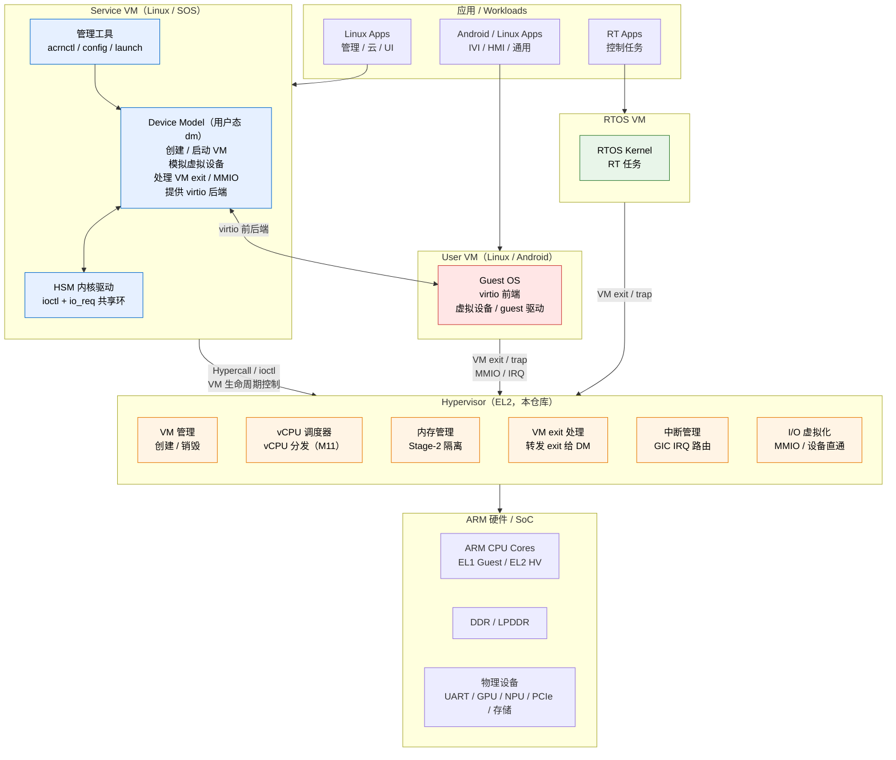
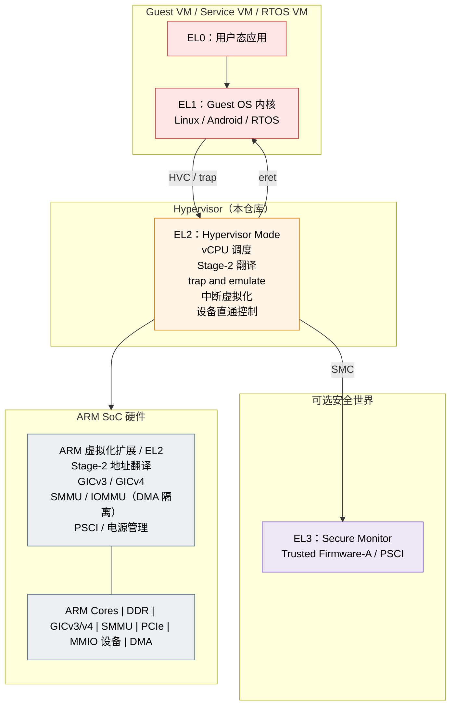

# 目标架构 / Target Architecture（ACRN 模型，M12–M15）

> **这不是当前实现。** 本文画的是路线图终点的形态——Service VM + 用户态 Device Model
> 的完整 ACRN 模型，对应 M12（Hypercall ABI + VM 生命周期）、M13（HSM 内核驱动 +
> io_req 环）、M14（Device Model + virtio 后端）、M15（RK3588 移植）。截至 M10，
> 下面图里的 Device Model、HSM、virtio 后端、SMMU 隔离**都还不存在**。
>
> **当前实现**见 [2026-06-21-architecture-zoom-out.md](2026-06-21-architecture-zoom-out.md)
> （真实调用链与端到端 trace）与 [[../../adr/0014-multi-vm-static-partition-el2-console]]
> （M10 的多 VM 静态分区与 EL2 控制台）。里程碑定义见 `roadmap` skill。
>
> 本文的两张图原先是 `CLAUDE.md` 里的 ASCII 大图，2026-09-14 迁出并改用 Mermaid 重画
> （`CLAUDE.md` 要求架构文档配 Mermaid 图）。x86 基座的对位版本见
> [../x86/architecture-x86.md](../x86/architecture-x86.md) §1、§2。

---

## 1. 顶层系统图

三类 VM 横向并列，特权与职责自上而下分层。Service VM 是唯一持有 Device Model 的
特权域，User VM 的虚拟设备全部由它在用户态后端提供；RTOS VM 走直通、不依赖 DM。

**读图要点**

- **Service VM 的双层结构是 M13/M14 的核心**：`HSM` 是内核态驱动（仿 `acrn_hsm`），
  通过 io_req 共享环把 User VM 的 MMIO exit 递到用户态；`DM` 是用户态程序，真正
  完成模拟。EL2 只负责把 exit **转发**出去，不含 virtio 后端逻辑——这是
  「不写两遍后端」那条决策（见 `roadmap` skill 的 ACRN-model strategy 第 3 条）。
- **RTOS VM 不连 DM**：它走直通路径，这也是 SMMU/DMA 隔离最终会落在哪的原因。
- **EL2 六个方框对应本仓库的目录**：`common/vm/`、`common/sched/`（M11）、
  `arch/arm64/mmu/`、`common/vmexit/`、`arch/arm64/irq/` + `arch/arm64/vgic/`、
  `dm/`。当前 `dm/` 里只有 `vuart.c` 和 `console.c`。

---

## 2. 特权层次图

ARM64 的四级异常等级是一条线性阶梯，虚拟化扩展位于 EL2。

**读图要点**

- **EL2 拥有自己的一组系统寄存器**（`VBAR_EL2`、`SP_EL2`、`TTBR0_EL2`……），与 guest
  的 EL1 组在硬件上分离，所以世界切换只需搬运"共享"部分（通用寄存器，M11 起加
  FP/SIMD）。与 x86 共用一组寄存器、靠 VMCS 整体换的做法对照见
  [../x86/architecture-x86.md](../x86/architecture-x86.md) §2。
- **EL3 是可选的**：QEMU `virt` 上本仓库自己实现 PSCI（`common/psci/psci.c`），不依赖
  TF-A；RK3588（M15）上则要与真实固件划清边界。
- **SMMU 目前是空格子**：所有 User VM 设备都由 DM 模拟，不需要 DMA 隔离；等 M15 真机
  直通时才排期（见 roadmap 的 Deferred 行）。

---

## 与当前实现的差距

| 图中元素 | 现状（M10） | 计划 |
| --- | --- | --- |
| Service VM / 特权域概念 | 无，两个 VM 对等 | M12 |
| Hypercall ABI（区别于 PSCI） | 只有 PSCI over HVC | M12 |
| HSM 内核驱动 + io_req 环 | 无 | M13 |
| Device Model（用户态） | 无；`dm/` 只有 vuart + console | M14 |
| virtio 前后端 | 无，guest 用 vuart + initramfs | M14 |
| vCPU 调度器 | 无，1:1 静态绑核 | M11 |
| SMMU / DMA 隔离 | 无 | Deferred |
| 运行时 FDT 解析 | 静态板级配置（ADR-0008） | M15 |

---

## 延伸阅读

- [2026-06-21-architecture-zoom-out.md](2026-06-21-architecture-zoom-out.md) — **当前实现**的
  鸟瞰（顶层调用链 → GIC 子系统 → 端到端 trace）。新读者从这里开始。
- [../x86/architecture-x86.md](../x86/architecture-x86.md) — 同样两张图的 x86-64 VT-x 基座
  重画，附术语对照表（EL2↔VMX root、Stage-2↔EPT、vGICv3↔vLAPIC、PSCI↔ACPI）。
- [[../../adr/0014-multi-vm-static-partition-el2-console]] — M10 的多 VM 静态分区、
  per-VM Stage-2/vGIC、EL2 独占控制台。
- `roadmap` skill（`.claude/skills/roadmap/SKILL.md`）— M0–M15 里程碑表与 ACRN-model
  strategy 的六条标准决策。
