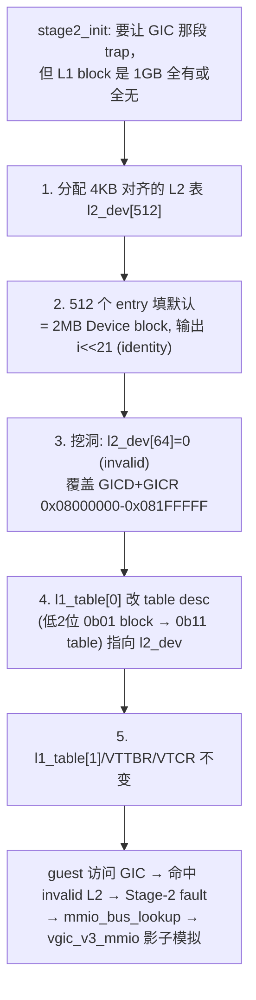
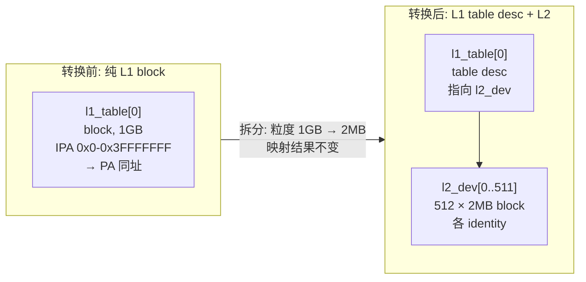
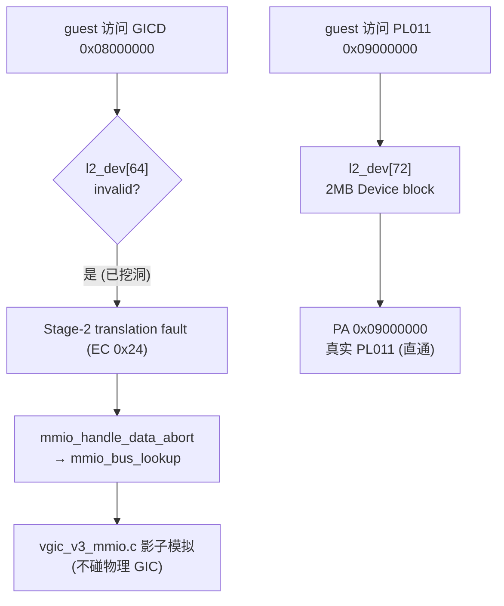

# Stage-2 L1 到 L2 映射转换说明

> 配套阅读：[stage2.md](stage2.md)（页表分级 / 粒度推导 / IPA 范围的由来）、
> [[adr-0012]]（物理 GICv3 独占）、
> [2026-06-21-gicd-gicr-trap-investigation.md](2026-06-21-gicd-gicr-trap-investigation.md)
> （实证为什么必须 punch-hole）、
> 设计与计划：`docs/superpowers/specs/2026-06-21-stage2-gic-punch-hole-design.md`。

本文面向不了解页表细节的后来者，解释 ARM64 hypervisor 的 Stage-2 页表里，一段原本由
**L1 block descriptor** 直接映射的大范围 IPA，**为什么**以及**怎样**被拆成
**L2 table + 多个 L2 entry**。

---

## 1. 背景

当前代码（`hypervisor/arch/arm64/mmu/stage2.c`）已经能用 Stage-2 页表启动 UP Linux
guest。它的 Stage-2 表**极简**——整张 L1 表只填两个表项，且都是 1 GB 的 block：

```c
/* IPA 0x00000000–0x3FFFFFFF → PA identity: Device (covers PL011 @ 0x09000000) */
l1_table[0] = 0x00000000UL |
              S2_BLOCK | S2_MEMATTR_DEV | S2_S2AP_RW | S2_SH_OSH | S2_AF | S2_XN;

/* IPA 0x40000000–0x7FFFFFFF → PA ram_pa: Normal WB (guest RAM) */
l1_table[1] = (ram_pa & 0xFFFFC0000000UL) |
              S2_BLOCK | S2_MEMATTR_NORM | S2_S2AP_RW | S2_SH_ISH | S2_AF;
```

这套「两个 1 GB block」在 M3.0 够用：一整块 Device 直通 + 一整块 RAM。但它有一个**已被
真实 boot 实证的问题**：`l1_table[0]` 把 GICD(`0x08000000`)/GICR(`0x080A0000`)也
identity 直通进来了，导致 guest 访问 GIC 时直接命中**物理 GIC**，vGICv3 影子模拟永不触发
（详见 [investigation 文档](2026-06-21-gicd-gicr-trap-investigation.md)）。要修这个问题，
就必须把 `l1_table[0]` 这个 1 GB block **拆成 L2**，单独把 GIC 那一小段「挖洞」。

> **当前实现状态**：L1→L2 的 punch-hole **已落地**（commit `feat(stage2): punch-hole
> GICD/GICR …`）。`stage2_init` 现在把 `l1_table[0]` 拆成 L2 表 `l2_dev`，并把覆盖
> GICD/GICR 的 2 MB entry 设 invalid。已由真实 boot 实证：带 `[VERIFY]` instrumentation
> 时 `vgicd/vgicr_mmio_handler` 现在会被命中（`off=0xffe8`，即 Linux GICv3 驱动探测时读的
> GICD/GICR_PIDR2），改动前为 0 次。第 9 节给出现状代码位置。

---

## 2. L1 映射是什么

在本仓库的 4 KB 粒度、`SL0=1`（从 L1 起步）配置下，**L1 表的每个表项覆盖 1 GB IPA**
（推导见 [stage2.md §2](stage2.md)）。一个 L1 表项可以是两种描述符之一：

- **L1 block descriptor**（本仓库现状用的）：直接给出一段 1 GB 物理区间的输出基址，
  **翻译到此结束**，不再往下走。`l1_table[0]`、`l1_table[1]` 都是 block。
- **L1 table descriptor**：不直接给 PA，而是**指向下一级（L2）表**，翻译继续往 L2 走。

「L1 映射」在本文里特指**用 L1 block descriptor 一次性映射 1 GB**这种粗粒度方式。

```
VTTBR_EL2 ──▶ L1 表
              l1_table[0]  = block → IPA[0x00000000,0x40000000) 整 1GB 一把映射
              l1_table[1]  = block → IPA[0x40000000,0x80000000) 整 1GB 一把映射
              (翻译在 L1 结束，没有 L2/L3)
```

---

## 3. L2 映射是什么

如果某个 L1 表项改成 **table descriptor**，它就指向一张 **L2 表**。L2 表同样是 512 个
表项，但**每个 L2 表项覆盖 2 MB**（1 GB ÷ 512 = 2 MB）。L2 表项也可以是：

- **L2 block descriptor**：直接映射 2 MB 物理区间，翻译结束；
- **L2 table descriptor**：再指向 L3 表（每项 4 KB），翻译继续。
- **invalid（值为 0）**：该 2 MB 区间**没有映射**，guest 一访问就触发 Stage-2 fault。

「L2 映射」就是把原来「1 个 L1 entry 管 1 GB」细化成「1 个 L2 表里 512 个 entry，各管
2 MB」，从而能对其中**某些 2 MB**单独设属性、单独 invalid。

```
VTTBR_EL2 ──▶ L1 表
              l1_table[0]  = table desc ──▶ L2 表 (l2_dev)
                                            l2_dev[0]   = block → IPA[0x00000000,0x00200000) 2MB
                                            ...
                                            l2_dev[64]  = invalid → IPA[0x08000000,0x08200000) 不映射(挖洞)
                                            ...
                                            l2_dev[511] = block → IPA[0x3FE00000,0x40000000) 2MB
```

---

## 4. L1 和 L2 的核心区别

| 维度 | L1 entry（本仓库 4KB 粒度） | L2 entry |
| --- | --- | --- |
| **地址粒度** | 每项 **1 GB**（`2^30`） | 每项 **2 MB**（`2^21`） |
| **覆盖范围** | 一个 L1 表（512 项）= 512 GB | 一个 L2 表（512 项）= 1 GB |
| **描述符类型** | block（结束翻译）或 table（指向 L2） | block（结束）/ table（指向 L3）/ invalid |
| **输出地址对齐** | block 输出基址须 **1 GB 对齐**（低 30 位为 0） | block 输出基址须 **2 MB 对齐**（低 21 位为 0） |
| **权限/属性控制粒度** | 只能整 1 GB 同一套属性 | 可逐 2 MB 不同属性 / 不同有效性 |
| **能否局部挖洞** | **不能**——1 GB 内要么全映射要么全不映射 | **能**——可把某个 2 MB 设 invalid 触发 trap |

一句话：**L1 粗、L2 细**。L1 一笔管 1 GB，省表省内存但「全有或全无」；L2 把这 1 GB
切成 512 份 2 MB，代价是多一张表、多一次走表，换来「逐段可控」。

---

## 5. 为什么需要从 L1 转换到 L2

L1 block 的「1 GB 全有或全无」在两类需求下会卡住，必须下沉到 L2（甚至 L3）：

1. **局部 trap（本仓库的真实动因）**：guest 的 GICD/GICR 落在 `l1_table[0]` 这个 1 GB
   Device block 里。我们想让 guest 访问 GIC 时**陷入 EL2**做影子模拟，但又想让同一个
   1 GB 里的 PL011（`0x09000000`）继续直通。L1 做不到「这 1 GB 里只有 GIC 那一小段
   trap、其余直通」——必须拆 L2，把 GIC 所在的 2 MB 单独设 invalid。

2. **细粒度权限 / 不同内存属性**：若 1 GB 内既有需要 Device-nGnRE 的 MMIO，又有需要
   Normal-WB 且只读的区段，L1 单一属性无法表达，需要拆到 L2 按 2 MB 分别设
   `S2_MEMATTR_*` / `S2_S2AP_*` / `S2_XN`。

3. **物理碎片 / 非 1 GB 对齐的搬运**：L1 block 输出基址必须 1 GB 对齐；若要把 guest 的
   某段 IPA 映射到一段非 1 GB 对齐的物理内存，L1 block 表达不了，需要 L2（2 MB 对齐）
   甚至 L3（4 KB 对齐）。

本仓库当前只因 **动因 1** 需要 L2。动因 2/3 列在这里是为了说明 L2 的一般价值。

---

## 6. 转换过程概览

把一个 L1 block 转成 L2 的步骤（以 `l1_table[0]` 为例）：

1. **分配一张 L2 表**：一个 4 KB 对齐的 `u64 l2_dev[512]`（4 KB 对齐是因为 table
   descriptor 的输出地址低 12 位必须为 0）。
2. **填默认值**：把 512 个 L2 entry 全部填成 2 MB block，输出基址 = `i << 21`（identity），
   属性沿用原 L1 block 的 Device-nGnRE，使「不挖洞的部分」行为与原 1 GB block 完全一致。
3. **挖洞**：把要 trap 的那个 2 MB entry 设为 `0`（invalid）。本仓库里 GICD+GICR 同落
   index `0x08000000 >> 21 = 64`，所以 `l2_dev[64] = 0`。
4. **改 L1 表项类型**：把 `l1_table[0]` 从 block 改成 **table descriptor**，输出指向
   `l2_dev` 的地址，描述符低 2 位由 `0b01`(block) 改成 `0b11`(table)。
5. **其余不变**：`l1_table[1]`（RAM）、`VTTBR_EL2`/`VTCR_EL2` 都不动。建表发生在
   `eret` 进 guest 之前，`stage2_activate` 已有 `dsb ish`/`isb`，无需额外 TLBI。



---

## 7. 示例一：大块内存映射拆分为 L2 映射

**场景**：把 `l1_table[0]` 原本「1 个 L1 block 映射整 1 GB」拆成「1 个 L1 table desc +
512 个 L2 entry，各映射 2 MB」。这是纯结构拆分，**映射结果对绝大多数地址不变**，只是
把粒度从 1 GB 降到 2 MB，为后续挖洞做准备。

### 转换前（现状：纯 L1 block）

- **页表结构**：`l1_table[0]` = block descriptor，翻译在 L1 结束。
- **IPA→PA**：IPA `[0x00000000, 0x40000000)` identity 映射到 PA 同址（Device-nGnRE）。
  例：IPA `0x09000000`（PL011）→ PA `0x09000000`；IPA `0x08000000`（GICD）→ PA `0x08000000`。
- **L1 entry**：block，输出基址 `0x00000000`，低 2 位 `0b01`。

```
L1 表
  l1_table[0] = [block] 输出基址 0x00000000, Device-nGnRE
                └─ IPA[0x00000000,0x40000000) ── identity ──▶ PA 同址 (整 1GB)
```

### 转换后（拆成 L2，先不挖洞）

- **页表结构**：`l1_table[0]` = table descriptor，指向 `l2_dev`；翻译走到 L2 才结束。
- **IPA→PA**：每个 `l2_dev[i]` = 2 MB block，输出基址 `i << 21`，identity。整体映射结果
  与转换前**完全一致**（IPA `0x09000000` 仍 → PA `0x09000000`），只是现在由 512 个 2 MB
  entry 拼出来，而非 1 个 1 GB block。
- **L1 entry**：从 block 变成 **table desc**（低 2 位 `0b01` → `0b11`，输出地址改成
  `l2_dev` 的基址）。**L2 entry**：block，每个管 2 MB。

```
L1 表                          L2 表 (l2_dev, 512 项, 各 2MB)
  l1_table[0] = [table] ──────▶ l2_dev[0]   = [block] 0x00000000  IPA[0x00000000,0x00200000)
                                l2_dev[1]   = [block] 0x00200000  IPA[0x00200000,0x00400000)
                                ...
                                l2_dev[64]  = [block] 0x08000000  IPA[0x08000000,0x08200000) (GIC, 暂仍直通)
                                ...
                                l2_dev[72]  = [block] 0x09000000  IPA[0x09000000,0x09200000) (PL011)
                                ...
                                l2_dev[511] = [block] 0x3FE00000  IPA[0x3FE00000,0x40000000)
```



**L1 vs L2 区别（本例）**：转换前 1 个 L1 block 管 1 GB；转换后 1 个 L1 table desc +
512 个 L2 block，各管 2 MB。**这一步没有改变任何 IPA→PA 的结果**，纯粹把控制粒度变细。

**为什么需要 L2**：本例本身只是结构拆分，真正的目的是为示例二的「挖洞」铺路——只有先
有了 2 MB 粒度的 L2 entry，才能在示例二里单独把 GIC 那一个 entry 设 invalid。

---

## 8. 示例二：需要细粒度权限控制的映射

**场景**：在示例一的 L2 结构上，把覆盖 GICD/GICR 的那个 2 MB entry 设为 **invalid**，
让 guest 访问 GIC 时 fault → trap-and-emulate，而**同一个 1 GB 内**的 PL011 仍直通。这正是
L1 block「全有或全无」做不到、必须用 L2 的典型场景。

### 关键地址（已实测核对）

| 设备 | IPA 基址 | 大小 | `>> 21` = L2 index | 落在哪个 2MB |
| --- | --- | --- | --- | --- |
| GICD | `0x08000000` | 64 KB | **64** | `0x08000000–0x081FFFFF` |
| GICR | `0x080A0000` | 128 KB | **64** | 同上（同一个 entry） |
| PL011 | `0x09000000` | 4 KB | **72** | `0x09000000–0x091FFFFF`（另一个 entry） |

GICD 与 GICR **同落 index 64**，PL011 在 **index 72**——所以「挖洞 index 64、保留 72」
就能精确地只 trap GIC、只直通 PL011。

### 转换前（示例一的 L2，全 identity，GIC 仍直通）

- **页表结构**：`l1_table[0]` = table desc → `l2_dev`，`l2_dev[64]` = 2 MB Device block。
- **IPA→PA**：IPA `0x08000000`（GICD）→ PA `0x08000000`（**物理 GIC**，无 trap）。
- **问题**：guest 访问 GIC 直接命中真实硬件，vGICv3 影子模拟（`vgic_v3_mmio.c`）永不触发。

### 转换后（挖洞：index 64 设 invalid）

- **页表结构**：`l2_dev[64] = 0`（invalid）。其余 entry（含 index 72 的 PL011）不变。
- **IPA→PA**：IPA `0x08000000`（GICD）→ **无 PA 映射** → Stage-2 translation fault；
  IPA `0x09000000`（PL011）→ PA `0x09000000`（仍直通）。
- **L1 entry**：table desc（不变）。**L2 entry**：index 64 从 block 变 invalid（值=0）；
  index 72 仍是 block。
- **效果**：guest 读写 GICD/GICR → fault → EC 0x24 → `mmio_handle_data_abort` →
  `mmio_bus_lookup` 命中已注册的 GICD/GICR 区段 → `vgic_v3_mmio.c` 影子模拟应答，
  **不再落到物理 GIC**。

```
L2 表 (l2_dev)
  ...
  l2_dev[64]  = 0 (INVALID)   IPA[0x08000000,0x08200000)  ← GICD+GICR 挖洞 → fault → 模拟
  ...
  l2_dev[72]  = [block] 0x09000000  IPA[0x09000000,...)   ← PL011 仍 identity 直通
  ...
```



**L1 vs L2 区别（本例）**：如果还停留在 L1 block（1 GB 一把），要么整 1 GB 都 trap
（PL011 也被迫 trap，earlycon 直通就没了），要么整 1 GB 都直通（GIC 无法模拟）——
**两难**。下沉到 L2 后，2 MB 粒度让「GIC 这 2 MB invalid、PL011 那 2 MB 直通」得以共存。

**为什么这个场景需要 L2**：trap 与直通的边界（GIC vs PL011）落在同一个 1 GB 内、相距仅
`0x01000000`，远小于 L1 的 1 GB 粒度。只有 2 MB 的 L2 粒度（甚至 4 KB 的 L3）才能把这条
边界划进页表。这就是「局部 trap / 细粒度属性」必须从 L1 转 L2 的根本原因。

> 注：本例为聚焦演示，挖洞粒度取整个 2 MB entry（index 64）。GICD 只占 64 KB、GICR 占
> 128 KB，整个 2 MB 里除 GIC 外没有其它需直通的设备（guest `qemu_virt.dts` 已核对），
> 故 punch 整 2 MB 无副作用。若某天该 2 MB 内混入需直通的设备，则需再下沉一级到 **L3**
> （4 KB 粒度）只挖 GIC 的那几页——机制与 L1→L2 完全同构，多套一层表而已。

---

## 9. 代码路径说明

> L1→L2 punch-hole **已实现**（commit `feat(stage2): punch-hole GICD/GICR …`）。以下都是
> 现状代码，可直接在仓库中找到。

### 9.1 建表侧（`hypervisor/arch/arm64/mmu/stage2.c`）

- **`stage2_init(struct vcpu *, u32 vmid, u64 ram_pa)`**：现在把 `l1_table[0]` 建成
  **table descriptor 指向 `l2_dev`**（不再是 1 GB block）。具体：
  - 宏 `S2_TABLE = 0x3ULL`（table descriptor，低 2 位 `0b11`）。
  - 静态表 `static u64 l2_dev[512] __attribute__((aligned(4096)))`。
  - 一个 `for` 循环把 512 个 L2 entry 填成 2 MB identity Device block（输出基址 `i << 21`）。
  - `u32 gic_l2_idx = BOARD_GIC_DIST_BASE >> 21;` 算出挖洞索引；若 `BOARD_GIC_RDIST_BASE >> 21`
    与之不同则 `printk` 告警（地址布局变更的早期信号）；然后 `l2_dev[gic_l2_idx] = 0`（invalid）。
  - 最后 `l1_table[0] = (u64)(uintptr_t)l2_dev | S2_TABLE`。
  - `l1_table[1]`（RAM 的 1 GB block）与 `vttbr_el2` 赋值不变。
- **`stage2_activate(const struct vcpu *)`**（同文件）：把 `VTCR_EL2`/`VTTBR_EL2` 写入硬件，
  含 `dsb ish`/`isb`。punch-hole 不改这个函数（建表在首次 `eret` 进 guest 前，无需额外 TLBI）。
- **没有独立的「L1→L2 转换函数」**：是在 `stage2_init` 内**一次性建表**（直接建成带 L2 的
  形态），并非运行时把已有 L1 block 动态拆分。所以仓库里**没有** `stage2_split_block()`
  之类的函数，不必去找。

### 9.2 trap 接收侧（已就绪，与本改动解耦）

guest 访问被挖洞的 GIC 地址 → Stage-2 fault 后，由这条既有链路处理：

- `hypervisor/arch/arm64/vmexit/vmexit.c` → `handle_exit()`：`case 0x24` 分流 Data Abort。
- `hypervisor/arch/arm64/vmexit/mmio.c` → `mmio_handle_data_abort()` / `mmio_bus_lookup()`：
  解析 ISS、按 IPA 查 MMIO 总线。
- `hypervisor/arch/arm64/irq/vgic_v3_mmio.c` → `vgicd_mmio_handler()` / `vgicr_mmio_handler()`，
  经 `vgicv3_mmio_init()` 注册到 MMIO 总线。

> 这条接收链在 punch-hole 之前就存在，只是当时 GIC 访问从不 fault、handler 从未被调用
> （[investigation 文档](2026-06-21-gicd-gicr-trap-investigation.md) 实证「命中 0 次」）。
> punch-hole 落地后，真实 boot 实证这两个 handler 现在会被命中（`off=0xffe8`，即 Linux
> GICv3 驱动探测时读的 GICD/GICR_PIDR2）。

---

## 10. 常见问题和注意事项

**Q：L1→L2 是运行时动态拆分吗？**
A：不是。本仓库的做法是在 `stage2_init` **建表时直接建成带 L2 的形态**（示例一的「转换前」
只是用来对照说明粒度变化，并非代码里先建 block 再拆）。没有运行时 split 逻辑。

**Q：挖洞为什么是把 entry 设 0（invalid），而不是设某个特殊「trap」属性？**
A：Stage-2 里「该 IPA 没有有效映射」本身就会产生 translation fault 并路由到 EL2
（`HCR_EL2.VM=1` + 异常路由）。invalid（描述符低位非 valid）就是最直接的「制造 fault」
手段，不需要特殊属性位。

**Q：拆成 L2 会不会拖慢 guest？**
A：多一级走表，但仅首次未命中时；TLB 缓存的是 Stage-1+Stage-2 合并结果，命中后与 L1
block 无差异。Device 区段访问频率低，影响可忽略。

**Q：为什么不直接拆到 L3（4 KB）做最精确的挖洞？**
A：能，但本场景不需要——GIC 所在的 2 MB 内没有其它需直通设备，整 2 MB invalid 即可，
拆 L3 只会多两张表、多一层走表。**够用就好**符合本项目「小步快走」哲学。若将来该 2 MB
混入需直通设备，再下沉 L3（机制同构）。

**Q：改了 L1 entry 类型需要刷 TLB 吗？**
A：本场景不需要。建表发生在**首次** `eret` 进 guest 之前，此前没有该 VMID 的有效
Stage-2 翻译被缓存；`stage2_activate` 的 `dsb ish`/`isb` 已保证写表对 MMU 可见。
（若将来要**运行时**改活跃的 Stage-2 表，则必须配 `TLBI` —— 那是 M3.5+ 的话题。）

**Q：`l2_dev` 为什么必须 4 KB 对齐？**
A：L1 table descriptor 的「下一级表基址」字段要求低 12 位为 0（表必须页对齐），与
`l1_table` 自身 `aligned(4096)` 同理。

---

## 修改的文件

本文档（reference）的改动：

- **新增** `docs/reference/stage2-l1-to-l2.md`（本文）。
- **更新** `docs/reference/README.md`（在索引中加入本文一行）。

配套的代码落地（独立 commit）：

- **`hypervisor/arch/arm64/mmu/stage2.c`** —— punch-hole 实现（commit
  `feat(stage2): punch-hole GICD/GICR …`），按
  `docs/superpowers/plans/2026-06-21-stage2-gic-punch-hole.md` 执行，已由真实 boot 实证。
- **`docs/adr/0012-physical-gicv3-ownership.md`** —— 补一句指向本实现。
