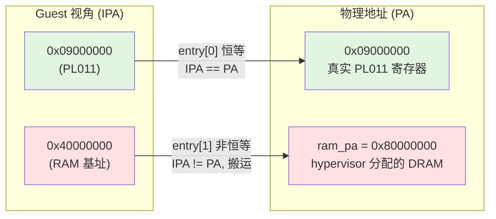
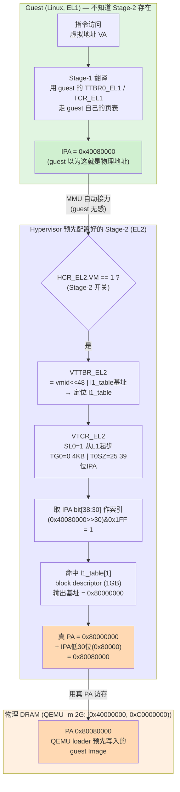

# Stage-2 页表与 IPA 范围解析（M3.0）

本文解释 `hypervisor/arch/arm64/mmu/stage2.c` 中 Stage-2 映射的几个常见疑问：

1. `l1_table[0]` 覆盖的 IPA 范围 `0x00000000 – 0x3FFFFFFF` 是怎么来的？
2. L0/L1/L2/L3 是什么？
3. 每一级页表的粒度（512GB / 1GB / 2MB / 4KB）是如何推导出来的？

---

## 1. 多级页表与 L0/L1/L2/L3

L0/L1/L2/L3 就是**页表等级（translation table levels）**——多级页表里的层级编号。

### 为什么需要多级

一个中间物理地址（IPA）要翻译成物理地址（PA），理论上可以用一张巨大的平坦表（每页一个表项）。但 39 位地址空间、4KB 页 = 2²⁷ ≈ 1.3 亿个表项，一张表占约 1GB 内存，且绝大多数为空，太浪费。

解法是**把地址高位切成若干段，每段索引一级表**，像查字典一样逐层往下走，这就是 L0→L1→L2→L3。

### 翻译过程（“查字典”）

```
VTTBR_EL2 ──→ [L1 表] ──idx──→ [L2 表] ──idx──→ [L3 表] ──idx──→ 物理页
              entry              entry            entry
```

- 每一级用地址里对应的位段当下标，取出一个表项；
- 表项要么是 **table descriptor**（指向下一级表，继续往下走），要么是 **block/page descriptor**（直接给出物理地址，翻译结束）。

---

## 2. 每级粒度的推导（4KB 粒度配置）

粒度链不是定义出来的，而是从“地址位怎么切”一步步推出来的。两个架构选择决定了一切：

### 起点：4KB 页 + 每级 9 位索引

**① 粒度选 4KB** → 页内偏移需要 `log₂(4096) = 12` 位。所以地址最低 **12 位是页内偏移**，剩下高位才用来查表。

**② 每张表正好占 1 个页（4KB）**。一个表项 8 字节（64 位），那么一张表能放：

```
4096 字节 ÷ 8 字节/项 = 512 项 = 2⁹ 项
```

512 项 → 索引一张表需要 **9 位**。即**每一级表用 9 位索引**。

### 由此推出每级粒度

“某级一个表项覆盖多大地址” = `2^(它下面还剩多少位)`，从底往上数：

```
L3 entry: 下面只剩 12 位偏移              → 2¹²  = 4 KB
L2 entry: 下面 = L3索引(9) + 偏移(12) = 21位 → 2²¹  = 2 MB
L1 entry: 下面 = 9 + 9 + 12 = 30位          → 2³⁰  = 1 GB
L0 entry: 下面 = 9 + 9 + 9 + 12 = 39位      → 2³⁹  = 512 GB
```

换个角度：**每上一级，粒度 ×512**（多管了 9 位索引）：

```
4KB ×512 = 2MB ×512 = 1GB ×512 = 512GB
 L3        L2         L1         L0
```

### 地址位的完整切法

```
位:  47        39 38      30 29      21 20      12 11        0
     ┌───────────┬──────────┬──────────┬──────────┬──────────┐
     │  L0 idx   │  L1 idx  │  L2 idx  │  L3 idx  │  页内偏移 │
     │   9 位    │   9 位   │   9 位   │   9 位   │   12 位   │
     └───────────┴──────────┴──────────┴──────────┴──────────┘
        512GB       1GB        2MB        4KB
       (每项)      (每项)     (每项)     (每项)
```

一个表项覆盖的范围 = 它右边所有位能表示的地址数。L1 表项右边还有 30 位，`2³⁰ = 1GB`，所以 L1 粒度就是 1GB。

### 粒度随 granule 变化

这套 512 / 9位 是 **4KB 粒度专属的**。换粒度则数字全变：

| 粒度 | 偏移位 | 表项数 / 索引位 | L3 | L2 | L1 |
|------|-------|---------------|----|----|----|
| **4KB** | 12 | 512 / 9位 | 4KB | 2MB | 1GB |
| 16KB | 14 | 2048 / 11位 | 16KB | 32MB | 64GB |
| 64KB | 16 | 8192 / 13位 | 64KB | 512MB | (无 L1) |

`stage2.c` 中 `VTCR_TG0 = 0` 即选了 **4KB 粒度**，走第一行。

**一句话总结：** 粒度链 = 偏移位（4KB → 12）+ 每级索引位（一表一页 → 9）累加出的 2 的幂。不是有人规定“L1 = 1GB”，而是 `2^(9+9+12) = 1GB` 自然算出来的。

---

## 3. `0x00000000 – 0x3FFFFFFF` 的由来

这个范围不是“算”出来的，而是**由 L1 页表项的固定步长机械决定的**——它就是 L1 页表第 0 个表项（`l1_table[0]`）所覆盖的 IPA 范围。

### 配置回顾（`stage2.c`，VTCR_EL2）

- `TG0 = 0`：4KB 粒度
- `T0SZ = 25`：39 位 IPA
- `SL0 = 1`：**Start Level = L1**，翻译从 L1 起步（跳过 L0）

在这套配置下，L1 每个表项天然覆盖 **1 GB = 0x40000000 字节**：

```
l1_table[0]  → IPA [0x00000000, 0x40000000)  = 0x00000000 – 0x3FFFFFFF   (第 1 个 GB)
l1_table[1]  → IPA [0x40000000, 0x80000000)  = 0x40000000 – 0x7FFFFFFF   (第 2 个 GB)
l1_table[2]  → IPA [0x80000000, 0xC0000000)  ...
```

所以 `0x3FFFFFFF` 就是**第 0 项的末地址 = 1GB − 1 = 0x40000000 − 1**。它不是为对齐某个设备选的边界，而是 L1 entry[0] 的天然边界。

### 只用了 L1：为什么没有 L2/L3

`SL0=1` 让翻译从 L1 开始；而 `l1_table[0]` 和 `l1_table[1]` 都是 **block descriptor（`S2_BLOCK`）**，不是指向下级表的 table descriptor。因此翻译**在 L1 就结束**，每个表项直接覆盖一整个 1GB block，根本没有 L2/L3 表。

用 1GB block 而非细分到页，是因为 M3.0 只需要“一整块 Device + 一整块 RAM”，两个表项就够，最省事。

| 级别 | 粒度（4KB配置） | M3.0 是否用到 |
|------|----------------|--------------|
| L0 | 512 GB | 否（SL0=1 跳过） |
| **L1** | **1 GB** | ✅ 用 block 直接结束翻译 |
| L2 | 2 MB | 否 |
| L3 | 4 KB | 否 |

---

## 4. 两个 block 的语义

### entry[0]：Device 恒等映射（`stage2.c`）

```c
/* IPA 0x00000000–0x3FFFFFFF → PA identity: Device (covers PL011 @ 0x09000000) */
l1_table[0] = 0x00000000UL | S2_BLOCK | S2_MEMATTR_DEV | S2_S2AP_RW | S2_SH_OSH | S2_AF | S2_XN;
```

- 真正意图：**覆盖 QEMU `virt` 的低地址外设**——PL011 UART @ `0x09000000`、GIC @ `0x08000000` 等全部落在第一个 1GB 内。
- **identity（恒等）映射**：输出地址写 `0x00000000`，块输出地址 = IPA 基址，故 IPA `0x09000000` → PA `0x09000000`，把物理 PL011 直通给 guest，Linux earlycon 可直接写真实 UART（M3.0 目标）。
- 属性 **Device-nGnRE + XN**：MMIO 区域不可缓存、不可取指执行。

### entry[1]：guest RAM（Normal WB）

```c
/* IPA 0x40000000–0x7FFFFFFF → PA ram_pa: Normal WB (guest RAM) */
l1_table[1] = (ram_pa & 0xFFFFC0000000UL) | S2_BLOCK | S2_MEMATTR_NORM | S2_S2AP_RW | S2_SH_ISH | S2_AF;
```

- 第 2 个 GB（`0x40000000–0x7FFFFFFF`）**非恒等地**映射到 `ram_pa`，属性 Normal WB。
- 这也是 Linux 启动协议里 guest `mem_base` 落在 `0x40000000` 的原因。

### 恒等映射 vs 非恒等映射

**核心一句话：看“输入地址（IPA）”和“输出地址（PA）”是否相等。**

- **恒等映射（identity）**：IPA == PA，地址不变，原样穿过页表。entry[0] 就是——块描述符的输出基址写成 `0x00000000`，等于该 block 的 IPA 基址，于是 `IPA + offset → PA + offset`，数值完全一致。目的是把**真实的物理外设**（PL011、GIC）按原地址直通给 guest，guest 用 `0x09000000` 访问 UART，硬件上就是真的 `0x09000000`。
- **非恒等映射（non-identity）**：IPA != PA，页表把 guest 看到的地址**搬运**到另一段物理内存。entry[1] 就是——guest 以为自己的 RAM 在 `0x40000000`，实际被映射到 hypervisor 分配的 `ram_pa`（如 `0x80000000`）。guest 完全感知不到这层搬运，这正是 Stage-2 做内存隔离/重定位的手段。



**为什么外设要恒等、RAM 可以非恒等？**

| | entry[0] Device | entry[1] RAM |
|---|---|---|
| 目标 | 物理 MMIO 寄存器（位置固定，由 SoC 决定） | 一块普通 DRAM（放哪都行） |
| 地址能否搬动 | **不能**——`0x09000000` 是硬件焊死的 UART 位置，改 PA 就指不到真寄存器了 | **能**——只要 guest 内部自洽，物理上放在哪一段 DRAM 都无所谓 |
| 所以选择 | 恒等：IPA 直接当 PA 用 | 非恒等：guest 看到 `0x40000000`，实际落到 `ram_pa` |

形象地说：**恒等映射像“透明玻璃”**，guest 透过它看到的就是底层真实硬件地址；**非恒等映射像“转发邮局”**，guest 寄到 `0x40000000` 的信，被悄悄转投到 `ram_pa`，收发双方都不知道中间换过地址。

> 注意：entry[1] 的输出基址必须 1GB 对齐（`ram_pa & 0xFFFFC0000000`），因为 L1 block 的输出地址低 30 位被架构强制为 0——这是 1GB-block 的硬约束，不是“凑整”。

---

## 5. 与 M3.1 的衔接

注释说 entry[0] “covers PL011”，但同一个 Device block 其实也把 GIC（`0x08000000`）恒等映射了进来。M3.0 设计为 guest 一访问 GIC 就 stall（尚无 trap 框架）。

M3.1 引入 MMIO trap 后，GIC 那段地址需要从这个直通 block 里“挖洞”：把 entry[0] 这个 1GB block 拆成下一级表（L2 / L3），让 GIC 那一小段单独不映射，从而触发 Stage-2 data abort → trap-and-emulate。届时 L2/L3 才会真正登场。

---

## 6. hypervisor 自身的 PA 在哪分配？内存是怎么管理的？

> 疑问：`ram_pa` 弄清楚了，那 **hypervisor 自己**的物理地址在哪里分配的？有没有做内存管理？

### 6.1 hyp 镜像的 PA：链接脚本硬编码，无运行时分配

hypervisor 自身的 PA **不是分配出来的，而是在链接脚本里写死的**。
`hypervisor/arch/arm64/board/qemu_virt/linker.lds` 第一行：

```ld
. = 0x40080000;
```

这就是 hypervisor 镜像的链接/加载基址，也是 `_start` 入口。QEMU 把 `hypervisor.bin`
加载到 PA `0x40080000`（`virt` 的默认 kernel load 地址），链接脚本从这里往上顺序铺开各段：

```
0x40080000  .text    (_start, vectors, 代码)
            .rodata
            .data
            .bss     (__bss_start … __bss_end，head.S 启动时清零)
            +0x4000  16 KiB 启动栈 → __stack_top   (SP_EL2 设到这里)
```

整个 hyp 占用的 PA = `0x40080000` 到 `__stack_top` 的一段**连续区域**，大小由链接时
各段实际大小决定（链接器算出），运行时不变。注意 EL2 自身**没有开 Stage-1 MMU**——
hypervisor 直接跑在物理地址上。

### 6.2 有没有内存管理？——没有，且是有意为之

搜遍 `hypervisor/`：**没有任何 allocator**——没有 `malloc`/`kmalloc`、没有页分配器
（buddy/slab）、没有 heap、没有 `sbrk`。内存“管理”是**静态、编译期固定**的，分三类：

| 类别 | 分配方式 | 例子 |
|------|----------|------|
| **hyp 自身镜像** | 链接脚本固定基址 `0x40080000` + 16KB 固定栈 | `linker.lds` |
| **运行时结构体 / 页表** | 全部是 `static` 全局变量，落在 `.bss`，编译期就分配好 | `l1_table[512]`（`aligned(4096)` 保证 VTTBR_EL2[11:0]=0）、`g_vgicd`、`g_vgicr`、`g_console`、`mmio_regions[]` |
| **guest RAM** | board.h 里写死的固定 PA 窗口，**不是 hyp 分配的**，只是约定的物理区间 | `BOARD_LINUX_RAM_PA = 0x80000000`（256MB，1GB 对齐），靠物理布局保证不与 hyp（`0x40080000`）重叠 |

`l1_table[1]` 把 guest 的 IPA `0x40000000` 映射到 `BOARD_LINUX_RAM_PA`，就是第 4 节
entry[1] 那条非恒等映射。

### 6.3 为什么这样设计 / 代价

这是学习型 hypervisor 的有意取舍，和项目“small, fast iterations + 单 VM 单 vCPU”的
哲学一致：

- 目标只跑**一个**固定的 UP Linux guest，VM 数量与内存布局编译期全知道，无需动态分配。
- 没有 allocator → 没有碎片、没有 OOM、没有锁、没有分配失败路径，复杂度大幅降低，
  便于先把 Stage-2 / vGIC / virtio 这些核心机制跑通。

**代价 / 后续暴露点**：到 **M3.5（SMP）** 和 **M4（RK3588 port）** 时，多 vCPU、
每 pCPU 状态、多 VM 会需要真正的页分配器与动态 VM 内存管理；目前“一切 static +
链接脚本写死”的方案撑不到那时，届时大概率要引入一个早期 page allocator——这是那两个
里程碑要补的第一个子系统。

---

## 7. guest 是怎么访问这段内存的？用到哪些寄存器？

> 疑问：`l1_table[1]` 把 IPA 搬到 PA 已经清楚了，但 **guest 实际跑起来时，一次访存到底
> 走了哪些寄存器、几个步骤**？

核心结论先说：**guest 完全不知道有 Stage-2**。它像在裸机上一样用自己的页表做
VA→“物理地址”翻译，但它产出的“物理地址”其实是 **IPA**，会被 MMU 偷偷再过一遍
hypervisor 配置的 Stage-2 表，才得到真 PA。这就是 ARMv8 的**两阶段翻译
（2-stage translation）**。

### 7.1 涉及的寄存器（谁拥有、谁设置）

| 寄存器 | 谁设置 | 作用 |
|--------|--------|------|
| **`TTBR0_EL1` / `TCR_EL1`** | **guest (Linux EL1)** 自己设 | **Stage-1**：guest 的 **VA → IPA**（guest 以为这是物理地址，到此为止） |
| **`HCR_EL2.VM`** | hypervisor（开 EL2 时） | Stage-2 **总开关**：置 1 才启用第二阶段翻译，guest 的“物理地址”才会被再翻一次 |
| **`VTTBR_EL2`** | **hypervisor**（`stage2.c:53/65`） | **Stage-2 页表基址**：`(vmid<<48) \| l1_table基址`，指向那张 4KB 的 `l1_table` |
| **`VTCR_EL2`** | **hypervisor**（`stage2.c:64`） | **Stage-2 翻译参数**：`T0SZ=25`(39位IPA)、`SL0=1`(从 L1 起步)、`TG0=0`(4KB 粒度)、`PS=2`(40位PA) |

> 注意：Stage-1（`TTBR0_EL1`）是 guest 的事，hypervisor 完全不碰；hypervisor 只负责
> Stage-2（`VTTBR_EL2`/`VTCR_EL2`），且在 `stage2_activate()` 里一次性写好后，每次访存
> 都是**硬件自动**走表，不需要 hyp 介入（命中映射时不会 trap）。

### 7.2 两阶段流程（以 guest 取指 IPA `0x40080000` 为例）

1. **Stage-1（guest 自管）**：CPU 用 guest 的 `TTBR0_EL1`/`TCR_EL1` 走 guest 页表，
   把 VA 翻成 **IPA = 0x40080000**。guest 以为这就是物理地址，翻译结束。
2. **Stage-2（对 guest 透明，硬件自动接力）**：因为 `HCR_EL2.VM=1`，MMU 不直接拿这个
   IPA 访存，而是用它再查 Stage-2——
   - 用 `VTTBR_EL2` 找到 `l1_table` 基址；
   - `VTCR_EL2.SL0=1` → 从 **L1** 起步；取 IPA bit[38:30] 作索引
     = `(0x40080000 >> 30) & 0x1FF` = **1** → 命中 **`l1_table[1]`**；
   - `l1_table[1]` 是 **block descriptor**（1GB block），翻译就此结束，输出基址
     = `0x80000000`；
   - 真 PA = block 基址 + IPA 低 30 位偏移 = `0x80000000 + 0x80000` = **PA 0x80080000**。
3. **真访存**：CPU 拿 PA `0x80080000` 访问 DRAM——正是 QEMU 在 `-m 2G` 的 DRAM 里、用
   `-device loader,addr=0x80080000` 预先写好 Image 的地方，取到指令。✓

后续命中时还有 **TLB**：Stage-1+Stage-2 合并后的结果缓存进 TLB，下次同地址直接出 PA，
不再走表。

### 7.3 Mermaid 图解



### 7.4 一句话串起来

guest 用 **`TTBR0_EL1`** 做 VA→IPA（它以为到此为止），硬件再用 hypervisor 设的
**`VTTBR_EL2`**（指向 `l1_table`）+ **`VTCR_EL2`**（`SL0=1` / 4KB）做 IPA→PA：取 IPA
bit[38:30]=1 命中 `l1_table[1]` 这个 1GB block，加偏移得真 PA `0x80080000`，最终落在
`-m 2G` 的真实 DRAM 里（见第 6 节：这个目标 PA 必须命中 `-m` 划出的 DRAM 区间）。两阶段
对 guest 完全透明，隔离与重定位都发生在 Stage-2 这一层。
