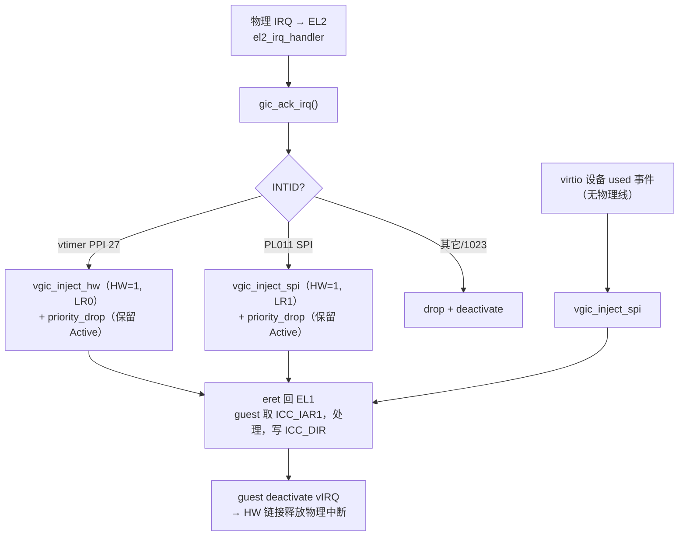

# vGIC 中断注入逻辑

本文解释 hypervisor 怎么把一个中断「注入」进 guest，让 guest 在 EL1 看到并处理它。
源码：

- `hypervisor/arch/arm64/irq/vgic.c` — 三个注入函数 + save/restore。
- `hypervisor/arch/arm64/irq/vgic.h` — `ICH_LR<n>_EL2` 列表寄存器位定义。
- `hypervisor/arch/arm64/irq/irq_handler.c` — EL2 物理 IRQ → 选哪种注入。

配套阅读：物理 IRQ 怎么进到 EL2 见 [vcpu-run-world-switch.md](vcpu-run-world-switch.md)；
为什么 vtimer 只 priority-drop 不 deactivate 见 ADR-0001
（`docs/adr/0001-vtimer-hardware-forwarding.md`）。

常见疑问：

1. 「注入一个中断给 guest」到底是写什么？
2. `vgic_inject_sw` / `vgic_inject_hw` / `vgic_inject_spi` 三者区别？
3. 为什么有的注入要带物理 INTID（HW=1）？

---

## 1. 注入 = 写一个 List Register（ICH_LR）

GICv3 的虚拟化靠 **List Registers（`ICH_LR0..3_EL2`）**：硬件维护一个虚拟 CPU
接口，guest 在 EL1 读 `ICC_IAR1_EL1`、写 `ICC_EOIR1_EL1` 时，实际命中的是 List
Register 里描述的虚拟中断（硬件把 `ICC_*` 重定向到 `ICV_*`）。

所以「**注入一个中断**」就是：**在某个 `ICH_LR<n>_EL2` 里填一条 64 位描述符**，标明
这个虚拟中断的 INTID、优先级、组、状态（Pending）。下一次 `eret` 回 EL1 时，硬件就
按 PMR / Group enable 把它呈现给 guest，触发 guest 的 IRQ 向量。

一条 LR 描述符的关键字段（`vgic.h`）：

| 字段 | 位 | 含义 |
|------|----|------|
| State | [63:62] | `0b01` = Pending（`ICH_LR_STATE_PENDING`） |
| HW | [61] | 0=纯软件注入；1=硬件转发，链一个物理 INTID |
| Group1 | [60] | 走 Group 1（NS） |
| Priority | [55:48] | 虚拟优先级 |
| pINTID | [44:32] | HW=1 时的物理 INTID |
| vINTID | [31:0] | guest 看到的虚拟 INTID |

vCPU 结构里有一份 `ich_lr[0..3]` 影子拷贝；注入函数**同时写影子和实时寄存器**，
影子供 `vgic_save/restore` 在上下文切换时搬运。

---

## 2. 三种注入函数

### 2.1 `vgic_inject_sw` —— 纯软件注入（HW=0），用 LR0

```c
u64 lr = ICH_LR_STATE_PENDING | ICH_LR_GROUP1 |
         (prio << ICH_LR_PRIO_SHIFT) | (vintid & ICH_LR_VINTID_MASK);
vcpu->ich_lr[0] = lr;
SYSREG_WRITE(ICH_LR0_EL2, lr);
```

最简单的一种：纯虚拟中断，guest 内部 deactivate 后就结束，**不牵连任何物理中断**。
M2 的 HVC 测试钩子用它。注意写完不需要 `isb`——回 EL1 的 `eret` 本身就是同步点。

### 2.2 `vgic_inject_hw` —— 硬件转发注入（HW=1），用 LR0

```c
u64 lr = ... | ICH_LR_HW | (pintid << ICH_LR_PINTID_SHIFT) | vintid;
```

比 sw 版多了 `ICH_LR_HW` 位和 **pINTID**。HW=1 的语义：guest 在 EL1 写
`ICC_DIR_EL1` **deactivate 这个虚拟中断时，硬件会顺着 LR 的链接自动 deactivate 对应
的物理中断**。

为什么需要这个？**电平触发（level-sensitive）的物理线**——比如虚拟定时器 PPI 27——
只要条件还在，物理线会一直拉高。如果 hypervisor 在 EL2 就把它 deactivate，guest 还
没处理完，线会立刻重新 pending，风暴打死 guest。HW 链接让「物理中断的释放时机」交给
**guest 处理完那一刻**，正好对齐。详见 ADR-0001。

### 2.3 `vgic_inject_spi` —— SPI 注入，固定用 LR1

```c
u64 lr = ICH_LR_STATE_PENDING | ICH_LR_HW | ICH_LR_GROUP1 |
         (0xA0 << ICH_LR_PRIO_SHIFT) |
         (intid << ICH_LR_PINTID_SHIFT) | (intid & ICH_LR_VINTID_MASK);
vcpu->ich_lr[1] = lr;
SYSREG_WRITE(ICH_LR1_EL2, lr);
```

给 SPI（INTID ≥ 32）用，**固定占 LR1**，原因写在源码注释里：vtimer 每个 tick 都重新
注入、独占 LR0，如果 SPI 也用 LR0，会在 guest 取走前被 vtimer 覆盖掉。两类中断分占
LR0 / LR1 互不踩。

> 注意一个文档/实现的细节张力：`vgic.h` 把 `vgic_inject_spi` 注释成「software (HW=0)
> 的瘦封装」，但 `vgic.c` 的实现实际带了 `ICH_LR_HW`（HW=1）并用 LR1——给了
> PL011 RX 这类电平直通线一个真实的 HW 链接。以**实现为准**：当前是 HW=1 / LR1。
> 头注释是早期 M3.3 纯模拟 virtio 时代的说法，已被 PL011 直通的需求覆盖。

---

## 3. 谁来决定用哪种注入：`el2_irq_handler`

物理 IRQ 被 `HCR_EL2.IMO=1` 路由到 EL2（走 Lower-EL IRQ 向量），保存 guest 现场后
调到 `el2_irq_handler`，它按 INTID 分流：

```c
u32 intid = gic_ack_irq();               /* 读 ICC_IAR1_EL1 */

if (intid == BOARD_VTIMER_IRQ) {         /* PPI 27 虚拟定时器 */
    vgic_inject_hw(&g_vm.vcpu, 27, 27, 0xA0);
    gic_priority_drop(intid);            /* 只 EOIR1，保留 Active（ADR-0001） */
} else if (intid == BOARD_PL011_IRQ) {   /* SPI，ttyAMA0 直通 */
    vgic_inject_spi(&g_vm.vcpu, intid);
    gic_priority_drop(intid);            /* 同样保留 Active，靠 guest 释放 */
} else {
    gic_priority_drop(intid);            /* 未预期 / 1023 伪中断 */
    gic_deactivate(intid);              /* 直接 drop + deactivate */
}
```

要点：**HW 转发的中断在 EL2 只 `gic_priority_drop`（EOIR1）、绝不 `gic_deactivate`**。
deactivate 留给 guest 在 EL1 完成，通过 LR 的 HW 链接传导到物理侧——这正是 2.2 节
说的电平线防风暴机制。只有「未预期中断」才在 EL2 直接 drop + deactivate。

此外，**纯模拟设备**（无物理 GIC 线）也会注入：M3.3 的 virtio-mmio 在
`dm/virtio_mmio.c:58` 用 used-buffer 事件直接调 `vgic_inject_spi`，路径不经过物理
IRQ handler，而是在 MMIO trap-and-emulate 处理 guest 的 kick 时触发。



---

## 4. save / restore

`vgic_save` / `vgic_restore` 把 `ICH_HCR_EL2 / ICH_VMCR_EL2 / ICH_LR0..3` 在 vCPU
结构和实时寄存器间整体搬运。M2 单 vCPU 不重调度，第一个真实用户是 M2.5 的定时器
上下文切换。M3.5 没有 scheduler：vCPU0/vCPU1 静态 1:1 绑定到各自 pCPU，每个核心
只保存/恢复自己的 vGIC 状态。若未来加入 vCPU 迁移或 overcommit，每次切换仍必须走
这对函数，否则 LR 里的待处理中断会跨 vCPU 串台。

---

> 配套阅读：物理 IRQ 进 EL2 的路径见 [vcpu-run-world-switch.md](vcpu-run-world-switch.md)；
> MMIO 模拟（virtio kick → 注入）见 [handle-exit-dispatch.md](handle-exit-dispatch.md)；
> 电平线防风暴的完整论证见 ADR-0001（`docs/adr/0001-vtimer-hardware-forwarding.md`）。
