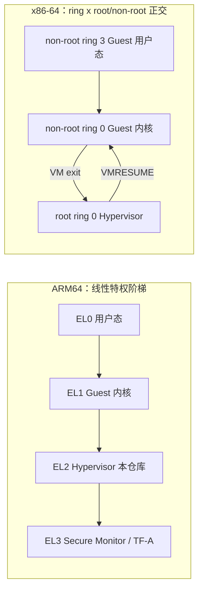
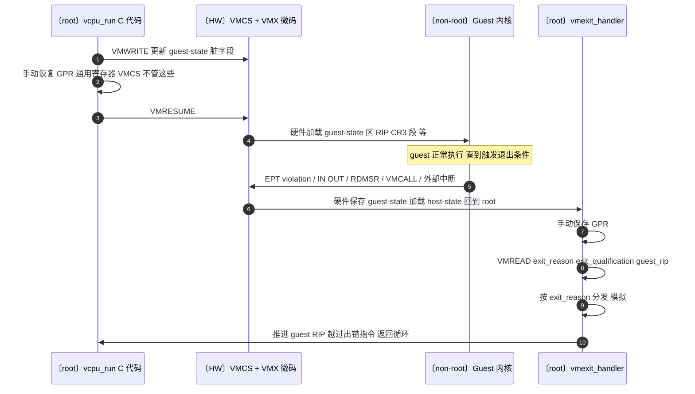
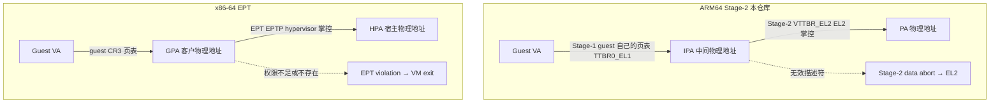
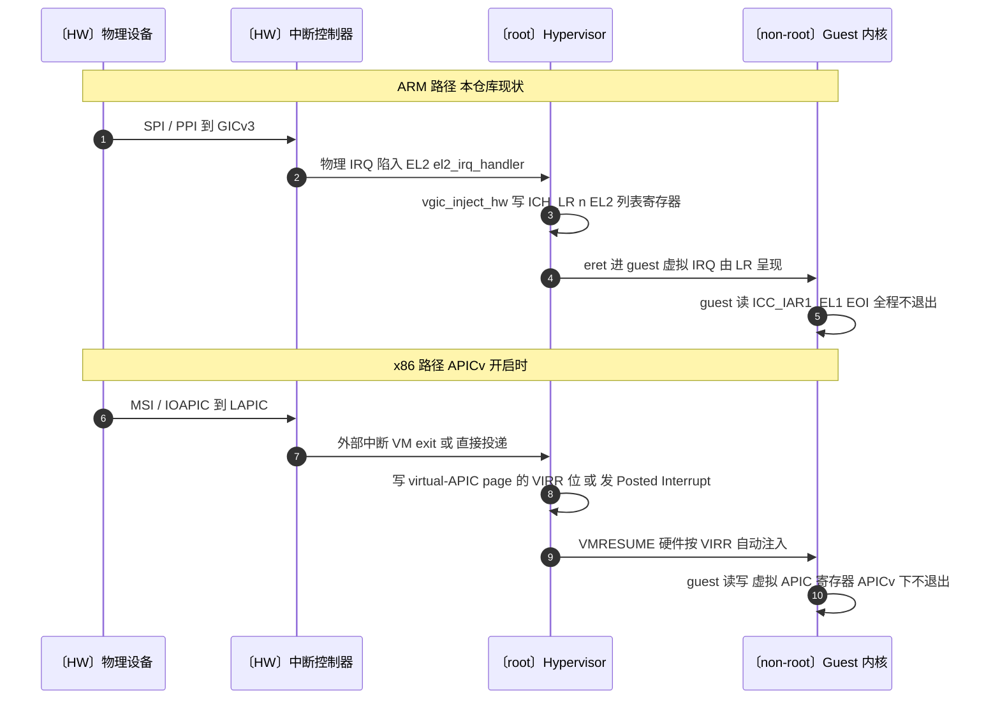
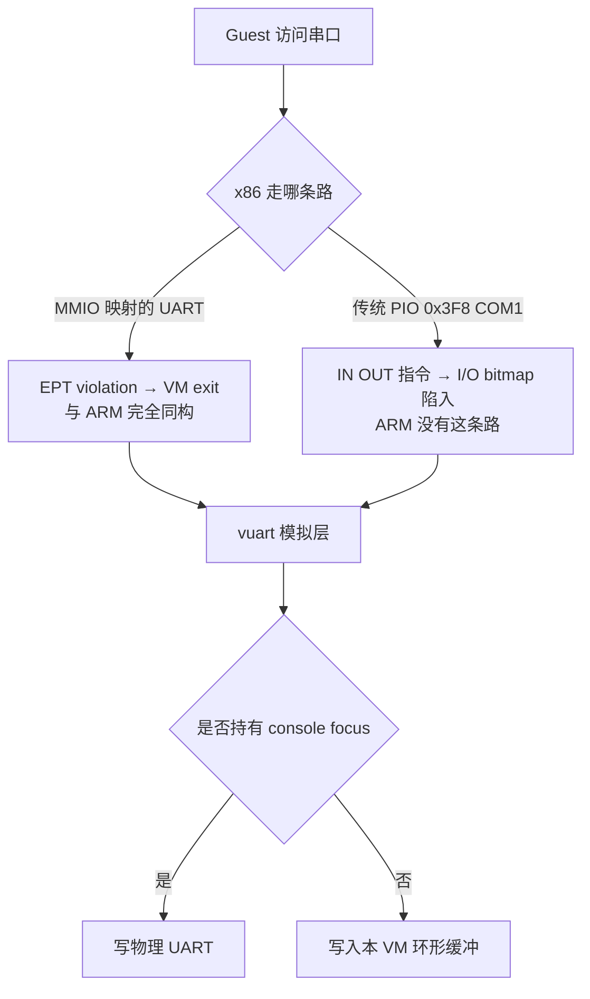
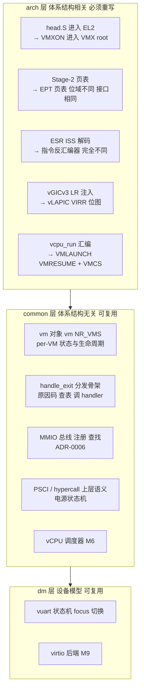

# 架构对照：x86 基座版 / Architecture on an x86 Baseline

> **本文性质**：这是一份**对照文档**，不是实现计划。本仓库的代码基座是 ARM64 EL2
> （`hypervisor/arch/arm64/`），本文把 `CLAUDE.md` 里那几张 ASCII 大图逐张换成
> **x86-64 VT-x** 基座重画，并给出 ARM↔x86 的术语与机制对照，用途是：
>
> 1. 读 `../acrn-hypervisor`（x86 Type-1，本仓库的结构灵感来源）时能把它的概念映射回来；
> 2. 判断本仓库某个设计是「体系结构无关的通用虚拟化结构」还是「ARM 特有的实现细节」——
>    凡是两栏能一一对上的，通常属于前者，抽象层就该切在那里。
>
> 本文不改变路线图。RK3588（M10）之外没有 x86 移植计划；roadmap 见 `CLAUDE.md`。

配套阅读：`CLAUDE.md`（ARM 版原图）、[2026-06-21-architecture-zoom-out.md](../arm/2026-06-21-architecture-zoom-out.md)
（ARM 版端到端 trace）、`docs/adr/`（各项决策依据）。

---

## 0. 一句话对照

| | ARM64（本仓库） | x86-64（本文） |
| --- | --- | --- |
| Hypervisor 特权态 | **EL2**（独立异常级） | **VMX root operation, ring 0**（正交于 ring，不是新 ring） |
| Guest 内核态 | EL1 | VMX non-root, ring 0 |
| 进/出 guest | `eret` ↓ / 异常 ↑ | `VMLAUNCH`/`VMRESUME` ↓ / VM-exit ↑ |
| 二级地址翻译 | Stage-2（VTTBR_EL2） | **EPT**（Extended Page Tables, EPTP） |
| Guest 上下文存放 | 手写结构体 + 汇编 save/restore | **VMCS**（部分字段由硬件自动切换） |
| 中断虚拟化 | vGICv3 + 列表寄存器 ICH_LR<n> | vLAPIC + **APICv**（Posted Interrupt / virtual-APIC page） |
| 电源/固件接口 | PSCI over HVC | ACPI + **hypercall**（`VMCALL`） |
| DMA 隔离 | SMMU | **VT-d IOMMU** |

一句话：**结构完全同构，硬件把「上下文」这件事的分工划在了不同位置**——ARM 让软件显式
保存几乎所有状态，x86 把一大半塞进 VMCS 由硬件切换。这个差别是后文所有分歧的根源。

---

## 1. 顶层系统图（x86 基座）

对应 `CLAUDE.md` 的第一张 ASCII 大图。ACRN 模型的形状不变——Service VM 里跑用户态
Device Model，User VM 用 virtio 前端——变的只是底座那一层。

```
+--------------------------------------------------------------------------------+
|                         Applications / Workloads                               |
|                                                                                |
|   +----------------------+     +----------------------+     +----------------+ |
|   | Linux Apps           |     | Android / Linux Apps |     | RT Apps        | |
|   | Mgmt / Cloud / UI    |     | IVI / HMI / General  |     | Control Tasks  | |
|   +----------+-----------+     +----------+-----------+     +-------+--------+ |
|              |                            |                         |          |
+--------------|----------------------------|-------------------------|----------+
               |                            |                         |
               v                            v                         v
+-------------------------------+   +------------------------+   +--------------+
|          Service VM            |   |        User VM          |   |   RTOS VM    |
|       Linux / SOS VM           |   |  Linux / Android Guest  |   | RTOS Guest   |
|                                |   |                         |   |              |
| +----------------------------+ |   | +--------------------+  |   | +----------+ |
| |    Device Model, DM        | |   | | Guest OS           |  |   | | RTOS     | |
| |                            | |   | |                    |  |   | | Kernel   | |
| | - Create / start VM        | |   | | - VirtIO frontend  |  |   | |          | |
| | - Emulate virtual devices  | |<---->| - Virtual devices |  |   | | RT tasks | |
| | - Handle VM exits / PIO    | |   | | - Guest drivers    |  |   | +----------+ |
| | - Provide VirtIO backend   | |   | | - Applications     |  |   |              |
| +-------------+--------------+ |   | +--------------------+  |   |              |
|               |                |   +------------+-----------+   +------+-------+
| +-------------v--------------+ |                |                      |
| | HSM driver (acrn_hsm)      | |                |                      |
| | ioctl + io_req shared ring | |                |                      |
| +-------------+--------------+ |                |                      |
|               |                                |                      |
+---------------|--------------------------------|----------------------|---------+
                |                                |                      |
                | hypercall = VMCALL             | VM Exit              |
                | VM lifecycle control           | EPT viol / PIO / MSR |
                v                                v                      v
+--------------------------------------------------------------------------------+
|                       Hypervisor  (VMX root, ring 0)                           |
|                                                                                |
| +--------------------+  +--------------------+  +----------------------------+ |
| | VM Management      |  | vCPU Scheduler     |  | Memory Manager             | |
| | Create / destroy   |  | vCPU dispatch      |  | EPT: GPA -> HPA isolation   | |
| +--------------------+  +--------------------+  +----------------------------+ |
|                                                                                |
| +--------------------+  +--------------------+  +----------------------------+ |
| | VM Exit Handler    |  | Interrupt Manager  |  | I/O Virtualization         | |
| | Decode exit reason |  | vLAPIC / APICv /   |  | MMIO / PIO bitmap /        | |
| | Forward to DM      |  | Posted Interrupt   |  | MSR bitmap / passthrough   | |
| +--------------------+  +--------------------+  +----------------------------+ |
|                                                                                |
|        CPU / Memory / Interrupt / Device Isolation & Virtualization             |
+--------------------------------------------------------------------------------+
                |
                v
+--------------------------------------------------------------------------------+
|                              x86-64 Platform / SoC                             |
|                                                                                |
| +----------------------+  +----------------------+  +------------------------+ |
| | x86 Cores            |  | Memory               |  | Platform Devices       | |
| | Intel Core / Xeon    |  | DDR RAM              |  | UART 16550 / I2C / SPI | |
| | ring 0-3 x           |  |                      |  | GPU / USB / PCIe       | |
| | (root / non-root)    |  |                      |  | NIC / NVMe / Display   | |
| +----------------------+  +----------------------+  +------------------------+ |
|          |                         |                         |                 |
|          +-------------------------+-------------------------+                 |
|                                                                                |
|        Intel VT-x / VMX root & non-root operation                              |
|        EPT (Extended Page Tables) — second-level address translation           |
|        Local APIC / x2APIC / APICv / IOAPIC                                    |
|        VT-d (IOMMU) for DMA isolation                                          |
|        ACPI / power management                                                 |
+--------------------------------------------------------------------------------+
```

**与 ARM 版的差异只有三处**（其余逐行同构）：

1. **底座那一栏**：EL2 → VMX root；Stage-2 → EPT；GICv3/GICv4 → LAPIC/APICv/IOAPIC；
   SMMU → VT-d；PSCI → ACPI + VMCALL。
2. **"Handle VM exits / MMIO"** 变成 **"Handle VM exits / PIO"**：x86 有独立的 I/O 端口
   空间（`IN`/`OUT`），这是 ARM 完全没有的第二条 I/O 通路，DM 必须同时处理 MMIO 和 PIO。
3. **多出 MSR bitmap**：x86 的大量"系统寄存器"是 MSR，通过 `RDMSR`/`WRMSR` 访问，
   要按位决定哪些陷入。ARM 的对应物是 `HCR_EL2`/`CPTR_EL2` 等一组 trap 使能位——
   粒度粗得多（按功能组，而非按寄存器）。

---

## 2. 特权层次图（x86 基座）

对应 `CLAUDE.md` 的 "Layering" 图。**这是两个体系结构差异最大的一张图**：ARM 的 EL0–EL3
是一条线性的特权阶梯，hypervisor 住在比 guest 内核**更高的一级**；x86 的 VMX root/non-root
是**正交于 ring 0–3 的一个新维度**，hypervisor 和 guest 内核都在 ring 0，靠"哪一侧"区分。

```
+--------------------------------------------------------------------------------+
|                    x86-64 Privilege: two orthogonal axes                       |
|                                                                                |
|                 ring 3  (user)          |          ring 0  (kernel)            |
|   -----------------------------------------------------------------------------|
|                                          |                                     |
|   VMX non-root   Guest applications      |   Guest OS kernel                    |
|   (guest side)   Linux / Android / RTOS  |   Linux / Android / RTOS             |
|                  user space              |   - drivers, virtio frontends        |
|                                          |   - traps out on VM exit             |
|   -----------------------------------------------------------------------------|
|                                          |                                     |
|   VMX root       (Service VM userspace   |   Hypervisor                         |
|   (host side)     DM runs here, but as   |   - vCPU scheduling                  |
|                   ring 3 of the Service  |   - EPT (GPA -> HPA)                 |
|                   VM, i.e. still         |   - VM exit decode & emulate         |
|                   non-root — see note)   |   - interrupt virtualization         |
|                                          |   - device passthrough control       |
|                                          |                                     |
+--------------------------------------------------------------------------------+
|                    Optional firmware / security layer                          |
|                    SMM (System Management Mode) — orthogonal again;            |
|                    UEFI / ACPI provide the PSCI-equivalent power interface     |
+--------------------------------------------------------------------------------+
|                              x86-64 Hardware                                   |
|                                                                                |
|  x86 Cores | DDR Memory | LAPIC/x2APIC/IOAPIC | VT-d | PCIe | MMIO+PIO | DMA    |
+--------------------------------------------------------------------------------+
```

> **易错点**：ACRN 的 Device Model 是 Service VM 里的**用户态**程序，所以它在
> `VMX non-root, ring 3`——它并不比 User VM 更特权。它的权力来自 hypervisor 认可它的
> **hypercall 权限**（M7 里的 "Service VM privilege concept"），不来自 CPU 特权级。
> ARM 侧同理：Service VM 的 DM 在 EL0，靠 hypervisor 的 VM 角色标记而非 EL 取得特权。
> **这一点是体系结构无关的**，两边都成立。

对照 ARM 侧的线性阶梯：



**为什么这个差别对代码有影响**：ARM 侧 hypervisor 有一整套**属于自己的**系统寄存器
（`VBAR_EL2`、`SP_EL2`、`TTBR0_EL2`……），guest 的 EL1 寄存器在硬件上是分离的一组，
所以 `vcpu_run` 世界切换里只需要手动搬运"共享"的那部分（通用寄存器、FP/SIMD）。x86 侧
hypervisor 和 guest **共用同一组**架构寄存器（`RIP`、`RSP`、`CR3`、段寄存器……），
只能靠 VMCS 的 host-state / guest-state area 让硬件在每次 VM entry/exit 时整体换掉。

---

## 3. 世界切换：ARM `vcpu_run` vs x86 `VMRESUME`

对应 [vcpu-run-world-switch.md](../arm/vcpu-run-world-switch.md)。本仓库 `vcpu_run` 的三段式
（进 guest 汇编 / 出 guest 异常向量 / 彻底退出）在 x86 上塌缩成**一条指令边界**。



**逐项对照本仓库的实现**：

| 本仓库（ARM） | x86 等价物 | 差异要点 |
| --- | --- | --- |
| `eret` 进 guest | `VMLAUNCH`（首次）/ `VMRESUME`（后续） | x86 区分首次与后续；ARM 不区分 |
| `VBAR_EL2` 向量表接住 exit | 无向量表，VM exit 统一回到 VMCS 的 host `RIP` | x86 只有**一个**退出入口，分发全靠软件读 `exit_reason` |
| `ESR_EL2` 的 EC 字段分流 | `VMCS.exit_reason`（基本原因）+ `exit_qualification`（细节） | 同构：都是"硬件给一个编码，软件查表分发" |
| `FAR_EL2` + `HPFAR_EL2` 重建 IPA | `guest_physical_address` 字段（VMCS 直接给 GPA） | **x86 更省事**：不用拼接，硬件直接给出错的 GPA |
| ISS 解码访问宽度/寄存器/方向 | **无**——x86 必须**软件反汇编** guest 指令 | **x86 更麻烦**：变长指令集，ARM 的定长指令让硬件能把这些填进 ISS |
| `ELR_EL2 += 4` 推过出错指令 | `guest_rip += VMCS.exit_instruction_length` | 同构，但 x86 长度由硬件给（指令变长） |
| 手动 save/restore 几乎全部状态 | VMCS 自动切换大部分；只有 GPR 要手动 | ARM 的 `-mgeneral-regs-only`「不保存 FP/SIMD」这类假设在 x86 上同样存在（`XSAVE` 状态也要手动管） |

> **对本仓库抽象层的启示**：`handle_exit` 的"读一个硬件给的原因码 → 查表 → 调 handler →
> 推进 PC"这套骨架是**跨体系结构通用的**，可以作为 arch 无关层；而 ISS 解码
> （`hypervisor/arch/arm64/vmexit/mmio.c` 里那段）**必须**留在 arch 层——x86 在这里
> 需要的是一个完全不同的东西（指令反汇编器）。

---

## 4. 二级地址翻译：Stage-2 vs EPT

对应 [stage2.md](../arm/stage2.md)、[stage2-l1-to-l2.md](../arm/stage2-l1-to-l2.md)、ADR-0004。



**术语对照**：

| ARM64 | x86-64 | 说明 |
| --- | --- | --- |
| IPA（Intermediate Physical Address） | GPA（Guest Physical Address） | 完全同义 |
| PA | HPA（Host Physical Address） | 完全同义 |
| `VTTBR_EL2`（含 VMID） | `EPTP`（EPT pointer） | 页表基址寄存器 |
| VMID | 无直接对应；用 **VPID** 标记 TLB 项 | ARM 的 VMID 同时管 Stage-2 TLB 与 ASID 空间；x86 把这拆成 EPT 缓存 + VPID 两件事 |
| Stage-2 data abort | **EPT violation**（VM exit reason 48） | 触发 trap-and-emulate 的同一个机制 |
| L1 block（1 GB）/ L2 block（2 MB）/ L3 page（4 KB） | 1 GB / 2 MB / 4 KB EPT 页 | **粒度完全一致**（都是 4 级 4 KB granule 页表） |
| "punch hole"：把 1 GB block 拆成 L2 table 再置某项无效 | 同样操作：拆 1 GB EPT 项为 2 MB 表，把目标项权限清空 | **ADR-0004 的整套推导在 x86 上逐字成立** |

> **结论**：Stage-2 是本仓库里**移植成本最低**的子系统。页表格式的位域布局不同（EPT 项的
> R/W/X 是独立三位，且 EPT 天然支持"可读不可执行"这类 ARM Stage-2 也支持的组合），但
> `stage2_map()` / `stage2_activate()` / punch-hole 的**接口和调用时机一字不改**。

---

## 5. 中断虚拟化：vGICv3 vs vLAPIC + APICv

对应 [vgic-injection.md](../arm/vgic-injection.md)、ADR-0001、ADR-0012。**这是移植成本最高的
子系统**——两边的硬件模型分歧最大。



| ARM64（本仓库） | x86-64 | 差异要点 |
| --- | --- | --- |
| GICv3 Distributor（GICD） | **IOAPIC**（+ MSI/MSI-X 直接寻址 LAPIC） | 都做"外设中断 → 路由到某个 CPU" |
| GICv3 Redistributor（GICR，每 CPU 一个） | **LAPIC**（每 CPU 一个） | 逐个对应，含 per-CPU 私有中断 |
| PPI（每 CPU 私有，如 timer） | LAPIC 本地中断源（LVT timer 等） | 逐个对应 |
| SPI（共享外设中断） | IOAPIC 引脚 / MSI | 逐个对应 |
| SGI（软件生成，核间） | **IPI**（Inter-Processor Interrupt，写 ICR） | 逐个对应；M3.5 的 SGI 虚拟化在 x86 = IPI 虚拟化 |
| **列表寄存器 `ICH_LR<n>_EL2`**（本仓库靠它注入） | **virtual-APIC page 的 VIRR 位图** | **模型不同**：ARM 是"最多 N 个待注入槽位"（本仓库用 LR0/LR1），x86 是"256 位的完整待决位图"——**x86 没有槽位耗尽问题** |
| HW 位 + pINTID（硬件转发，EOI 直达物理） | **Posted Interrupt**（中断不经 VM exit 直接投给运行中的 guest） | 目的相同（省退出），机制不同 |
| `vgicv3_mmio_init()` 陷入模拟 GICD/GICR | vLAPIC 陷入模拟（APICv 关时）/ APIC-access page（APICv 开时） | 同构：都是 trap-and-emulate 一组寄存器 |

> **移植含义**：本仓库 `vgic_inject_sw` / `_hw` / `_spi` 三个入口的**语义**（软件注入 /
> 硬件转发 / 外设中断）在 x86 上仍然成立，但内部实现要从"分配一个 LR 槽位"改成
> "置一个 VIRR 位"。**LR 槽位分配逻辑（本仓库的 LR0/LR1 固定分配）是纯 ARM 产物**，
> 抽象层不该把它泄漏出去。这是设计接口时值得注意的一条界线。

---

## 6. 电源与固件接口：PSCI vs ACPI + hypercall

对应本仓库 `hypervisor/common/psci/psci.c`、M1.5。

| ARM64 | x86-64 | 说明 |
| --- | --- | --- |
| PSCI over `HVC`（`PSCI_VERSION`/`CPU_ON`/`CPU_OFF`/`SYSTEM_OFF`） | 无统一等价物：拆成 **ACPI**（S 状态、`_S5` 关机）+ **INIT-SIPI-SIPI**（启动 AP 核） | **x86 更零碎**：ARM 用一个 SMC/HVC 接口统一了"开核/关核/关机/重启" |
| `CPU_ON`（M3.5 用它拉起第二个 vCPU） | guest 发 **INIT-SIPI-SIPI** IPI 序列，hypervisor 陷入并模拟 | 同一目的，但 x86 要模拟一个三步握手时序 |
| `SYSTEM_OFF` / `SYSTEM_RESET` | guest 写 ACPI PM1a 控制端口（PIO 陷入）或三重故障 | x86 走 PIO 陷入路径 |
| HVC 作为 hypercall 载体（M7 的 hypercall ABI） | **`VMCALL`** | 完全同构；ACRN 的 hypercall 就走 `VMCALL` |

> **已知缺陷的对照**：`CLAUDE.md` 记录的 `CPU_OFF` 缺陷（`PSCI_CPU_OFF` 误用
> `psci_power_down()` 把整个 VM 拉下线，应只停调用者 vCPU）在 x86 上是**同一个 bug 类**——
> "per-vCPU 关断状态 vs per-VM 关断状态"是体系结构无关的状态建模问题。M6 重写状态管理时
> 该按 per-vCPU 建模，这个结论两边通用。

---

## 7. 控制台与 I/O：一处 x86 独有的复杂度

本仓库 M5 的决策（ADR-0014）是：**EL2 独占物理 PL011，每个 VM 看到一个 trap-and-emulate
的 vuart，`Ctrl-T` 切换 RX 焦点**。这套设计在 x86 上**整体成立**，但有一个必须加的分支：



**PIO 是 x86 的第二 I/O 空间**：guest 用 `IN`/`OUT` 访问 `0x3F8`（COM1）这类端口，
不经过 EPT，靠 VMCS 的 **I/O bitmap** 按端口号决定是否陷入。ARM 侧没有任何对应物——
所有设备寄存器都是 MMIO，因此 Stage-2 一条路管完。

> **对本仓库的启示**：`hypervisor/dm/vuart.c` 的 vuart 状态机（FIFO、LSR/LCR 寄存器语义、
> focus 切换）是**可复用的**；变的只是**前面挂哪条陷入通路**。这正好印证 ADR-0006 的
> MMIO 总线设计——把"设备模型"和"陷入解码"分开是对的，x86 只需要在总线旁边再注册一条
> PIO 总线。（顺带一提：x86 的 16550 UART 与 ARM 的 PL011 寄存器布局不同，vuart 的寄存器
> 语义层要换，但 focus 调度逻辑不变。）

---

## 8. 模块关系图（x86 基座下，本仓库目录如何映射）



**这张图是本文最有实用价值的产物**：它标出了本仓库当前代码里，哪些部分是"ARM 的偶然"、
哪些是"虚拟化的必然"。设计新子系统时，若一个抽象无法在上表两栏之间保持稳定，
那多半意味着**抽象层切错了位置**。

---

## 9. 里程碑对照：本仓库路线图在 x86 上的等价物

| 本仓库里程碑 | ARM 侧做的事 | x86 侧等价物 | 难度变化 |
| --- | --- | --- | --- |
| M0 Hello EL2 | `_start` 检查 `CurrentEL==0b1000`，进 EL2 | 检查 `CPUID` VMX 位 → 设 `CR4.VMXE` → `VMXON` | **x86 更繁琐**（要分配 VMXON region、对齐、revision id） |
| M1 裸机 guest | Stage-2 + 最小 vCPU | EPT + VMCS 初始化（约 100 个字段） | **x86 明显更繁琐**：VMCS 字段多且校验严，配错直接 VM-entry failure |
| M1.5 PSCI | HVC 陷入模拟 PSCI | `VMCALL` 陷入 + ACPI PIO 模拟 | 相当 |
| M2 vGIC 软件注入 | 写 `ICH_LR0_EL2` | 置 virtual-APIC page 的 VIRR 位 | **x86 略简单**（无槽位管理） |
| M2.5 物理 timer + HW 转发 | timer PPI → EL2 → HW 位转发 | LAPIC timer 陷入 / preemption timer | 相当 |
| M3.x Linux 启动 | arm64 boot protocol + DTB | x86 boot protocol（`boot_params`）或直接 ELF | 相当 |
| M3.5 SMP | PSCI `CPU_ON` + SGI 虚拟化 | INIT-SIPI-SIPI 模拟 + IPI 虚拟化 | **x86 略难**（三步握手时序） |
| M5 多 VM | per-VM Stage-2 / VMID / vGIC / vuart | per-VM EPT / VPID / vLAPIC / vuart(MMIO+PIO) | 相当，x86 多一条 PIO 路 |
| M6 调度器 | 上下文切换含 FP/SIMD | 上下文切换含 `XSAVE` 状态区 | 相当（都要处理"扩展状态不保存"这个假设） |
| M7–M9 hypercall/HSM/DM | HVC ABI + io_req ring + 用户态 DM | `VMCALL` ABI + io_req ring + 用户态 DM | **几乎一字不差**——这正是 ACRN 的原型 |
| M10 硬件移植 | RK3588（要运行时 FDT 解析） | 任一 Intel 平台（要 ACPI 解析） | 相当 |

> **值得注意的一点**：M7–M9（ACRN 模型的核心链路）在两个体系结构上**近乎完全相同**。
> 这不是巧合——`CLAUDE.md` 的 ACRN-model 策略之所以能从 x86 的 ACRN 借鉴到 ARM，
> 正是因为那一层已经在硬件差异之上了。反过来说，M0–M3.5 那些**最像"学 EL2 核心技术"
> 的部分，恰恰是最不可移植的部分**——这与本仓库把"学习 EL2 核心技术"列为首要目标是
> 自洽的。

---

## 10. 小结：三条可带走的结论

1. **同构的部分比想象中多**。顶层系统图、Service VM + DM 模型、MMIO 总线、VM 对象、
   退出分发骨架、电源状态机——这些在两个体系结构上逐行对应。ACRN 的结构能直接借鉴到
   ARM，原因就在这里。
2. **分歧集中在三处**：①上下文的软硬件分工（手动 save/restore vs VMCS 自动切换）；
   ②中断注入模型（LR 槽位 vs VIRR 位图）；③I/O 空间数量（只有 MMIO vs MMIO + PIO）。
   本仓库任何跨 arch 抽象，接口都不该泄漏这三处的细节。
3. **本仓库的 arch/common 目录划分基本正确**。第 8 节的映射表显示，需要重写的东西
   几乎都已经在 `hypervisor/arch/arm64/` 下了。**唯一值得复查的是 vGIC**——
   `vgic_inject_*` 系列的 LR 槽位语义偏向 ARM，M6 重构 per-vCPU 状态时可以顺手把
   这层接口收敛得更中性。

---

## 参考

- Intel® 64 and IA-32 Architectures Software Developer's Manual, **Volume 3C**
  （VMX 全部内容：VMCS 布局、VM exit reason 表、EPT、APICv）
- Intel® Virtualization Technology for Directed I/O（VT-d，DMA 隔离）
- `../acrn-hypervisor` — 本文所有 x86 侧结论的对照实现；重点看
  `hypervisor/arch/x86/guest/`（vCPU/VMCS/vLAPIC）与 `hypervisor/dm/`（设备模型）
- ARM 侧对照见 `CLAUDE.md` 原图与 [2026-06-21-architecture-zoom-out.md](../arm/2026-06-21-architecture-zoom-out.md)
