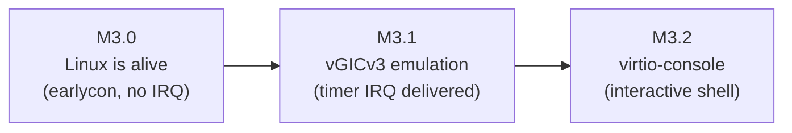

# Hypervisor — M3 (Single-Core Linux Guest) Implementation Plan

- **Date**: 2026-06-15
- **Spec**: `docs/superpowers/specs/2026-06-15-m3-linux-guest-design.md`
- **Milestone**: M3 — boot unmodified UP Linux to an interactive shell on QEMU `virt`

> **来源 / Provenance**: 本计划由 `2026-06-15` 的 `/grill-me` 访谈综合而成（**单核路径**，
> SMP 拆至 M3.5）。若与其他 brainstorm 会话产出的 M3 计划并存，以本标记 + 文件名日期区分。

---

## Strategy

Three sub-milestones, each independently runnable and verifiable. The ordering follows the
dependency tree: you cannot debug interrupts until Linux runs (M3.0), cannot reach a shell
until interrupts work (M3.1), cannot interact until there's a console device (M3.2). Each
phase ends at a concrete, observable terminus so a hang is always attributable to the phase
under construction.

**Prep (shared, before M3.0):** assemble guest artifacts — an arm64 `Image`, a busybox
`rootfs.cpio` initramfs (`/init` = `sh`), and a hand-written `guest.dts`. Add a
`make guest` / run-script path that passes the three `-device loader` entries. Bump QEMU
`-m` if needed and keep `/memory` (DTB) ⇔ stage-2 ⇔ `-m` consistent.

---

## Phase M3.0 — Linux is alive (no interrupts)

**Goal:** Linux self-decompresses and prints its boot log via earlycon, hanging where it
first needs the GIC.

**Steps**
1. `vm_config`: replace `entry` with `kernel_ipa` / `dtb_ipa` / `initrd_ipa`.
2. `vm_init`: set `regs.x[0]=dtb_ipa`, `x[1..3]=0`, `elr_el2=kernel_ipa`, `spsr_el2=EL1h`
   (DAIF masked); keep existing `vcpu_run`.
3. Author `guest.dts` (memory, 1 CPU psci, arch timer, `/chosen` bootargs with
   `earlycon=pl011,mmio32,0x09000000 console=ttyAMA0 nr_cpus=1`, initrd start/end);
   compile to `guest.dtb` via `dtc` as a build artifact.
4. Confirm stage-2 maps DRAM and passes-through PL011 (already true for the 1 GB device
   block — no change strictly required for M3.0, but verify the RAM block is large enough).
5. Run-script: add the three `-device loader` entries; build a busybox `rootfs.cpio`.

**Acceptance:** `Booting Linux on physical CPU 0x0` + further early log appear; kernel
hangs at GIC init. Build clean. M2.5 `run_svm2_test.sh` still passes.

**Likely failure modes:** wrong boot register state (no output) → recheck x0/ELR/SPSR;
DTB/`-m`/stage-2 mismatch → memory not found or aborts; bad earlycon address → silence.

---

## Phase M3.1 — vGICv3 distributor/redistributor emulation

**Goal:** Linux's gic-v3 driver probes successfully and the architected timer interrupt is
delivered to the guest (no re-pend storm), letting boot proceed past timer setup.

**Steps**
1. **Stage-2 restructure** (`stage2.c`): low 1 GB from a single block to L1[0]→L2 table of
   2 MB blocks. Leave the `0x08000000` (GIC) and `0x0A000000` (virtio) 2 MB blocks
   **unmapped**; keep `0x09000000` (PL011) passthrough; rest passthrough/unmapped.
2. **MMIO dispatch** (`vmexit.c`): handle `EC=0x24`; compute IPA from `HPFAR_EL2`/`FAR_EL2`;
   decode ISS (ISV/SAS/SRT/WnR); static dispatch array {GICD, GICR, virtio}; `elr_el2+=4`;
   ISV=0 and unregistered-region both **panic** with IPA+ESR.
3. **vGIC model** (`vgic.c`/`vgic.h`): `struct vgic_irq` arrays (`ppi[32]`, `spi[N_SPI]`);
   GICD/GICR read/write handlers for the touched subset, RAZ/WI + log otherwise. Get
   `GICR_WAKER` (`ChildrenAsleep=0`), `GICR_TYPER` (`Last=1`+affinity), `GICD_TYPER`
   (`ITLinesNumber`) right first — they gate probe.
4. **LR alloc + sync**: extend `vgic_save`→`vgic_sync` (fold LR state back into `vgic_irq`);
   per-entry rebuild allocates a free LR per `pending && enabled` IRQ by priority; HW=1 for
   `irq->hw`; **panic on LR exhaustion**.
5. **Generalize `el2_irq_handler`** (`irq_handler.c`): ack → identity `vintid` (27→27 else
   panic) → gate on `irq->enabled` → set pending/hw/pintid → priority-drop only.
6. **DTB**: ensure GIC `reg`/`interrupts`/`#interrupt-cells` match the emulated bases exactly.

**Acceptance:** no `GICR_WAKER` silent hang; kernel proceeds past timer init; timer IRQ
delivered with no storm. Build clean; M2.5 test still passes.

**Likely failure modes:** silent hang → `GICR_WAKER`/`TYPER.Last`; storm → HW-link/EOImode
or `enabled` gate; abort loops → ISS decode or `elr` advance; wrong IPA → HPFAR shift.

---

## Phase M3.2 — virtio-console + interactive shell

**Goal:** an interactive shell prompt that echoes typed input.

**Steps**
1. **virtio-console backend** (`virtio_console.c`): virtio-mmio v2 register file
   (`MagicValue`/`Version=2`/`DeviceID=3`, `Status` handshake, `Queue*` setup,
   `InterruptStatus`/`ACK`); register in the MMIO dispatch array for `0x0A000000`.
2. **Split-vring** (rx/tx): dereference guest ring addresses directly (1:1 IPA==PA). TX:
   on `QueueNotify`, drain descriptors → write bytes to PL011 → mark used → SW-inject SPI 48.
3. **RX poll**: on the timer tick, poll PL011 `RXFE`; if a byte is present, take a free rx
   descriptor → fill → mark used → SW-inject SPI 48.
4. **SPI 48 wiring**: add to `vgic.spi[]`; `vgic_inject_sw`-style (hw=false) via the LR
   allocator; declare the SPI in the virtio node of `guest.dts`.
5. **cmdline**: add `console=hvc0 nohz=off`; ensure `/init` (busybox) is the initramfs entry.

**Acceptance:** virtio-console probes; shell prompt appears; typing (e.g. `ls`) echoes and
runs. Build clean; M2.5 test still passes.

**Likely failure modes:** device skipped → Magic/Version/DeviceID; stuck handshake →
`Status` bits / `FEATURES_OK`; no output → used-ring index or SPI not injected; input
lag/none → RX poll cadence (`nohz=off`) or `InterruptStatus` not set before inject.

---

## Files (new / changed)

| File | Phase | Change |
|---|---|---|
| `hypervisor/common/vm/vm_config.h` | 3.0 | `kernel_ipa/dtb_ipa/initrd_ipa` |
| `hypervisor/common/vm/vm.c`, `boot/main.c` | 3.0 | boot-protocol register setup |
| `boards/.../guest.dts` (+ `dtc` build rule) | 3.0/3.1/3.2 | guest device tree |
| `scripts/run-qemu.sh`, `Makefile` | 3.0 | 3× `-device loader`, `make guest`, `-m` |
| `hypervisor/arch/arm64/mmu/stage2.c` | 3.1 | 2-level / 2 MB blocks, selective trap |
| `hypervisor/arch/arm64/vmexit/vmexit.c` | 3.1 | `EC=0x24` MMIO dispatch |
| `hypervisor/arch/arm64/irq/vgic.{c,h}` | 3.1 | vgic_irq model, GICD/GICR emul, LR alloc/sync |
| `hypervisor/arch/arm64/irq/irq_handler.c` | 3.1 | generalized gated injection |
| `hypervisor/.../virtio_console.c` (+ header) | 3.2 | virtio-mmio v2 console backend |
| `tests/run_m3_*.sh` | each | per-phase QEMU smoke checks |

## Verification

Per CLAUDE.md: `make` zero warnings; `readelf` entry `0x40080000`; `make run` observed
output. Add `tests/run_m3_0.sh` (grep boot-log line), `run_m3_1.sh` (timer progress),
`run_m3_2.sh` (shell prompt + scripted input echo via QEMU stdio). M2.5 regression check
runs every phase.
