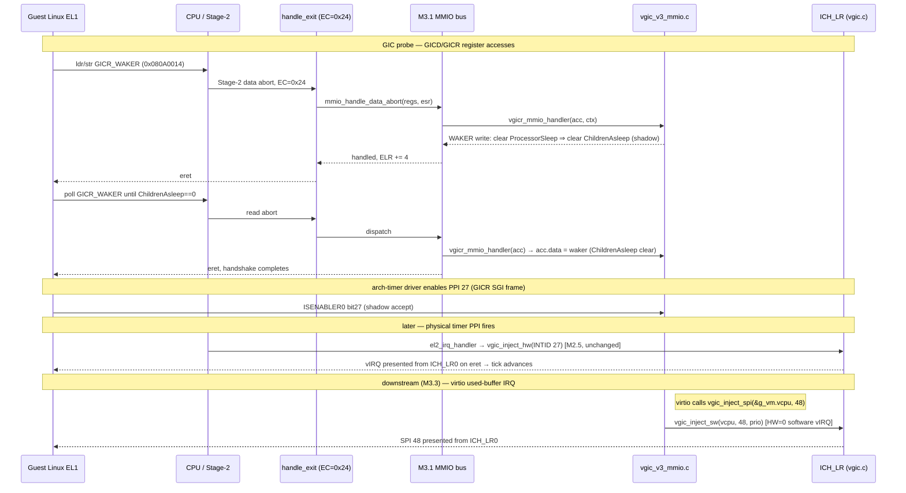

# M3.2 — vGICv3 GICD + GICR(cpu0) MMIO Emulation Implementation Plan

> **For agentic workers:** REQUIRED SUB-SKILL: Use superpowers:subagent-driven-development (recommended) or superpowers:executing-plans to implement this plan task-by-task. Steps use checkbox (`- [ ]`) syntax for tracking.

> **Upstream assumptions (state up front):** This plan builds directly on **M3.1** (merged): the MMIO trap-and-emulate bus in `hypervisor/arch/arm64/vmexit/mmio.{h,c}` with `struct mmio_access { u64 ipa; u64 offset; u8 size; bool is_write; u64 data; }`, `typedef int (*mmio_handler_t)(struct mmio_access *acc, void *ctx)`, and `int mmio_bus_register(u64 base, u64 len, mmio_handler_t handler, void *ctx)`. It also assumes **M3.0** (`board.h` address map, the guest `.dts`, the Linux boot protocol in `vm_init`) is merged. M3.1 left a **temporary scaffold** (`hypervisor/arch/arm64/vmexit/mmio_scaffold.c` registered over the GICD range from `vm_init`); **M3.2 deletes that scaffold** and registers the real vGIC handlers in its place.

**Goal:** Boot the Linux guest past GICv3 probe by emulating a **GICv3 distributor (GICD)** and a single-cpu **redistributor (GICR cpu0)** as trap-and-emulate MMIO devices on the M3.1 bus, so the guest's `gic-v3` driver initialises without faulting (no `EC=0x24` stall at `0x08000000` or `0x080A0000`, and the **GICR_WAKER ProcessorSleep/ChildrenAsleep handshake completes**). M3.2 also lets the guest **enable the virtual-timer PPI (INTID 27)** through the GICR SGI frame, so the timer tick already wired in M2.5 (`el2_irq_handler` → `vgic_inject_hw`) is delivered to the guest and its clocksource/scheduler tick advances. Finally, M3.2 exports the **SPI-injection API** the downstream virtio slice needs: `void vgic_inject_spi(struct vcpu *vcpu, u32 intid)`.

**Observable DoD:** on `make run`, the guest's GICv3 driver initialises (the earlier M3.0/M3.1 stall at the GICD/GICR frames is gone, the WAKER handshake clears), boot proceeds past "Calibrating delay loop" / the clocksource is registered, and the timer interrupt advances guest time. **A shell is M3.4 — do not claim it.** virtio-console (M3.3) and rootfs (M3.4) are out of scope; M3.2 finishes the moment the GIC probe succeeds and the tick advances.

---

## Architecture

The guest's GICv3 driver touches two MMIO frames during probe; both are unbacked in Stage-2 (per M3.0) and therefore trap to EL2 as `EC=0x24` data aborts, decoded by the M3.1 bus:

- **GICD** at `0x08000000` (`BOARD_GIC_DIST_BASE`), 64 KB (`0x10000`).
- **GICR cpu0** at `0x080A0000` (`BOARD_GIC_RDIST_BASE`), `0x20000` = two 64 KB pages: the **RD frame** (`0x00000..0x0FFFF`: CTLR/IIDR/TYPER/WAKER/PIDR2) and the **SGI frame** (`0x10000..0x1FFFF`: IGROUPR0/ISENABLER0/IPRIORITYR/ICFGR for INTIDs 0–31).

M3.2 adds one new file, `hypervisor/arch/arm64/irq/vgic_v3_mmio.c`, holding:
1. a minimal shadow-state struct pair (`struct vgicv3_dist`, `struct vgicv3_redist`) inside the existing single `g_vm.vcpu` flow (UP, cpu0 only);
2. two `mmio_handler_t` callbacks — `vgicd_mmio_handler` (GICD) and `vgicr_mmio_handler` (GICR) — that decode `acc->offset` against the GICv3 register map, serve reads from shadow state (with the read-as-one / TYPER / PIDR2 corrections a Linux driver requires), and record writes into shadow state;
3. `vgicv3_mmio_init()` which registers both regions on the M3.1 bus via `mmio_bus_register`.

It extends `vgic.c`/`vgic.h` with `vgic_inject_spi(struct vcpu *, u32 intid)` — a thin wrapper over the **existing M2 software-injection path** `vgic_inject_sw` (HW=0 list-register injection): the virtio SPI has no physical backing, so it must be a pure software vIRQ. It modifies `vm.c` to (a) replace the deleted `mmio_scaffold_init()` call with `vgicv3_mmio_init()`, and (b) **make `vm_run` a re-entry loop** so the periodic timer PPI keeps being delivered (today `vm_run` calls `vcpu_run` once; a single guest entry cannot receive repeated ticks). It modifies the arch `Makefile` (drop `mmio_scaffold.o`, add `vgic_v3_mmio.o`), and deletes `mmio_scaffold.c`.

### Why no write-through to the physical GICD/GICR

The reference Rust hypervisor write-throughs guest GICD writes to the physical GICD because it forwards arbitrary physical SPIs. **This hv does not.** The only physical interrupt the guest consumes is the EL1 virtual-timer **PPI 27**, and the hv already programs *that* line in `gic_init()` (physical GICR ISENABLER0 / IGROUPR0 / IPRIORITYR for INTID 27) and hardware-forwards it (`vgic_inject_hw`, ADR-0001). The virtio SPI 48 is delivered as a *software* vIRQ. Therefore the guest's GICD/GICR register writes are **shadow-only**: emulated state the driver reads back, with no physical side effects. This keeps M3.2 small and avoids re-touching the physical GIC that M2.5 already owns.

### SRE / CPU-interface boundary (stated explicitly)

The GICv3 **CPU interface** (`ICC_*` system registers — IAR/EOIR/PMR/IGRPEN1/CTLR) is **not** MMIO and is **not** emulated here. `vgic_init()` (M2) already set `ICC_SRE_EL2.SRE|Enable` so EL1 uses the system-register `ICC_*`/`ICV_*` interface directly; the hardware redirects guest `ICC_*` to the virtual interface (`ICV_*`) and presents pending vIRQs from the **list registers** `ICH_LR<n>_EL2`. M3.2 therefore touches the CPU interface only through the existing list-register injection helpers (`vgic_inject_sw` / `vgic_inject_hw`). **Only the GICD and GICR _MMIO_ frames are trap-and-emulated.** SRE itself is left to hardware; we do not trap `ICC_*` accesses.

### Timer-PPI delivery (what M3.2 does and does NOT do)

> **Discrepancy vs the task prompt — resolved against the code.** The prompt suggested M3.2 "must inject the timer PPI as INTID 27". In the actual tree the timer PPI injection **already exists and works**: `el2_irq_handler` (`hypervisor/arch/arm64/irq/irq_handler.c`) calls `vgic_inject_hw(&g_vm.vcpu, BOARD_VTIMER_IRQ /*27*/, 27, 0xA0)` on every physical timer PPI, and `gic_init()` programs the physical line. M3.2 does **not** re-implement that. What M3.2 must add for the tick to actually reach the guest is twofold:
> 1. **Let the guest enable PPI 27 in software:** the Linux arch-timer driver writes the GICR **SGI-frame** ISENABLER0 (bit 27) and IGROUPR0 / IPRIORITYR for INTID 27. Those writes currently fault (GICR unbacked). M3.2's `vgicr_mmio_handler` accepts them into shadow state so the driver's probe completes. (The physical enable is already done by `gic_init`; the shadow write is what the *driver* needs to see succeed.)
> 2. **Re-enter the guest after each tick:** `vm_run` is single-shot today. M3.2 wraps `vcpu_run` in a loop so the guest is re-entered after each timer exit, letting successive ticks advance the clocksource. (M3.3 also depends on this loop existing.)

The injected INTID is **27** (`BOARD_VTIMER_IRQ`), matching the arch-timer PPI the guest `.dts` declares (`interrupts = <1 14 …>` for the EL1 virtual timer, PPI 14 → INTID `16 + 14 = 30`? — **verify against the actual `.dts` at run time**, see Task 8 Note). The hv already uses 27; if the guest's virtual-timer PPI in its `.dts` differs from 27, that is an M3.0 `.dts` authoring issue, not an M3.2 emulation issue — M3.2 injects whatever INTID `el2_irq_handler` already uses (`BOARD_VTIMER_IRQ`).

### Trap → emulate → inject flow



---

## Minimal GICv3 register set (the Linux gic-v3 probe touches these) — for reference

Verified against `../hypervisor/src/devices/gic/{distributor,redistributor}.rs` (which boots Linux on QEMU virt). RAZ/WI everything not listed.

### GICD frame (`0x08000000`, 64 KB), all 32-bit except IROUTER

| Offset | Name | Read | Write |
|---|---|---|---|
| `0x0000` | GICD_CTLR | shadow `ctlr` **OR ARE_NS(bit4)** (read-as-one); RWP(bit31)=0 | store, force ARE_NS set |
| `0x0004` | GICD_TYPER | `ITLinesNumber=31` (1024 INTIDs) `| IDbits=9<<19 | A3V<<24 | No1N<<25 | CPUNumber=(ncpu-1)<<5` | RO/WI |
| `0x0008` | GICD_IIDR | `0x0000_043B` (ARM) | RO/WI |
| `0x0080`–`0x00FC` | GICD_IGROUPRn (32) | shadow | shadow |
| `0x0100`–`0x017C` | GICD_ISENABLERn (32) | shadow `enabled[]` | set-bits: `enabled[r] |= v` |
| `0x0180`–`0x01FC` | GICD_ICENABLERn (32) | shadow `enabled[]` | clr-bits: `enabled[r] &= ~v` |
| `0x0200`–`0x027C` | GICD_ISPENDRn (32) | shadow `ispend[]` | `|=` |
| `0x0280`–`0x02FC` | GICD_ICPENDRn (32) | shadow `ispend[]` | `&= ~` |
| `0x0300`–`0x037C` | GICD_ISACTIVERn (32) | shadow `isactive[]` | `|=` |
| `0x0380`–`0x03FC` | GICD_ICACTIVERn (32) | shadow `isactive[]` | `&= ~` |
| `0x0400`–`0x07FC` | GICD_IPRIORITYRn (256) | shadow | shadow |
| `0x0C00`–`0x0CFC` | GICD_ICFGRn (64) | shadow | shadow |
| `0x6100`–`0x7FD8` | GICD_IROUTERn (64-bit, SPIs 32+) | shadow `irouter[]` (8B or split 4B halves) | shadow |
| `0xFFE8` | GICD_PIDR2 | `0x30` (ArchRev[7:4]=3 ⇒ GICv3) | RO/WI |

### GICR frame cpu0 (`0x080A0000`, `0x20000`) — split RD frame + SGI frame

RD frame (`within < 0x10000`):

| Offset | Name | Read | Write |
|---|---|---|---|
| `0x0000` | GICR_CTLR | shadow `ctlr` | store |
| `0x0004` | GICR_IIDR | `0x0000_043B` | RO/WI |
| `0x0008` | GICR_TYPER (64-bit) | `Aff0<<32 | ProcNum<<8 | **Last(bit4)=1**` (cpu0 is the only/last redist) | RO/WI |
| `0x000C` | TYPER high (4-byte read of `0x0008+4`) | `typer >> 32` | RO/WI |
| `0x0010` | GICR_STATUSR | `0` | WI |
| `0x0014` | GICR_WAKER | shadow `waker` | **ProcessorSleep(bit1) clear ⇒ waker=0 (ChildrenAsleep clears); set ⇒ waker=ProcSleep|ChildrenAsleep** |
| `0xFFE8` | GICR_PIDR2 | `0x30` | RO/WI |

SGI frame (`within >= 0x10000`, pass `within - 0x10000`):

| Offset | Name | Read | Write |
|---|---|---|---|
| `0x0080` | GICR_IGROUPR0 | shadow | shadow |
| `0x0100` | GICR_ISENABLER0 | shadow `isenabler0` | `|=` (PPI 27 enable lands here) |
| `0x0180` | GICR_ICENABLER0 | shadow `isenabler0` | `&= ~` |
| `0x0200` | GICR_ISPENDR0 | shadow `ispendr0` | `|=` |
| `0x0280` | GICR_ICPENDR0 | shadow `ispendr0` | `&= ~` |
| `0x0300` | GICR_ISACTIVER0 | shadow `isactiver0` | `|=` |
| `0x0380` | GICR_ICACTIVER0 | shadow `isactiver0` | `&= ~` |
| `0x0400`–`0x041C` | GICR_IPRIORITYRn (8 regs, INTID 0–31) | shadow | shadow |
| `0x0C00` | GICR_ICFGR0 (SGIs, RO edge) | `0xAAAA_AAAA` | WI |
| `0x0C04` | GICR_ICFGR1 (PPIs) | shadow `icfgr1` | shadow |

**GICR_WAKER handshake (the usual GICv3 hang point):** reset value is `ProcessorSleep=1 | ChildrenAsleep=1` (`0x6`). Linux clears ProcessorSleep (writes bit1=0) then **polls ChildrenAsleep (bit2) until it reads 0**. Emulation: on a WAKER write with ProcessorSleep clear, set the whole register to `0` (both bits clear) so the poll terminates immediately.

---

## File Structure

- **Create** `hypervisor/arch/arm64/irq/vgic_v3_mmio.c` — GICD + GICR shadow state, the two `mmio_handler_t` callbacks, and `vgicv3_mmio_init()` (registers both frames on the M3.1 bus). Lives beside `vgic.c` / `gic_v3.c` in the existing `irq/` directory: this is GIC device-model code, the natural neighbour of the physical `gic_v3.c` and the list-register `vgic.c`. A *separate* file (not folded into `vgic.c`) keeps the MMIO trap-and-emulate concern isolated from the CPU-interface/list-register concern, mirroring how M3.1 isolated the bus and how the Rust reference splits `distributor.rs` / `redistributor.rs`.
- **Create** `hypervisor/arch/arm64/irq/vgic_v3_mmio.h` — register-offset macros + `vgicv3_mmio_init()` prototype.
- **Modify** `hypervisor/arch/arm64/irq/vgic.h` — declare `void vgic_inject_spi(struct vcpu *vcpu, u32 intid)` (the M3.3 contract symbol).
- **Modify** `hypervisor/arch/arm64/irq/vgic.c` — implement `vgic_inject_spi` as a wrapper over `vgic_inject_sw`.
- **Modify** `hypervisor/common/vm/vm.c` — replace the M3.1 `mmio_scaffold_init()` call with `vgicv3_mmio_init()`; convert `vm_run` into a re-entry loop.
- **Modify** `hypervisor/arch/arm64/Makefile` — drop `arch/arm64/vmexit/mmio_scaffold.o`, add `arch/arm64/irq/vgic_v3_mmio.o`.
- **Delete** `hypervisor/arch/arm64/vmexit/mmio_scaffold.c` and its `mmio.h` prototype line.
- **Modify** `CLAUDE.md` — flip M3.2 status to done / M3.3 to current after the run observation.

There is no unit-test framework. "Tests" are: `make` builds clean with `-Werror`, `readelf -h build/hypervisor.elf` entry stays `0x40080000`, and the single `make run` observation. Each task ends with a concrete build/inspect/run command and expected output.

---

### Task 1: Add `vgic_inject_spi` (the M3.3 SPI-injection contract)

**Files:**
- Modify: `hypervisor/arch/arm64/irq/vgic.h`
- Modify: `hypervisor/arch/arm64/irq/vgic.c`

The virtio-console (M3.3) raises its used-buffer IRQ via `vgic_inject_spi(&g_vm.vcpu, 48)`. SPI 48 has no physical line, so it is a **software** vIRQ: reuse the existing M2 `vgic_inject_sw` (HW=0 list-register injection) with a sensible default priority. This is the FIXED downstream symbol; ship it first so it exists before the rest of M3.2.

- [ ] **Step 1: Declare the symbol in `vgic.h`**

In `hypervisor/arch/arm64/irq/vgic.h`, after the `vgic_inject_hw` declaration (before `vgic_save`), add:

```c
/* Inject a Shared Peripheral Interrupt (SPI, INTID >= 32) into the guest as a
 * software (HW=0) virtual interrupt via the list registers. Used by emulated
 * devices (M3.3 virtio-console: SPI 48) that have no physical GIC line. Thin
 * wrapper over vgic_inject_sw with a device-class priority. */
void vgic_inject_spi(struct vcpu *vcpu, u32 intid);
```

- [ ] **Step 2: Implement it in `vgic.c`**

In `hypervisor/arch/arm64/irq/vgic.c`, after `vgic_inject_hw`, add:

```c
/* Device SPIs are software-injected (no physical line). Priority 0xA0 matches
 * the timer-PPI class already used in el2_irq_handler; the guest reorders by
 * its own ICC_PMR/IPRIORITYR. */
void vgic_inject_spi(struct vcpu *vcpu, u32 intid)
{
    vgic_inject_sw(vcpu, intid, 0xA0);
}
```

- [ ] **Step 3: Build (driver already in arch-objs)**

Run: `make`
Expected: build succeeds, zero warnings. `vgic_inject_spi` is a new non-`static` global; not yet called (M3.3 calls it), so no `-Wunused`.

- [ ] **Step 4: Commit**

```bash
git add hypervisor/arch/arm64/irq/vgic.h hypervisor/arch/arm64/irq/vgic.c
git commit -m "$(cat <<'EOF'
feat(m3.2): add vgic_inject_spi software SPI injection (M3.3 contract)

Co-Authored-By: Claude Opus 4.8 <noreply@anthropic.com>
EOF
)"
```

---

### Task 2: vGICv3 MMIO header (register offsets + init prototype)

**Files:**
- Create: `hypervisor/arch/arm64/irq/vgic_v3_mmio.h`

- [ ] **Step 1: Write the header**

Create `hypervisor/arch/arm64/irq/vgic_v3_mmio.h`:

```c
/* SPDX-License-Identifier: TBD */
#ifndef HV_VGIC_V3_MMIO_H
#define HV_VGIC_V3_MMIO_H

#include <types.h>

/* Frame sizes (QEMU virt GICv3). */
#define VGICD_SIZE        0x00010000ULL   /* 64 KB distributor frame      */
#define VGICR_SIZE        0x00020000ULL   /* RD frame + SGI frame (cpu0)  */
#define VGICR_SGI_OFFSET  0x00010000ULL   /* SGI frame within the GICR    */

/* ── GICD register offsets ── */
#define VGICD_CTLR              0x0000U
#define VGICD_TYPER             0x0004U
#define VGICD_IIDR              0x0008U
#define VGICD_IGROUPR_BASE      0x0080U
#define VGICD_IGROUPR_END       0x00FCU
#define VGICD_ISENABLER_BASE    0x0100U
#define VGICD_ISENABLER_END     0x017CU
#define VGICD_ICENABLER_BASE    0x0180U
#define VGICD_ICENABLER_END     0x01FCU
#define VGICD_ISPENDR_BASE      0x0200U
#define VGICD_ISPENDR_END       0x027CU
#define VGICD_ICPENDR_BASE      0x0280U
#define VGICD_ICPENDR_END       0x02FCU
#define VGICD_ISACTIVER_BASE    0x0300U
#define VGICD_ISACTIVER_END     0x037CU
#define VGICD_ICACTIVER_BASE    0x0380U
#define VGICD_ICACTIVER_END     0x03FCU
#define VGICD_IPRIORITYR_BASE   0x0400U
#define VGICD_IPRIORITYR_END    0x07FCU
#define VGICD_ICFGR_BASE        0x0C00U
#define VGICD_ICFGR_END         0x0CFCU
#define VGICD_IROUTER_BASE      0x6100U
#define VGICD_IROUTER_END       0x7FD8U
#define VGICD_PIDR2             0xFFE8U

/* GICD_CTLR.ARE_NS (bit 4) is read-as-one in our affinity-routed model. */
#define VGICD_CTLR_ARE_NS       (1U << 4)

/* ── GICR RD-frame register offsets ── */
#define VGICR_CTLR      0x0000U
#define VGICR_IIDR      0x0004U
#define VGICR_TYPER     0x0008U   /* 64-bit; 0x000C is its high half */
#define VGICR_STATUSR   0x0010U
#define VGICR_WAKER     0x0014U
#define VGICR_PIDR2     0xFFE8U

/* GICR_WAKER bits. Reset = ProcessorSleep | ChildrenAsleep = 0x6. */
#define VGICR_WAKER_PROCESSOR_SLEEP  (1U << 1)
#define VGICR_WAKER_CHILDREN_ASLEEP  (1U << 2)

/* ── GICR SGI-frame register offsets (relative to SGI base) ── */
#define VGICR_IGROUPR0        0x0080U
#define VGICR_ISENABLER0      0x0100U
#define VGICR_ICENABLER0      0x0180U
#define VGICR_ISPENDR0        0x0200U
#define VGICR_ICPENDR0        0x0280U
#define VGICR_ISACTIVER0      0x0300U
#define VGICR_ICACTIVER0      0x0380U
#define VGICR_IPRIORITYR_BASE 0x0400U
#define VGICR_IPRIORITYR_END  0x041CU
#define VGICR_ICFGR0          0x0C00U
#define VGICR_ICFGR1          0x0C04U

/* ArchRev[7:4]=3 ⇒ GICv3, returned by both GICD_PIDR2 and GICR_PIDR2. */
#define VGIC_PIDR2_GICV3      0x30U

/* Register the GICD + GICR(cpu0) frames on the M3.1 MMIO bus. Call once during
 * vm_init, before the guest runs. */
void vgicv3_mmio_init(void);

#endif /* HV_VGIC_V3_MMIO_H */
```

- [ ] **Step 2: Syntax-check the header standalone**

Run: `aarch64-none-linux-gnu-gcc -ffreestanding -nostdlib -mgeneral-regs-only -mstrict-align -Wall -Wextra -Werror -O2 -Ihypervisor/include -Ihypervisor/arch/arm64/board/qemu_virt -Ihypervisor/arch/arm64/include -fsyntax-only -x c hypervisor/arch/arm64/irq/vgic_v3_mmio.h`
Expected: no output, exit 0 (self-contained via `types.h`).

- [ ] **Step 3: Commit**

```bash
git add hypervisor/arch/arm64/irq/vgic_v3_mmio.h
git commit -m "$(cat <<'EOF'
feat(m3.2): add vGICv3 GICD/GICR register-offset header

Co-Authored-By: Claude Opus 4.8 <noreply@anthropic.com>
EOF
)"
```

---

### Task 3: GICD shadow state + read/write emulation

**Files:**
- Create: `hypervisor/arch/arm64/irq/vgic_v3_mmio.c`

This task creates the file with the GICD half: shadow struct, the GICD `mmio_handler_t`, and the helpers. The GICR half and `vgicv3_mmio_init` are added in Task 4 (same file). Reads serve the driver-required corrections (CTLR ARE_NS read-as-one, TYPER ITLinesNumber/IDbits, IIDR/PIDR2 constants); writes shadow into arrays. No physical write-through (see Architecture).

- [ ] **Step 1: Write the file with includes, shadow state, and the GICD handler**

Create `hypervisor/arch/arm64/irq/vgic_v3_mmio.c`:

```c
/* SPDX-License-Identifier: TBD */
/*
 * vGICv3 distributor (GICD) + redistributor (GICR cpu0) MMIO trap-and-emulate.
 *
 * Built on the M3.1 MMIO bus (struct mmio_access). Shadow-only: the guest's
 * GICD/GICR register accesses never touch the physical GIC. The one physical
 * interrupt the guest consumes (vtimer PPI 27) is owned by gic_init() and
 * hardware-forwarded by el2_irq_handler (M2.5/ADR-0001); device SPIs are
 * software-injected via vgic_inject_spi. Single VM, single vCPU, cpu0 only.
 */
#include <types.h>
#include <printk.h>
#include <board.h>
#include <vm.h>
#include "../../vmexit/mmio.h"   /* struct mmio_access, mmio_handler_t, bus */
#include "vgic_v3_mmio.h"

/* ── GICD shadow state (1024 INTIDs => 32 words of 1 bit/INTID) ── */
struct vgicv3_dist {
    u32 ctlr;
    u32 igroupr[32];
    u32 enabled[32];      /* ISENABLER/ICENABLER */
    u32 ispend[32];       /* ISPENDR/ICPENDR     */
    u32 isactive[32];     /* ISACTIVER/ICACTIVER */
    u32 ipriorityr[256];  /* 1 byte/INTID, packed 4 per word */
    u32 icfgr[64];        /* 2 bits/INTID */
    u64 irouter[988];     /* SPIs 32..1019 */
};

static struct vgicv3_dist g_vgicd;

/* GICD_TYPER for a single-cpu, 1024-INTID, GICv3 distributor.
 *   ITLinesNumber[4:0] = 31  -> (31+1)*32 = 1024 INTIDs
 *   CPUNumber[7:5]     = 0    -> 1 cpu (ncpu-1)
 *   IDbits[23:19]      = 9    -> 10-bit INTID space
 *   A3V[24] = 1, No1N[25] = 1
 */
static u32 vgicd_typer(void)
{
    return 31U | (0U << 5) | (9U << 19) | (1U << 24) | (1U << 25);
}

/* Helper: index of a per-32-INTID register word from an offset range. */
static u32 reg_index(u64 off, u32 base)
{
    return (u32)((off - base) / 4U);
}

static u32 vgicd_read(u64 off, u8 size)
{
    /* IROUTER is 64-bit; Linux may also read it as two 32-bit halves. */
    if (off >= VGICD_IROUTER_BASE && off <= VGICD_IROUTER_END) {
        u64 aligned = off & ~0x7ULL;
        u32 idx = (u32)((aligned - VGICD_IROUTER_BASE) / 8U);
        u64 full = (idx < 988U) ? g_vgicd.irouter[idx] : 0ULL;
        if (size == 8U)
            return (u32)full;                 /* low half; caller width=8 */
        return (off & 0x4ULL) ? (u32)(full >> 32) : (u32)full;
    }

    switch (off) {
    case VGICD_CTLR:  return g_vgicd.ctlr | VGICD_CTLR_ARE_NS; /* ARE_NS RA1 */
    case VGICD_TYPER: return vgicd_typer();
    case VGICD_IIDR:  return 0x0000043BU;                       /* ARM */
    case VGICD_PIDR2: return VGIC_PIDR2_GICV3;
    default: break;
    }

    if (off >= VGICD_IGROUPR_BASE && off <= VGICD_IGROUPR_END)
        return g_vgicd.igroupr[reg_index(off, VGICD_IGROUPR_BASE)];
    if (off >= VGICD_ISENABLER_BASE && off <= VGICD_ISENABLER_END)
        return g_vgicd.enabled[reg_index(off, VGICD_ISENABLER_BASE)];
    if (off >= VGICD_ICENABLER_BASE && off <= VGICD_ICENABLER_END)
        return g_vgicd.enabled[reg_index(off, VGICD_ICENABLER_BASE)];
    if (off >= VGICD_ISPENDR_BASE && off <= VGICD_ISPENDR_END)
        return g_vgicd.ispend[reg_index(off, VGICD_ISPENDR_BASE)];
    if (off >= VGICD_ICPENDR_BASE && off <= VGICD_ICPENDR_END)
        return g_vgicd.ispend[reg_index(off, VGICD_ICPENDR_BASE)];
    if (off >= VGICD_ISACTIVER_BASE && off <= VGICD_ISACTIVER_END)
        return g_vgicd.isactive[reg_index(off, VGICD_ISACTIVER_BASE)];
    if (off >= VGICD_ICACTIVER_BASE && off <= VGICD_ICACTIVER_END)
        return g_vgicd.isactive[reg_index(off, VGICD_ICACTIVER_BASE)];
    if (off >= VGICD_IPRIORITYR_BASE && off <= VGICD_IPRIORITYR_END)
        return g_vgicd.ipriorityr[reg_index(off, VGICD_IPRIORITYR_BASE)];
    if (off >= VGICD_ICFGR_BASE && off <= VGICD_ICFGR_END)
        return g_vgicd.icfgr[reg_index(off, VGICD_ICFGR_BASE)];

    return 0U;   /* RAZ */
}

static void vgicd_write(u64 off, u32 val, u8 size)
{
    if (off >= VGICD_IROUTER_BASE && off <= VGICD_IROUTER_END) {
        u64 aligned = off & ~0x7ULL;
        u32 idx = (u32)((aligned - VGICD_IROUTER_BASE) / 8U);
        if (idx >= 988U)
            return;
        if (size == 8U) {
            /* 64-bit path: caller passes the full value via vgicd_write64. */
            return;   /* handled in the 8-byte branch of the handler */
        }
        if (off & 0x4ULL)
            g_vgicd.irouter[idx] =
                (g_vgicd.irouter[idx] & 0x00000000FFFFFFFFULL) | ((u64)val << 32);
        else
            g_vgicd.irouter[idx] =
                (g_vgicd.irouter[idx] & 0xFFFFFFFF00000000ULL) | (u64)val;
        return;
    }

    switch (off) {
    case VGICD_CTLR:  g_vgicd.ctlr = val | VGICD_CTLR_ARE_NS; return; /* force ARE_NS */
    case VGICD_TYPER: /* fallthrough */
    case VGICD_IIDR:  /* fallthrough */
    case VGICD_PIDR2: return;   /* RO */
    default: break;
    }

    if (off >= VGICD_IGROUPR_BASE && off <= VGICD_IGROUPR_END) {
        g_vgicd.igroupr[reg_index(off, VGICD_IGROUPR_BASE)] = val; return;
    }
    if (off >= VGICD_ISENABLER_BASE && off <= VGICD_ISENABLER_END) {
        g_vgicd.enabled[reg_index(off, VGICD_ISENABLER_BASE)] |= val; return;
    }
    if (off >= VGICD_ICENABLER_BASE && off <= VGICD_ICENABLER_END) {
        g_vgicd.enabled[reg_index(off, VGICD_ICENABLER_BASE)] &= ~val; return;
    }
    if (off >= VGICD_ISPENDR_BASE && off <= VGICD_ISPENDR_END) {
        g_vgicd.ispend[reg_index(off, VGICD_ISPENDR_BASE)] |= val; return;
    }
    if (off >= VGICD_ICPENDR_BASE && off <= VGICD_ICPENDR_END) {
        g_vgicd.ispend[reg_index(off, VGICD_ICPENDR_BASE)] &= ~val; return;
    }
    if (off >= VGICD_ISACTIVER_BASE && off <= VGICD_ISACTIVER_END) {
        g_vgicd.isactive[reg_index(off, VGICD_ISACTIVER_BASE)] |= val; return;
    }
    if (off >= VGICD_ICACTIVER_BASE && off <= VGICD_ICACTIVER_END) {
        g_vgicd.isactive[reg_index(off, VGICD_ICACTIVER_BASE)] &= ~val; return;
    }
    if (off >= VGICD_IPRIORITYR_BASE && off <= VGICD_IPRIORITYR_END) {
        g_vgicd.ipriorityr[reg_index(off, VGICD_IPRIORITYR_BASE)] = val; return;
    }
    if (off >= VGICD_ICFGR_BASE && off <= VGICD_ICFGR_END) {
        g_vgicd.icfgr[reg_index(off, VGICD_ICFGR_BASE)] = val; return;
    }
    /* else WI */
}

static int vgicd_mmio_handler(struct mmio_access *acc, void *ctx)
{
    (void)ctx;

    /* 64-bit IROUTER access. */
    if (acc->size == 8U &&
        acc->offset >= VGICD_IROUTER_BASE && acc->offset <= VGICD_IROUTER_END) {
        u32 idx = (u32)(((acc->offset & ~0x7ULL) - VGICD_IROUTER_BASE) / 8U);
        if (idx < 988U) {
            if (acc->is_write)
                g_vgicd.irouter[idx] = acc->data;
            else
                acc->data = g_vgicd.irouter[idx];
        } else if (!acc->is_write) {
            acc->data = 0;
        }
        return 0;
    }

    if (acc->is_write)
        vgicd_write(acc->offset, (u32)acc->data, acc->size);
    else
        acc->data = vgicd_read(acc->offset, acc->size);

    return 0;
}
```

- [ ] **Step 2: Syntax-check (allow the temporarily-unused statics)**

`vgicd_mmio_handler` is currently `static` and unreferenced until Task 4's `vgicv3_mmio_init` registers it; that would trip `-Wunused-function -Werror`. As in M3.1 Task 2, defer the standalone compile to Task 4 (which references it). For now, just confirm the file parses with `-fsyntax-only` (which does not run the unused-function check):

Run: `aarch64-none-linux-gnu-gcc -ffreestanding -nostdlib -mgeneral-regs-only -mstrict-align -Wall -Wextra -Werror -O2 -Ihypervisor/include -Ihypervisor/arch/arm64/board/qemu_virt -Ihypervisor/arch/arm64/include -fsyntax-only hypervisor/arch/arm64/irq/vgic_v3_mmio.c`
Expected: no output, exit 0. (`-fsyntax-only` parses and type-checks; the unused-`static` diagnostic fires only on a full compile, which Task 4 does once the handler is referenced.)

- [ ] **Step 3: Commit**

```bash
git add hypervisor/arch/arm64/irq/vgic_v3_mmio.c
git commit -m "$(cat <<'EOF'
feat(m3.2): emulate GICv3 distributor (GICD) MMIO

Co-Authored-By: Claude Opus 4.8 <noreply@anthropic.com>
EOF
)"
```

---

### Task 4: GICR(cpu0) shadow state + WAKER handshake + bus registration

**Files:**
- Modify: `hypervisor/arch/arm64/irq/vgic_v3_mmio.c`

This adds the redistributor half — RD frame (CTLR/IIDR/TYPER/WAKER/PIDR2 with the **WAKER handshake**) and SGI frame (IGROUPR0/ISENABLER0/IPRIORITYR/ICFGR for INTIDs 0–31, where the guest enables PPI 27) — plus `vgicv3_mmio_init` that registers both frames. After this task the file compiles fully (the GICD handler from Task 3 is now referenced by `vgicv3_mmio_init`).

- [ ] **Step 1: Append the GICR shadow state, handler, and init**

Append to `hypervisor/arch/arm64/irq/vgic_v3_mmio.c`:

```c
/* ── GICR cpu0 shadow state (INTIDs 0..31: SGIs 0-15 + PPIs 16-31) ── */
struct vgicv3_redist {
    /* RD frame */
    u32 ctlr;
    u32 waker;            /* reset: ProcessorSleep | ChildrenAsleep */
    /* SGI frame */
    u32 igroupr0;
    u32 isenabler0;       /* PPI 27 enable lands here */
    u32 ispendr0;
    u32 isactiver0;
    u32 ipriorityr[8];    /* 8 regs x 4 INTIDs = 32 */
    u32 icfgr1;           /* PPIs (ICFGR0 = SGIs, RO edge) */
};

static struct vgicv3_redist g_vgicr = {
    .waker = VGICR_WAKER_PROCESSOR_SLEEP | VGICR_WAKER_CHILDREN_ASLEEP,
    .icfgr1 = 0,
};

/* GICR_TYPER for the single cpu0 redistributor:
 *   Aff0 (Processor affinity) at bits [39:32] = 0
 *   Processor_Number [23:8]   = 0
 *   Last (bit 4)              = 1  (cpu0 is the only/last redistributor)
 */
static u64 vgicr_typer(void)
{
    return (1ULL << 4);
}

static u32 vgicr_read_rd(u64 off, u8 size)
{
    switch (off) {
    case VGICR_CTLR:    return g_vgicr.ctlr;
    case VGICR_IIDR:    return 0x0000043BU;
    case VGICR_TYPER:   return (size == 8U) ? (u32)vgicr_typer()
                                            : (u32)(vgicr_typer() & 0xFFFFFFFFU);
    case VGICR_TYPER + 4: return (u32)(vgicr_typer() >> 32);  /* high half */
    case VGICR_STATUSR: return 0U;
    case VGICR_WAKER:   return g_vgicr.waker;
    case VGICR_PIDR2:   return VGIC_PIDR2_GICV3;
    default:            return 0U;   /* RAZ */
    }
}

static void vgicr_write_rd(u64 off, u32 val)
{
    switch (off) {
    case VGICR_CTLR:
        g_vgicr.ctlr = val;
        break;
    case VGICR_WAKER:
        /* Handshake: guest clears ProcessorSleep, then polls ChildrenAsleep
         * until it reads 0. Clearing ProcessorSleep clears ChildrenAsleep. */
        if ((val & VGICR_WAKER_PROCESSOR_SLEEP) == 0U)
            g_vgicr.waker = 0U;
        else
            g_vgicr.waker = VGICR_WAKER_PROCESSOR_SLEEP |
                            VGICR_WAKER_CHILDREN_ASLEEP;
        break;
    default:
        break;   /* WI */
    }
}

static u32 vgicr_read_sgi(u64 off)
{
    switch (off) {
    case VGICR_IGROUPR0:   return g_vgicr.igroupr0;
    case VGICR_ISENABLER0: return g_vgicr.isenabler0;
    case VGICR_ICENABLER0: return g_vgicr.isenabler0;
    case VGICR_ISPENDR0:   return g_vgicr.ispendr0;
    case VGICR_ICPENDR0:   return g_vgicr.ispendr0;
    case VGICR_ISACTIVER0: return g_vgicr.isactiver0;
    case VGICR_ICACTIVER0: return g_vgicr.isactiver0;
    case VGICR_ICFGR0:     return 0xAAAAAAAAU;   /* SGIs edge-triggered, RO */
    case VGICR_ICFGR1:     return g_vgicr.icfgr1;
    default:
        if (off >= VGICR_IPRIORITYR_BASE && off <= VGICR_IPRIORITYR_END)
            return g_vgicr.ipriorityr[(u32)((off - VGICR_IPRIORITYR_BASE) / 4U)];
        return 0U;
    }
}

static void vgicr_write_sgi(u64 off, u32 val)
{
    switch (off) {
    case VGICR_IGROUPR0:   g_vgicr.igroupr0   = val;  break;
    case VGICR_ISENABLER0: g_vgicr.isenabler0 |= val; break;   /* set */
    case VGICR_ICENABLER0: g_vgicr.isenabler0 &= ~val; break;  /* clear */
    case VGICR_ISPENDR0:   g_vgicr.ispendr0   |= val; break;
    case VGICR_ICPENDR0:   g_vgicr.ispendr0   &= ~val; break;
    case VGICR_ISACTIVER0: g_vgicr.isactiver0 |= val; break;
    case VGICR_ICACTIVER0: g_vgicr.isactiver0 &= ~val; break;
    case VGICR_ICFGR0:     break;   /* SGIs RO */
    case VGICR_ICFGR1:     g_vgicr.icfgr1 = val; break;
    default:
        if (off >= VGICR_IPRIORITYR_BASE && off <= VGICR_IPRIORITYR_END)
            g_vgicr.ipriorityr[(u32)((off - VGICR_IPRIORITYR_BASE) / 4U)] = val;
        break;   /* else WI */
    }
}

static int vgicr_mmio_handler(struct mmio_access *acc, void *ctx)
{
    (void)ctx;

    bool sgi = (acc->offset >= VGICR_SGI_OFFSET);
    u64  off = sgi ? (acc->offset - VGICR_SGI_OFFSET) : acc->offset;

    if (acc->is_write) {
        if (sgi)
            vgicr_write_sgi(off, (u32)acc->data);
        else
            vgicr_write_rd(off, (u32)acc->data);
    } else {
        acc->data = sgi ? vgicr_read_sgi(off) : vgicr_read_rd(off, acc->size);
    }
    return 0;
}

void vgicv3_mmio_init(void)
{
    int rd = mmio_bus_register(BOARD_GIC_DIST_BASE, VGICD_SIZE,
                               vgicd_mmio_handler, NULL);
    int rr = mmio_bus_register(BOARD_GIC_RDIST_BASE, VGICR_SIZE,
                               vgicr_mmio_handler, NULL);
    if (rd != 0 || rr != 0)
        printk("[hv] vGICv3: bus full, registration failed (d=%d r=%d)\n",
               rd, rr);
    else
        printk("[hv] vGICv3: GICD 0x%lx/0x%lx GICR 0x%lx/0x%lx registered\n",
               (unsigned long)BOARD_GIC_DIST_BASE, (unsigned long)VGICD_SIZE,
               (unsigned long)BOARD_GIC_RDIST_BASE, (unsigned long)VGICR_SIZE);
}
```

- [ ] **Step 2: Full compile (all statics now referenced via `vgicv3_mmio_init`)**

Run: `aarch64-none-linux-gnu-gcc -ffreestanding -nostdlib -mgeneral-regs-only -mstrict-align -Wall -Wextra -Werror -O2 -Ihypervisor/include -Ihypervisor/arch/arm64/board/qemu_virt -Ihypervisor/arch/arm64/include -c hypervisor/arch/arm64/irq/vgic_v3_mmio.c -o /tmp/vgic_v3_mmio.o`
Expected: compiles clean, zero warnings. `vgicd_mmio_handler` / `vgicr_mmio_handler` and all helpers are now reachable from the non-`static` `vgicv3_mmio_init`. (`mmio.h` is reached via the relative `"../../vmexit/mmio.h"` include.)

- [ ] **Step 3: Commit**

```bash
git add hypervisor/arch/arm64/irq/vgic_v3_mmio.c
git commit -m "$(cat <<'EOF'
feat(m3.2): emulate GICv3 redistributor + WAKER handshake; register frames

Co-Authored-By: Claude Opus 4.8 <noreply@anthropic.com>
EOF
)"
```

---

### Task 5: Delete the M3.1 scaffold and rewire the build

**Files:**
- Delete: `hypervisor/arch/arm64/vmexit/mmio_scaffold.c`
- Modify: `hypervisor/arch/arm64/vmexit/mmio.h` (remove the scaffold prototype)
- Modify: `hypervisor/arch/arm64/Makefile`

The M3.1 scaffold was an explicitly temporary GICD-range probe. M3.2's `vgicd_mmio_handler` now backs that same range (plus GICR), so the scaffold must go — leaving it registered would collide with `vgicd_mmio_handler` on the bus.

- [ ] **Step 1: Delete the scaffold source**

Run: `git rm hypervisor/arch/arm64/vmexit/mmio_scaffold.c`
Expected: file staged for deletion.

- [ ] **Step 2: Remove the scaffold prototype from `mmio.h`**

In `hypervisor/arch/arm64/vmexit/mmio.h`, delete the M3.1 scaffold prototype block (added in M3.1 Task 4), i.e. remove:

```c
/* M3.1 scaffold (TEMPORARY — removed in M3.2). Registers a GICD-range test
 * device that prints decoded accesses. */
void mmio_scaffold_init(void);
```

(Leave the rest of `mmio.h` — the `struct mmio_access`, `mmio_handler_t`, `mmio_bus_register`, `mmio_handle_data_abort` — untouched; M3.2 and M3.3 consume them verbatim.)

- [ ] **Step 3: Swap the object in the arch Makefile**

In `hypervisor/arch/arm64/Makefile` `arch-objs`, remove the scaffold line and add the vGIC line. Delete:

```make
    arch/arm64/vmexit/mmio_scaffold.o \
```

and add (next to the other `irq/` objects, e.g. after `arch/arm64/irq/vgic.o`):

```make
    arch/arm64/irq/vgic_v3_mmio.o \
```

`arch-includes` already has `-Ihypervisor/arch/arm64/irq` and `-Ihypervisor/arch/arm64/include`; `vgic_v3_mmio.c` reaches `mmio.h` through the relative `"../../vmexit/mmio.h"` include, so no new include path is needed.

- [ ] **Step 4: Build the whole project**

Run: `make`
Expected: build succeeds, zero warnings. `vgic_v3_mmio.o` appears under `build/`; `mmio_scaffold.o` no longer built. `vgicv3_mmio_init` is a non-`static` global, not yet called (wired in Task 6) — no `-Wunused`. If the build errors on a still-present `mmio_scaffold_init()` call, that is `vm.c` (fixed in Task 6); for this task confirm only the scaffold object/prototype are gone.

> Note: `vm.c` still calls `mmio_scaffold_init()` until Task 6, so the **full link** may fail with an undefined reference here. That is expected — Task 5 is the source/Makefile change; Task 6 fixes the caller. If you prefer a clean build at every task boundary, do Task 5 and Task 6 as one commit; the plan keeps them separate for reviewability and notes the transient link error.

- [ ] **Step 5: Commit**

```bash
git add hypervisor/arch/arm64/vmexit/mmio.h hypervisor/arch/arm64/Makefile
git commit -m "$(cat <<'EOF'
build(m3.2): drop M3.1 mmio scaffold; compile vgic_v3_mmio.o

Co-Authored-By: Claude Opus 4.8 <noreply@anthropic.com>
EOF
)"
```

---

### Task 6: Register the vGIC in `vm_init` and make `vm_run` re-entrant

**Files:**
- Modify: `hypervisor/common/vm/vm.c`

Two changes: (a) replace the deleted scaffold registration with `vgicv3_mmio_init()`; (b) wrap `vcpu_run` in a loop so the periodic timer PPI keeps being delivered after each guest exit (a single `vcpu_run` cannot receive repeated ticks). M3.3 also relies on this loop existing.

- [ ] **Step 1: Include the vGIC MMIO header**

In `hypervisor/common/vm/vm.c`, replace the M3.1 scaffold include (added in M3.1 Task 7) — `#include "../../arch/arm64/vmexit/mmio.h"` (or whatever path M3.1 used) — with:

```c
#include "../../arch/arm64/irq/vgic_v3_mmio.h"
```

(If M3.1 left the `mmio.h` include for the scaffold, remove it; nothing else in `vm.c` needs `mmio.h`. If the build later reports a missing header, verify the relative depth: `vm.c` is at `hypervisor/common/vm/vm.c`, the header at `hypervisor/arch/arm64/irq/vgic_v3_mmio.h`, so `../../arch/arm64/irq/vgic_v3_mmio.h` resolves.)

- [ ] **Step 2: Replace the scaffold call with `vgicv3_mmio_init()` in `vm_init`**

In `vm_init`, find the M3.1 line `mmio_scaffold_init();` (the last call before the closing `}`) and replace it with:

```c
    vgicv3_mmio_init();
```

(If, in your tree, M3.1 placed `mmio_scaffold_init()` elsewhere, replace it in place. There must be exactly one call site.)

- [ ] **Step 3: Make `vm_run` a re-entry loop**

Replace the body of `vm_run` with:

```c
void vm_run(void)
{
    stage2_activate(&g_vm.vcpu);
    vgic_restore(&g_vm.vcpu);

    for (;;) {
        vcpu_run(&g_vm.vcpu);
        /* vcpu_run returns to the hv on each handled exit (MMIO data abort,
         * HVC) and on the timer IRQ exit. Re-enter the guest so successive
         * timer PPIs (injected by el2_irq_handler) keep advancing guest time.
         * The HVC "done" path still calls hv_restore(), which longjmps past
         * this loop and out of vm_run. */
    }
}
```

This preserves the existing single-shot semantics for the HVC "done" path (`hv_restore` longjmps out of `vcpu_run` and past this loop), while letting every other exit re-enter the guest. It is not a fair scheduler — that is M4.

- [ ] **Step 4: Build**

Run: `make`
Expected: build succeeds, zero warnings; the earlier transient link error from Task 5 is resolved (no more `mmio_scaffold_init` reference). `vgicv3_mmio_init` is now called.

- [ ] **Step 5: Static check entry point unchanged**

Run: `aarch64-none-linux-gnu-readelf -h build/hypervisor.elf | grep -i entry`
Expected: `Entry point address: 0x40080000`.

- [ ] **Step 6: Commit**

```bash
git add hypervisor/common/vm/vm.c
git commit -m "$(cat <<'EOF'
feat(m3.2): register vGICv3 in vm_init; make vm_run re-entrant for ticks

Co-Authored-By: Claude Opus 4.8 <noreply@anthropic.com>
EOF
)"
```

---

### Task 7: End-to-end run observation (the DoD)

**Files:**
- Modify: `CLAUDE.md` — flip M3.2 status after a successful observation

This task is the spec's single observable verification: the guest's GICv3 driver probes both frames without faulting, the WAKER handshake completes, and the timer tick advances guest time. (A shell is M3.4 — not claimed here.)

- [ ] **Step 1: Run the Linux guest and capture the log**

Run: `LINUX_IMAGE=/path/to/Image QEMU_EXTRA_ARGS="-no-reboot" timeout 30 ./scripts/run-qemu.sh 2>&1 | tee /tmp/m3.2-boot.log`

(Use the same prebuilt arm64 `Image` from M3.0. If no `Image` is available in this environment, this is the operator handoff: the code is complete and statically verified by Tasks 1–6; document and stop.)

- [ ] **Step 2: Confirm the vGIC registered and the probe did not fault**

Run: `grep -E 'vGICv3: GICD|unexpected exit EC=0x24' /tmp/m3.2-boot.log | head`
Expected:
1. `[hv] vGICv3: GICD 0x8000000/0x10000 GICR 0x80a0000/0x20000 registered` (from `vm_init`).
2. **No** `unexpected exit EC=0x24` at `0x0800xxxx` (GICD) or `0x080Axxxx` (GICR) — both frames are now backed, so the M3.0/M3.1 stall is gone. (A later EC=0x24 at the virtio frame `0x0A000000` is **expected** and acceptable — that is M3.3's job, not a regression.)

- [ ] **Step 3: Confirm the Linux GICv3 driver initialised**

Run: `grep -iE 'GICv3|GIC: using|interrupt controller|Architected cp15|arch_timer|clocksource' /tmp/m3.2-boot.log | head`
Expected: the kernel prints its GICv3 init line (e.g. `GICv3: GIC: Using ... CPU interface` / `GICv3: 256 SPIs implemented` — exact text varies by kernel version) and the arch-timer / clocksource registration line, proving the WAKER handshake cleared and the redistributor/distributor probe succeeded.

- [ ] **Step 4: Confirm the tick advances (boot proceeds past delay-loop calibration)**

Run: `grep -iE 'Calibrating delay|bogomips|sched_clock|Freeing init|jiffies' /tmp/m3.2-boot.log | head`
Expected: the boot log progresses **past** "Calibrating delay loop" / shows scheduler/jiffies activity — i.e. the guest is receiving the vtimer PPI (INTID 27) and its clocksource tick advances rather than hanging. This — GIC probe OK + tick advancing — **is the M3.2 definition of done.** A login/shell prompt is M3.4; do not expect it here (no rootfs yet → a later panic/hang at `init` is acceptable for M3.2).

- [ ] **Step 5: Mark M3.2 done in `CLAUDE.md`**

In `CLAUDE.md`, in the **Milestone Roadmap** table, change the **M3.2** row Status from `next`/`current` to `done`, and flip **M3.3** to `current`. In the M3 narrative paragraph, the M3.1 scaffold sentence may be left as-is (historical), but if you tidy it, note that M3.2 replaced the scaffold with real vGICv3 emulation.

- [ ] **Step 6: Commit**

```bash
git add CLAUDE.md
git commit -m "$(cat <<'EOF'
docs(m3.2): mark vGICv3 emulation done; M3.3 current

Co-Authored-By: Claude Opus 4.8 <noreply@anthropic.com>
EOF
)"
```

---

## Self-Review

**Spec coverage** (against the M3 decomposition spec §"M3.2" — *"vGIC GICD + GICR(cpu0) MMIO emulation built on the M3.1 bus. DoD: Linux GIC driver probes OK; the vtimer tick is delivered to the guest → boot proceeds past 'Calibrating delay loop'"*):

- GICD MMIO emulation (CTLR/TYPER/IIDR/IGROUPR/IS-ICENABLER/IPRIORITYR/ICFGR/IROUTER/PIDR2, ARE_NS read-as-one, TYPER 1024-INTID/1-cpu) → Task 3. ✔
- GICR(cpu0) MMIO emulation: RD frame (CTLR/IIDR/TYPER with **Last=1**/WAKER/PIDR2) + SGI frame (IGROUPR0/IS-ICENABLER0/IPRIORITYR/ICFGR) → Task 4. ✔
- **GICR_WAKER handshake** (clear ProcessorSleep ⇒ clear ChildrenAsleep; the GICv3 hang point) → Task 4 `vgicr_write_rd`. ✔
- Built on the M3.1 bus, no bus redefinition → both handlers are `mmio_handler_t`, registered via `mmio_bus_register`, consume `acc->offset` and `acc->data` as a value (Task 3/4). ✔
- vtimer tick delivered → the M2.5 `el2_irq_handler`/`vgic_inject_hw(INTID 27)` path is unchanged; M3.2 lets the guest *enable* PPI 27 via GICR ISENABLER0 (Task 4) and makes `vm_run` re-entrant so successive ticks reach the guest (Task 6). DoD checked in Task 7 Step 4. ✔
- DoD observable on `make run` (GIC probe OK, no EC=0x24 at GICD/GICR, boot past delay-loop) → Task 7. Shell correctly deferred to M3.4. ✔

**Cross-slice interface reconciliation:**

(a) **Consumes the M3.1 `struct mmio_access` contract verbatim.** Both `vgicd_mmio_handler` and `vgicr_mmio_handler` have signature `int (*)(struct mmio_access *acc, void *ctx)` (= `mmio_handler_t`); they read `acc->offset` (region-relative byte offset), `acc->size` (1/2/4/8), and `acc->is_write`; they treat `acc->data` as a **value** — reading it on a write, writing the result into it on a read — exactly as M3.1 specified (the bus copies the source GPR into `acc->data` before the handler and copies `acc->data` back to the destination GPR after, honouring `xzr`). No field of `struct mmio_access` is reinterpreted, and the bus/decoder is not redefined. Registration is via `mmio_bus_register(base, len, handler, ctx)`. ✔

(b) **Deletes the M3.1 scaffold.** `hypervisor/arch/arm64/vmexit/mmio_scaffold.c` is `git rm`-ed, its `mmio_scaffold_init()` prototype removed from `mmio.h`, its `mmio_scaffold.o` removed from the arch Makefile, and its `vm_init` call replaced by `vgicv3_mmio_init()` (Tasks 5–6). The real `vgicd_mmio_handler` registers over the same GICD range the scaffold used. ✔

(c) **Exports `vgic_inject_spi(struct vcpu *, u32 intid)` in `vgic.h` for M3.3.** Declared in `hypervisor/arch/arm64/irq/vgic.h` and implemented in `vgic.c` as a wrapper over the existing `vgic_inject_sw` (HW=0 software vIRQ, priority `0xA0`) — Task 1. The exact committed signature is **`void vgic_inject_spi(struct vcpu *vcpu, u32 intid);`**, matching what M3.3 calls (`vgic_inject_spi(&g_vm.vcpu, 48)`). ✔

(d) **Registered GICD/GICR addresses match the guest `.dts` and don't collide with the M3.0/M3.3 map.** GICD `0x08000000`/`0x10000` (`BOARD_GIC_DIST_BASE`), GICR `0x080A0000`/`0x20000` (`BOARD_GIC_RDIST_BASE`) — the same addresses the M2.5 physical `gic_init()` uses and the values the guest `.dts` `gicv3` node declares (M3.0). Verified clear of: guest RAM `0x40000000`+256 MB, DTB `0x42000000`, PL011 `0x09000000`, and the M3.3 virtio-mmio frame `0x0A000000`. ✔

**Placeholder scan:** every code step shows complete code — the full GICD read/write `switch`/range ladder (Task 3), the GICR RD+SGI handlers with the WAKER handshake (Task 4), `vgicv3_mmio_init` registering both frames. No `TBD`/`TODO`/"handle edge cases". Every run/inspect step has an exact command + expected output. The only operator handoff is the runtime `Image` input (same as M3.0/M3.1/M3.3).

**Type consistency across tasks:**
- `mmio_handler_t = int (*)(struct mmio_access*, void*)` — both handlers match; registered via `mmio_bus_register(u64,u64,mmio_handler_t,void*)`. ✔
- `struct mmio_access { ipa, offset, size, is_write, data }` used per M3.1; `data` as value. ✔
- `vgic_inject_spi(struct vcpu*, u32)` declared (Task 1, `vgic.h`), defined (Task 1, `vgic.c`), called by M3.3. Reuses `vgic_inject_sw(struct vcpu*, u32, u8)` (existing). ✔
- `vgicv3_mmio_init(void)` declared (Task 2, header), defined (Task 4), called (Task 6, `vm_init`). ✔
- printk format specifiers used: `%lx %d` only — within the supported set (no `%p`, no width). ✔
- `-mgeneral-regs-only` respected (no FP/SIMD; only integer ops). `-mstrict-align` respected (all shadow arrays are naturally aligned `u32`/`u64`; the 64-bit IROUTER path reads/writes aligned `u64`). ✔

**Discrepancies found vs the task prompt (reported, resolved against the actual code):**
1. **Timer PPI mechanism already exists.** The prompt asked M3.2 to "inject the timer PPI as INTID 27". In the tree, `el2_irq_handler` already injects it via `vgic_inject_hw(&g_vm.vcpu, BOARD_VTIMER_IRQ /*27*/, 27, 0xA0)` and `gic_init()` programs the physical line (M2.5/ADR-0001). M3.2 does **not** add injection — it lets the guest *enable* PPI 27 through GICR ISENABLER0 (shadow) and makes `vm_run` re-entrant so the tick recurs. INTID is the existing `BOARD_VTIMER_IRQ` = 27.
2. **`vgic_inject_spi` is HW=0 (software), not a new LR mechanism.** vgic.c already has list-register injection (`vgic_inject_sw` / `vgic_inject_hw` writing `ICH_LR0_EL2`); the prompt said to extend it rather than invent. `vgic_inject_spi` is a one-line wrapper over `vgic_inject_sw`. ✔ (matches the prompt's "build on it" instruction.)
3. **`vm_run` was single-shot.** The prompt did not call this out, but a single `vcpu_run` cannot receive repeated timer ticks; Task 6 converts it to a re-entry loop (M3.3 also assumes this). Flagged as an M3.2-introduced change.
4. **M3.1 scaffold not present in the current working tree.** This plan is written against M3.1 *as specced* (the scaffold file/Makefile/`vm_init` call). At execution time M3.1 must be merged first; Tasks 5–6 assume the scaffold artifacts exist and remove them. If M3.1 named the scaffold call site differently, adjust the single replacement in Task 6 Step 2.

**Open risks flagged:**
1. **`.dts` timer PPI INTID.** Task 7 assumes the guest `.dts` arch-timer node and the hv's `BOARD_VTIMER_IRQ` agree on the virtual-timer PPI. If they diverge (e.g. `.dts` declares PPI 11 → INTID 27 vs a different cell), the guest enables a different INTID than the hv injects and the tick never lands. The Task 7 Step 4 observation is the guard; if it fails, reconcile the `.dts` PPI cell with `BOARD_VTIMER_IRQ` (an M3.0 `.dts` fix, not M3.2 logic).
2. **No physical write-through.** Shadow-only GICD/GICR is correct *because* the only physical interrupt (vtimer PPI) is owned by `gic_init`/`el2_irq_handler` and the only device SPI is software-injected. If a future device needs a *physical* SPI forwarded, write-through (as in the Rust reference) must be added then — out of scope for M3.2.
3. **GICR_TYPER affinity.** `vgicr_typer` returns only `Last=1` (Aff0=0, ProcNum=0), correct for the single cpu0. SMP (M4) must extend this to per-cpu affinity/`Last`.
4. **ISV=0 MMIO.** Inherited from M3.1: if Linux emits a GIC access with `ISV=0`, the M3.1 decoder reports it unsupported and parks. GIC register accesses are simple loads/stores (`ISV=1`) in practice; full instruction decode is deferred.
5. **`vm_run` loop and `hv_restore`.** The re-entry loop relies on `hv_restore` longjmp-ing *past* `vm_run` (the M1 behaviour). If a later change makes `hv_restore` return into `vm_run` instead, the loop would spin; verify the boot run (Task 7) does not regress the HVC "done"/SYSTEM_OFF path.

---

## Execution Handoff

**Plan complete and saved to `docs/superpowers/plans/2026-06-16-m3.2-vgicv3-emulation.md`. Two execution options:**

**1. Subagent-Driven (recommended)** — I dispatch a fresh subagent per task, review between tasks, fast iteration.

**2. Inline Execution** — Execute tasks in this session using executing-plans, batch execution with checkpoints.

**Which approach?**
