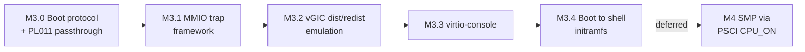
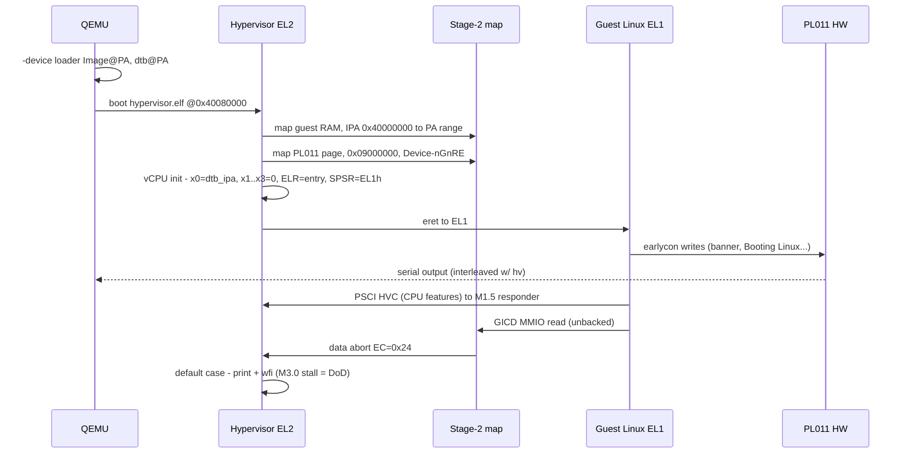

# M3 — Linux Guest: Decomposition & M3.0 Design

- **Date:** 2026-06-15
- **Status:** Approved (design); M3.0 ready for implementation planning
- **Supersedes:** the single-line M3 roadmap entry in `CLAUDE.md`
  (*"Boot Linux to shell, virtio-console; SMP via PSCI CPU_ON"*)

## Problem

The M3 roadmap line bundles six independent subsystems into one milestone.
Measured against the code that exists today, the gap is far too large for a
single spec → plan → implementation cycle:

**Built today (post-M2.5):**

- Single vCPU, single `g_vm`, one flat Stage-2 region (`vm_config.mem_base/size`).
- vGIC = **list-register injection only** (`vgic_inject_sw` / `vgic_inject_hw`).
  No GICD / GICR MMIO emulation.
- `handle_exit` handles **only HVC** (EC `0x16`). No data-abort / MMIO trap path.
- PSCI responder over HVC: VERSION / FEATURES / CPU_OFF / SYSTEM_OFF / RESET.
  **No CPU_ON.**
- vtimer with HW-forwarded injection (ADR-0001).
- Guest = a hand-written bare-metal SVM blob, not a Linux `Image`.

**Required to "boot Linux to shell + SMP":** Linux arm64 boot protocol +
`Image`/DTB/initrd loading; Stage-2 data-abort decode + MMIO trap-and-emulate
framework; full vGIC distributor + redistributor emulation (+ multi-LR /
maintenance IRQ); virtio-mmio + virtio-console; a rootfs; and SMP (PSCI CPU_ON,
multi-vCPU, per-CPU redistributor, SGIs, scheduling).

## Decision

Decompose M3 into **five small, dependency-ordered slices (M3.0–M3.4)** whose
shared goal is **single-core Linux booting to a busybox shell**. Each slice gets
its own spec → plan → implementation cycle.

**SMP is removed from M3** and deferred to its own later milestone. UP
boot-to-shell is the smaller, faster first win; SMP is a large, independent body
of work (multi-vCPU data structures, per-CPU GICR, SGIs, scheduling).

### Dependency graph

### Slice summary

| Slice | Goal | Definition of done (observable) |
|---|---|---|
| **M3.0** | Load Linux `Image` + DTB, arm64 boot protocol, PL011 passthrough early console | Linux earlycon prints banner + "Booting Linux…" + memory init, then **stalls at the first GIC MMIO access** (caught by `handle_exit` default → EC `0x24`) |
| **M3.1** | Stage-2 data-abort decode + MMIO trap-and-emulate dispatch framework | A trapped guest load/store reaches a registered device handler with correct address / size / direction / data |
| **M3.2** | vGIC GICD + GICR(cpu0) MMIO emulation built on the M3.1 bus | Linux GIC driver probes OK; the vtimer tick is delivered to the guest → boot proceeds past "Calibrating delay loop" |
| **M3.3** | virtio-mmio transport + virtio-console device + virtqueue + used-buffer IRQ | Guest exposes an interactive `hvc0` |
| **M3.4** | initramfs load + DTB initrd nodes (`linux,initrd-start/-end`) | **busybox shell prompt over the console** — headline M3 goal |

Slices M3.1–M3.4 are sketched here only enough to validate ordering; each will
be brainstormed to full spec depth when reached.

---

## M3.0 — Boot protocol + image launch + PL011 passthrough console

### Goal

Bring a real, unmodified arm64 Linux `Image` far enough to print boot logs
through `earlycon`, proving the boot protocol, guest RAM Stage-2 mapping, the
PL011 passthrough console, and PSCI-over-HVC all work — and to hand the GIC
problem cleanly to M3.1/M3.2 at a well-defined stall point.

### Settled design forks

| Fork | Decision |
|---|---|
| Early console | **Passthrough the physical PL011** into the guest Stage-2 (Device-nGnRE). No MMIO trap framework in M3.0. |
| `Image` + DTB delivery | **QEMU `-device loader` at fixed physical addresses.** Hypervisor maps them into Stage-2 and jumps. `hypervisor.bin` stays small; guest kernel is swappable without rebuilding the hv. |
| Guest DTB authoring | A hand-written `.dts` compiled to `.dtb` by `dtc` (no runtime DTB generation in M3.0). |

### Components & boundaries

1. **Guest memory layout.** Linux guest RAM is a dedicated region that does not
   overlap the hypervisor (hv loads at PA `0x40080000`). Stage-2 maps guest IPA
   `0x40000000` (RAM base, e.g. 256 MB) → a dedicated PA range outside the hv
   image. `Image` lands at IPA `0x40080000` (arm64 `text_offset` = `0x80000`
   from RAM base); the guest DTB at a fixed IPA (e.g. `0x4A000000`). Exact
   physical/IPA addresses are pinned in the implementation plan; this design
   fixes only the structure.

2. **`vm_config` extension.** Add `dtb_ipa` and a small device-passthrough
   table (initially just the PL011 frame); bump `mem_size` to a Linux-sized
   region. The existing single-region Stage-2 mapper is reused; M3.0 adds one
   device-page mapping.

3. **Boot-protocol vCPU init.** On guest launch set, per the arm64 Linux boot
   protocol: `x0 = dtb_ipa`, `x1 = x2 = x3 = 0`, `ELR_EL2 = kernel entry IPA`,
   `SPSR_EL2 = EL1h` with DAIF masked. Small change to the existing vCPU
   register setup — no new context-switch machinery.

4. **PL011 passthrough.** Stage-2 maps the physical PL011 frame
   (`0x09000000`, 4 KB) into the guest as a Device-nGnRE page. Guest
   `earlycon=pl011,0x9000000` writes straight to hardware. Hypervisor and guest
   share the UART; interleaved output is accepted for bring-up.

5. **Guest `.dts`.** Minimal but complete:
   - `/memory` — RAM base + size matching the Stage-2 map.
   - one `/cpu` with `enable-method = "psci"`.
   - `/psci` node — routes guest PSCI over HVC, **reusing the M1.5 responder**.
   - arch `/timer` node (the four timer PPIs).
   - `/pl011` node at `0x09000000`.
   - a `gicv3` node — present so the DTB is complete; its MMIO is unbacked in
     M3.0 and is the **intentional stall point**.
   - `/chosen` with `bootargs = "earlycon=pl011,0x9000000 console=ttyAMA0"` and
     `stdout-path`.

   Compiled by `dtc` via a new `guest/` make target. The Linux `Image` is
   user-supplied (prebuilt arm64 `defconfig`); Linux is **not** built in-repo.

6. **Build / run.** `scripts/run-qemu.sh` gains
   `-device loader,file=<Image>,addr=<PA>` and
   `-device loader,file=guest.dtb,addr=<PA>`. `hypervisor.bin` size is
   unchanged.

7. **vmexit.** Unchanged in M3.0. The GIC-MMIO data abort (EC `0x24`) hits the
   existing `default` case in `handle_exit`, which parks in `wfi`. That park is
   the M3.0 finish line; M3.1 replaces it with real MMIO dispatch.

### Data flow (M3.0 launch)

### Out of scope for M3.0

- Any MMIO trap-and-emulate (M3.1).
- Any GIC distributor/redistributor emulation (M3.2).
- virtio, rootfs, interactive console (M3.3 / M3.4).
- SMP / secondary vCPUs (deferred milestone).
- Building Linux or busybox in-repo (kernel is user-supplied).

### Verification (no CI, per repo convention)

1. **Build:** `make` succeeds with zero warnings (`-Werror`); the new `guest/`
   target produces `guest.dtb` via `dtc`.
2. **Static:** `readelf -h build/hypervisor.elf` — entry `0x40080000` unchanged.
3. **Run + observe:** `make run` (with the guest `Image` present) prints the
   Linux earlycon banner → `Booting Linux on physical CPU 0x0` → memory/PSCI
   init, then the hypervisor prints `unexpected exit EC=0x24 …` at the first
   GICD access. That single run proves boot protocol + RAM Stage-2 + PL011
   passthrough + PSCI-over-HVC.

### Risks / open items (resolve in the plan)

- Exact IPA↔PA address assignment for guest RAM, `Image`, and DTB, ensuring no
  overlap with the hv image and matching the `text_offset` requirement.
- `dtc` availability in the toolchain environment (add to prerequisites).
- Documenting how the user supplies the prebuilt `Image` (path / make var).
