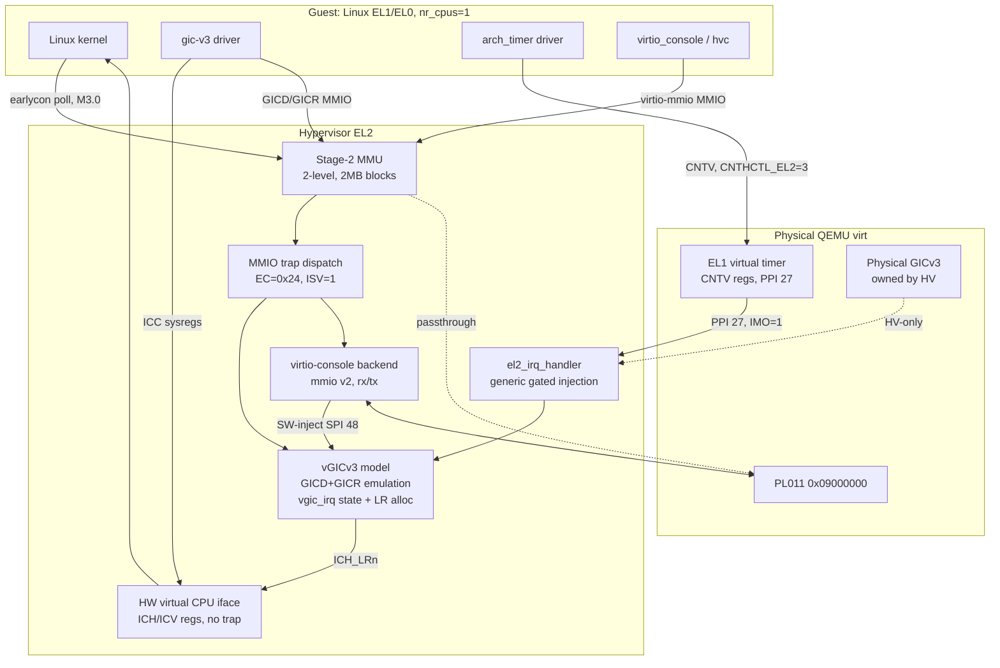
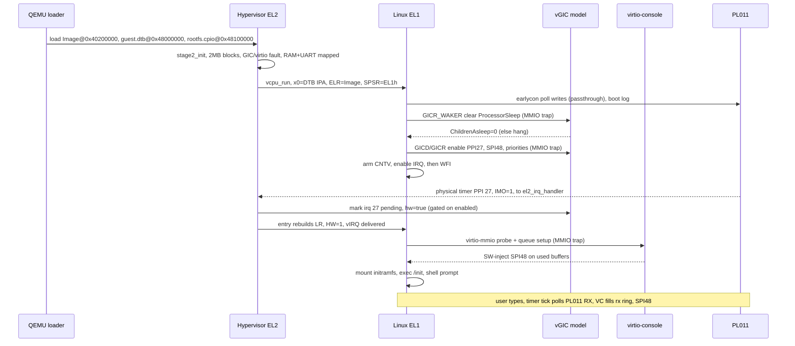
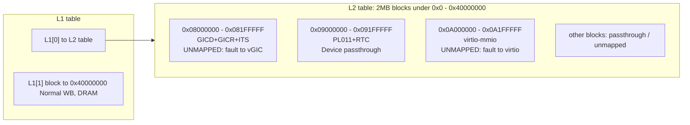

# Hypervisor — M3 (Single-Core Linux Guest) Design

- **Date**: 2026-06-15
- **Project**: `hypervisor-`
- **Milestone**: M3 — Boot an unmodified single-core (UP) Linux guest to an interactive shell
- **Target platform**: QEMU `virt` (AArch64), GICv3, Cortex-A72, `-smp 1`
- **Status**: Design approved (via `/grill-me` interview), ready for implementation planning

> **来源 / Provenance**: 本文档由 `2026-06-15` 的 `/grill-me` 访谈综合而成，走的是
> **单核（UP）路径**——SMP 被显式拆出到 M3.5。若仓库中并存另一份由其他
> brainstorm 会话产出的 M3 文档，请以本「来源」标记 + 文件名日期区分；二者可对照合并。

---

## 1. Purpose & Positioning

M2.5 proved the end-to-end *physical-timer → EL2 → HW-forwarded vGIC injection → guest*
chain for a single hand-written bare-metal payload. M3 replaces that payload with a
**real, unmodified upstream Linux kernel** and drives it to an **interactive shell**.

The headline jump is no longer one mechanism but a *guest OS that probes hardware it
expects to exist*: it loads from a device tree, programs the GIC distributor over MMIO,
arms the architected timer, and talks to a console device. M3 builds exactly the
hypervisor surface that an unmodified Linux touches during UP boot — and **nothing more**.

### 1.1 The single hard constraint: single-core (UP)

**SMP is out of M3 entirely** (deferred to M3.5). Rationale: SMP introduces a per-pCPU
"current vCPU" pointer (`TPIDR_EL2`, touching every exception entry stub), PSCI `CPU_ON`
+ secondary *physical* core wake-up (secondaries are parked in `head.S` today), SGI/IPI
virtualization, and a scheduler — every one of which is **orthogonal to "make Linux
run"**. Folding them together would make any hang ambiguous (vGIC emulation bug vs. SMP
race). M3 boots with `nr_cpus=1` so the entire critical path is deterministic and
single-step debuggable. Data structures are **shaped** for multi-core (vCPU-indexable,
`TPIDR_EL2` hook reserved) but the **execution path runs exactly one vCPU**.

### 1.2 Roadmap context

| Milestone | Goal |
|---|---|
| M2.5 — Physical timer + GIC + HW-forwarding *(done)* | timer PPI → EL2 → `vgic_inject_hw` → guest |
| **M3 — Single-core Linux guest** *(this spec)* | unmodified UP Linux → shell over virtio-console |
| M3.5 — SMP | PSCI `CPU_ON`, per-pCPU current vCPU, SGI virtualization, scheduler |
| M4 — RK3588 port | real hardware, DT/ACPI discovery, boot from storage |

---

## 2. Scope

### 2.1 In scope (M3)

Decomposed into three independently-verifiable sub-milestones (see `plans/`):

- **M3.0 — Linux is alive (no interrupts)**: load `Image` + hand-written `guest.dtb` +
  `rootfs.cpio` via QEMU `-device loader`; set the arm64 boot protocol register state
  (`x0=DTB IPA`, PC=Image base, EL1h); pass-through the physical PL011 so `earlycon`
  polling prints the boot log. Expected terminus: Linux prints up to the point it needs
  the GIC, then hangs.
- **M3.1 — vGICv3 distributor/redistributor emulation**: MMIO trap-and-emulate
  infrastructure (`EC=0x24`, ISV=1 only); stage-2 restructured to 2-level / 2 MB blocks
  so GIC/virtio regions fault while RAM + PL011 stay mapped; a lightweight per-INTID
  `vgic_irq` state model; GICD/GICR register subset Linux actually touches (RAZ/WI
  otherwise); dynamic List-Register allocation with per-exit save/rebuild; the timer PPI
  generalized from M2.5's hard-coded INTID 27 into the generic gated path.
- **M3.2 — virtio-console + interactive shell**: a virtio-mmio v2 (modern)
  virtio-console backend (rx/tx queues, `feature=0`), software-injected SPI, RX driven by
  polling the physical PL011 on the timer tick; `console=hvc0`. Terminus: a shell prompt
  that echoes typed input.

- **WFI**: left **un-trapped** (`HCR_EL2.TWI=0`); the physical timer naturally wakes the
  guest. `nohz=off` on the guest cmdline keeps a periodic tick alive to drive RX polling.

### 2.2 Out of scope

- **SMP / multiple vCPUs / PSCI `CPU_ON` / SGI virtualization / scheduler** → M3.5.
- **Maintenance interrupts** (`ICH_HCR_EL2.UIE/LRENPIE`) and software pending queues /
  LR-overflow handling — M3 has ≤ LR-count interrupt sources, so an LR-exhaustion panic
  is the guardrail (§5.4). Revisit at M3.5.
- **MMIO instruction decoder** — ISV=0 syndromes panic (§5.2). Linux's GIC/virtio drivers
  use single-register `readl/writel` → always ISV=1.
- **GICv3 ITS / LPIs / MSI** — virtio-mmio uses a wired SPI, not MSI.
- **Runtime DTB generation** — `guest.dts` is hand-written and compiled by `dtc` (§4.2).
- **Hypervisor-side image loader / ELF / decompression** — QEMU `-device loader` places
  raw images (§4.1).
- **Device passthrough / general pIRQ↔vIRQ routing table** — M3's only physical interrupt
  source is the timer PPI (identity 27→27); anything else panics (§4.6). → M4.
- **`CNTVOFF` virtualization / per-VM timebase**, **UART RX interrupt**, **FP/SIMD
  save/restore**, **DT/ACPI hardware discovery** (board-header constants remain) → M4.

---

## 3. Architecture

### 3.1 Guest-visible vs. hypervisor-owned hardware



The three-layer GICv3 split is the spine of M3:

| Layer | Who handles it | M3 work |
|---|---|---|
| CPU interface (`ICC_*` sysregs) | **HW virtual interface** (`ICH_*`/`ICV_*`) | **nothing** — guest `ICC_IAR1/EOIR1/PMR` are redirected by HW, never trap |
| Distributor (GICD MMIO @ `0x08000000`) | **emulation** | SPIs (INTID ≥ 32): enable/pending/priority/route |
| Redistributor (GICR MMIO @ `0x080A0000`) | **emulation** | SGI/PPI (INTID 0–31): enable/priority/config |

### 3.2 End-to-end boot flow (target: M3.2 complete)



### 3.3 Stage-2 IPA layout (M3.1 onward)



2 MB granularity suffices: QEMU virt places **all** GIC registers in a single 2 MB block,
with no passthrough device sharing it; the MMIO dispatcher uses the exact faulting IPA
(`HPFAR_EL2`), so a whole-block fault loses no precision. No L3 / 4 KB tables needed.

---

## 4. Component Design

### 4.1 Image loading & arm64 boot protocol

QEMU places raw images; the hypervisor only sets register state and starts:

```
-device loader,file=Image,addr=0x40200000        # kernel (2MB-aligned)
-device loader,file=guest.dtb,addr=0x48000000    # device tree
-device loader,file=rootfs.cpio,addr=0x48100000  # initramfs
```

`vm_config` gains `kernel_ipa / dtb_ipa / initrd_ipa` (replacing the single `entry`).
`vm_init` sets `vcpu.regs.x[0] = dtb_ipa`, `x[1]=x[2]=x[3]=0`, `elr_el2 = kernel_ipa`,
`spsr_el2 = EL1h + DAIF masked`, then `vcpu_run`. No ELF/decompression in the hypervisor.

### 4.2 Guest device tree (`guest.dts` → `guest.dtb`)

Hand-written `.dts`, compiled by `dtc` as a build artifact. Describes the **virtual**
topology (fixed for M3): `/memory`, one CPU (`enable-method = "psci"`), the vGIC
(`reg` = emulated GICD/GICR bases, matching §4.4 byte-for-byte), the arch timer,
`/psci { method = "hvc"; }`, one `virtio_mmio` node (the console, with its SPI), and
`/chosen { bootargs = "earlycon=pl011,mmio32,0x09000000 console=ttyAMA0 console=hvc0 nr_cpus=1 nohz=off"; linux,initrd-start/-end = <…>; }`.

**Invariant**: the DTB `/memory` range, the stage-2 mapped RAM range, and QEMU `-m` must
all agree. The DTB GIC `reg`/`interrupts` must match the emulated vGIC exactly. A good
starting point is `qemu-system-aarch64 … -machine dumpdtb=qemu.dtb` then trim.

### 4.3 MMIO trap-and-emulate infrastructure (`vmexit.c`)

New `EC=0x24` (lower-EL data abort) handler. **Trusts the HW syndrome only (ISV=1)**:
- IPA = `(HPFAR_EL2[39:4] << 8) | (FAR_EL2 & 0xFFF)`
- ISS: `ISV`(24), `SAS`(23:22)=size, `SRT`(20:16)=Xreg, `WnR`(6)=write
- write: `value = regs->x[SRT]` (SRT==31 ⇒ XZR=0); read: `regs->x[SRT] = handler_result`
- advance: `elr_el2 += 4` (assert `ESR.IL==1`)
- **ISV=0 ⇒ panic** with IPA+ESR (§5.2). **Unregistered region ⇒ panic** with IPA (§5.3).

Dispatch is a **static fixed array** of `{ipa_base, size, read_fn, write_fn}`: GICD, GICR,
virtio-console — three entries, no dynamic registration in M3.

### 4.4 vGICv3 model (`vgic.c`)

Lightweight per-INTID state, log-driven register subset:

```c
struct vgic_irq { u8 priority, config, group; bool enabled, pending, active, hw; u32 pintid; };
struct vgic {
    struct vgic_irq ppi[32];     /* SGI0-15 + PPI16-31, per-vCPU */
    struct vgic_irq spi[N_SPI];  /* INTID 32.., per-VM; N_SPI ↔ GICD_TYPER */
    u32 gicd_ctlr;
    /* LR shadow ich_lr[] already in struct vcpu */
};
```

Implement only the registers Linux's gic-v3 driver touches; **RAZ/WI** the rest; log
unknown offsets and add as needed. **Probe-blocking registers that must be correct**:
- `GICR_WAKER`: on read, `ChildrenAsleep=0` (Linux spins waiting for it — else silent hang).
- `GICR_TYPER`: report `Last=1` + correct affinity (else redistributor enumeration hangs).
- `GICD_TYPER`: `ITLinesNumber` sized to `N_SPI`.

**LR management** (§5.4): per-exit `vgic_sync()` reads back all `ICH_LRn`, folds
pending/active state into `vgic_irq`; per-entry rebuild allocates a free LR for each
`pending && enabled` IRQ by priority. HW-forwarded LRs (timer, `HW=1`) are recognized on
sync — guest deactivate auto-releases the physical INTID and invalidates the LR; clear
`active` accordingly. **LR exhaustion ⇒ panic** (no software pending queue in M3).

### 4.5 virtio-console backend (`virtio_console.c`)

virtio-mmio **v2 (modern)**, single virtio-console (DeviceID=3), two virtqueues rx(0)/tx(1),
`features=0` (no control queue, no multiport). **1:1 stage-2 RAM mapping (IPA==PA) ⇒ the
backend dereferences guest-supplied ring addresses directly — zero translation.**

- TX: guest writes tx ring → `QueueNotify` (MMIO trap) → backend reads descriptors → writes
  bytes to physical PL011 → marks used → SW-inject SPI 48.
- RX: timer-tick polls PL011 `RXFE` → backend takes a free rx buffer → fills bytes → marks
  used → SW-inject SPI 48.
- Probe-critical MMIO: `MagicValue`(0x000)=`0x74726976`, `Version`(0x004)=2,
  `DeviceID`(0x008)=3; the `Status` handshake (ACKNOWLEDGE→DRIVER→FEATURES_OK→DRIVER_OK,
  write 0 = reset); `QueueReady`/`QueueNotify`; `InterruptStatus`/`InterruptACK`.

### 4.6 Physical IRQ path (`el2_irq_handler`) — generalized timer

The only physical interrupt EL2 sees in UP M3 is the EL1 virtual timer PPI 27 (`IMO=1`).
M2.5's hard-coded `vgic_inject_hw(27,…)` becomes:

```
pintid = gic_ack_irq();
vintid = (pintid == 27) ? 27 : panic();      // identity only; no general map (M4)
irq = vgic_lookup(vcpu, vintid);
if (irq->enabled) { irq->pending = true; irq->hw = true; irq->pintid = pintid; }  // gate
gic_priority_drop(pintid);                    // drop only; HW link deactivates on guest EOI
```

The `enabled` gate prevents injecting before Linux has configured its vGIC. Timer stays
HW-forwarded; `CNTHCTL_EL2=3`, `CNTVOFF_EL2=0` (M2.5) unchanged — Linux's `arch_timer`
uses `CNTV_*` directly, no trap.

### 4.7 Idle / WFI

`HCR_EL2.TWI=0` (un-trapped). Guest WFI → physical timer PPI wakes the CPU → taken at EL2
→ inject → return. `nohz=off` (cmdline) keeps a periodic tick so RX polling has a beat.

---

## 5. Design Decisions

### 5.1 UP-only; SMP deferred to M3.5
Keep the critical path deterministic; shape data structures for multi-core but run one
vCPU. **Rejected**: SMP-in-M3 — couples vGIC-correctness debugging with concurrency races.

### 5.2 MMIO: trust ISV=1, panic on ISV=0
Linux GIC/virtio drivers use single-register `readl/writel` ⇒ always ISV=1. Avoids an
instruction decoder entirely (an ARM64 advantage over x86). **Rejected**: instruction
fetch+decode — large, unneeded for M3 access patterns.

### 5.3 Static dispatch table; unregistered MMIO panics
Single VM, fixed topology. **Rejected**: dynamic device registration / graceful RAZ/WI
fallback — that's the M4 VM-config framework.

### 5.4 Per-exit LR save/rebuild; no maintenance IRQ; LR-exhaustion panic
Continuation of M2.5's `vgic_save/restore`. M3 has ≤ LR-count sources (timer PPI + virtio
SPI) ⇒ never overflows 4 LRs ⇒ no software pending queue. **Rejected**: maintenance
interrupts (`UIE/LRENPIE`) — a performance optimization that adds an async source to debug.

### 5.5 Stage-2 → 2-level / 2 MB blocks; selective trap vs passthrough
GIC + virtio blocks unmapped (fault → emulate); PL011 block passthrough (earlycon); RAM
1:1. 2 MB granularity suffices (all GIC regs in one block; dispatch by exact IPA). No L3.

### 5.6 virtio-mmio v2, minimal; 1:1 IPA exploited
Modern transport (Linux default, no legacy QueuePFN quirk). `features=0`, rx/tx only.
1:1 RAM map removes IPA→PA translation in ring access. **Rejected**: virtio-pci (PCI
config space overhead); legacy v1.

### 5.7 Timer stays HW-forwarded; identity pIRQ↔vIRQ only
`CNTHCTL_EL2=3` gives Linux native `CNTV_*`; HW-forward (ADR-0001) keeps physical-line
deactivation correct via the LR linkage, now through dynamic LRs + an `enabled` gate.
**Rejected**: software virtual timer (only needed when VMs share a timebase, M4+);
general pIRQ↔vIRQ map (only for device passthrough, M4).

### 5.8 WFI un-trapped; `nohz=off`
Physical timer wakes WFI natively (zero code). `nohz=off` keeps RX-poll cadence alive.
**Rejected**: `TWI=1` (needed only for SMP scheduling/yield, M3.5); hypervisor-side
independent RX timer (optimization).

---

## 6. Acceptance Criteria

Per sub-milestone (detail in `plans/2026-06-15-m3-linux-guest.md`):

- **M3.0**: build clean; Linux self-decompresses and prints the boot log via earlycon up
  to the GIC-init hang. Diagnostic: `Booting Linux on physical CPU 0x0` appears.
- **M3.1**: Linux's gic-v3 driver probes (no `GICR_WAKER` hang); the architected timer
  interrupt is delivered (kernel proceeds past `Calibrating delay loop` / timer setup;
  no re-pend storm). Diagnostic: timer-driven progress and any later init continuing.
- **M3.2**: virtio-console probes; `/init` (busybox) execs; an **interactive shell prompt**
  appears on the serial console and **echoes typed input**. Diagnostic: typing `ls` and
  seeing output.

Global: `make` zero warnings (`-Werror`); entry `0x40080000`; the M2.5 `tests/run_svm2_test.sh`
still passes (no regression in the bare-metal path).

---

## 7. Forward Compatibility (M3.5 / M4)

- **M3.5 SMP**: vCPU array + `TPIDR_EL2` current-vCPU pointer read at every exception stub;
  PSCI `CPU_ON` + secondary pCPU wake (un-park `head.S`); SGI/IPI via vGIC; software
  pending queue once sources > LR count; maintenance interrupts as optimization; a
  scheduler or 1:1 vCPU↔pCPU pin; `HCR_EL2.TWI=1` for yield.
- **M4 RK3588**: DT/ACPI discovery replaces board-header constants; hypervisor-side image
  loader from storage; device passthrough → general pIRQ↔vIRQ routing table; `CNTVOFF`
  per-VM; multi-VM dynamic MMIO registration with graceful fallback.
