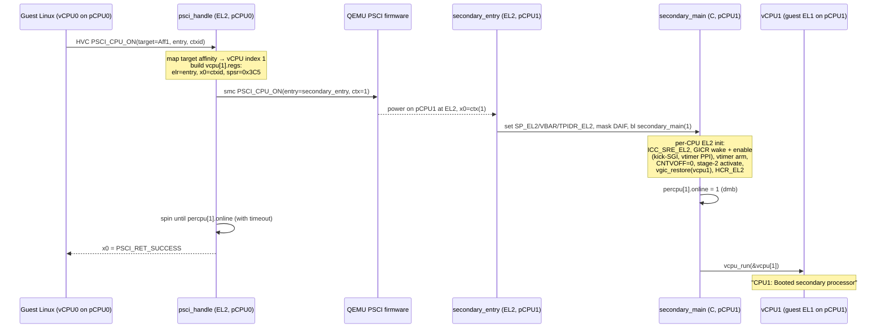
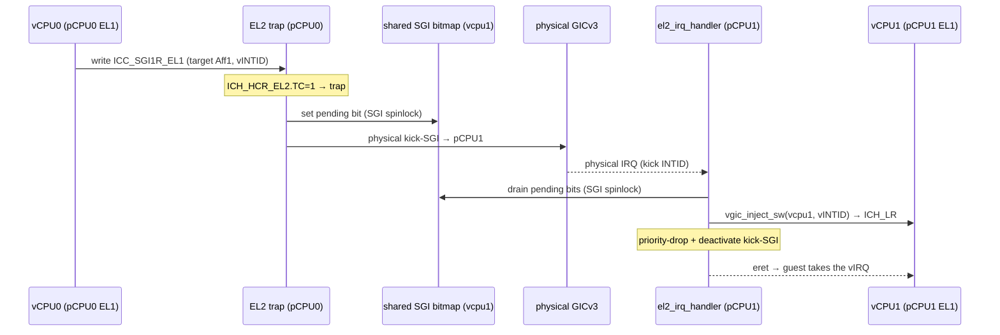

# M3.5 — SMP (2-vCPU Linux, static 1:1 pinning) Design

> **Status:** Implemented and boot-verified (2026-06-27; reverified 2026-07-13).
> **Milestone:** M3.5. Supersedes the
> single-vCPU assumption of [[../../adr/0002-single-global-vm-single-vcpu]].

## Goal

Boot an **unmodified `-smp 2` Linux guest** so its secondary CPU comes online and
the busybox shell reports CPUs `0-1` online. The guest is given exactly
**two vCPUs**, each **statically pinned 1:1 to a physical CPU** (vCPU0→pCPU0,
vCPU1→pCPU1). **There is no scheduler** — no time-sharing of vCPUs across pCPUs,
no overcommit. `NR_CPUS = 2` is a compile-time constant and the build assumes
physical = virtual = 2.

This is the smallest increment that turns the single-global-vCPU machine (in force
through M3.4) into a real SMP guest: it forces PSCI `CPU_ON`, a per-CPU EL2 model,
per-CPU vGIC/timer state, and the first cross-core IPI path to all actually work.

**Observable DoD (headline):** on `make run` with `-smp 2`, the serial log prints

```
CPU1: Booted secondary processor 0x0000000000000001 [...]
smp: Brought up 1 node, 2 CPUs
```

and at the busybox prompt `/sys/devices/system/cpu/online` shows `0-1` (`nproc`
may be used when that busybox applet is available). The SGI/IPI path is exercised
as a **non-blocking strong-verification** step (see Verification), not a gate on
the milestone.

---

## Decision summary (the 11 grilled decisions)

| # | Decision | Resolution |
|---|---|---|
| 1 | Scope | 2 vCPU, static 1:1 pinning, **no scheduler**, `NR_CPUS=2` locked |
| 2 | Secondary bring-up | **Guest-driven**: guest PSCI `CPU_ON` (HVC) → trap EL2 → EL2 issues a **real `smc CPU_ON`** to QEMU firmware to power on pCPU1 |
| 3 | vCPU1 init + MPIDR | vCPU1 regs built from guest `CPU_ON` args; **`VMPIDR_EL2`** provides the virtual MPIDR (vCPU0→Aff=0x0, vCPU1→Aff=0x1) |
| 4 | Concurrency | **`TPIDR_EL2`** for per-CPU; one minimal spinlock guarding **only printk and SGI**; everything else lock-free by not sharing |
| 5 | SGI/IPI | Trap `ICC_SGI1R_EL1` (`ICH_HCR_EL2.TC=1`) → shared pending bitmap → physical **kick-SGI** → target pCPU drains bitmap and injects |
| 6 | Timer | per-CPU `current_vcpu()` injection; PL011 SPI **pinned to pCPU0**; both cores `CNTVOFF_EL2 = 0` |
| 7 | Bring-up order | global vs per-CPU split; static `percpu[2]`; `online` handshake; **stage-2 activate before vgic_restore** |
| 8 | asm decoupling | `TPIDR_EL2` holds `&percpu[id]`; entry does `mrs … ; ldr [#PERCPU_CUR_VCPU]`; new controlled offset; ADR-0003 upgraded |
| 9 | DTB/QEMU | symmetric `cpu@1 reg=<0x1>`; `psci method="hvc"`; QEMU `-smp 2`; strict 1:1 |
| 10 | DoD | headline = `CPU1 booted` + sysfs CPUs `0-1`; IPI measured as non-blocking strong verification |
| 11 | Slicing | 5 tracer-bullet slices; **slice 1 (percpu/asm refactor) lands as its own first commit** |

---

## Why guest-driven bring-up, and what the QEMU environment forces

`scripts/run-qemu.sh` runs `-machine virt,virtualization=on`. **There is no EL3 /
TF-A** in that configuration: QEMU starts **CPU0 directly at EL2**, and the
**secondary pCPUs are powered-off** until someone issues `PSCI_CPU_ON`. QEMU's
**built-in PSCI implementation** (conceptually at EL3, transparent to us) then
powers the secondary on **at EL2**, jumping to the entry address we passed.

So our EL2 hypervisor cannot rely on the old "secondary is already running" model.
Today `head.S` parks secondaries in a dead `wfi` (`secondary_park`); that code
assumed the core was running. Under PSCI the secondary starts **off**, and **we
must actively wake it** by issuing a `smc PSCI_CPU_ON` to QEMU firmware with our
EL2 secondary entry address.

The trigger is **the guest**, not the hypervisor (decision 2b, not 2a). When the
guest's Linux executes `PSCI_CPU_ON` to bring up *its* vCPU1, that HVC traps to
`psci_handle`. We translate it into a physical `CPU_ON` of pCPU1. This preserves
real virtualization semantics — the guest's `maxcpus`, CPU hotplug and PSCI
contract all work — and reuses the M1.5 PSCI HVC trap path. A hypervisor-initiated
bring-up (2a) would be simpler but bypasses the guest's PSCI semantics.

> **Silent-failure trap:** the guest DTS `psci { method = "hvc"; }` is the
> precondition for `CPU_ON` to trap to EL2 at all. If it were `"smc"`, the guest's
> `CPU_ON` would go straight to QEMU firmware, bypass EL2, and the whole chain
> would fail silently. Already confirmed `"hvc"` in `guest/qemu_virt.dts`.

### Secondary bring-up sequence



---

## vCPU1 initial state and virtual MPIDR (decision 3)

Linux's `CPU_ON` passes `x1=target_cpuid` (MPIDR affinity), `x2=entry_point`
(guest IPA), `x3=context_id`. The secondary must come online in the arm64 boot
protocol's secondary state: EL1h, MMU off, `x0=context_id`, `PC=entry_point`.
This mirrors what `vm_init` already does for vCPU0, with different values:

- `vcpu[1].regs.elr_el2  = x2 (entry_point)`
- `vcpu[1].regs.x[0]     = x3 (context_id)`  — **not** the DTB; secondaries don't take it
- `vcpu[1].regs.x[1..3]  = 0`
- `vcpu[1].regs.spsr_el2 = 0x3C5` (EL1h + DAIF masked, same as vCPU0)
- `vcpu[1].hcr_el2`        identical to vCPU0
- vCPU1 **shares the same Stage-2 page table / VMID / IPA space** as vCPU0.

The guest's view of `MPIDR_EL1` is a **virtual** topology provided by
`VMPIDR_EL2`: vCPU0→Aff=0x0, vCPU1→Aff=0x1, matching the DTS `cpu@N reg` values.
This keeps the `target_cpuid → vCPU index` mapping fully under our control instead
of depending on the physical pCPU MPIDRs coinciding (they happen to be 0/1 on
`cortex-a72`, but we do not rely on it). A `CPU_ON` for a target affinity outside
{0,1} returns `PSCI_RET_INVALID_PARAMETERS`.

---

## Concurrency model (decision 4)

Once pCPU1 runs EL2 in parallel, every "load-bearing single-vCPU assumption" from
ADR-0002 is exposed. The model:

| State | global / per-CPU | Sharing & protection |
|---|---|---|
| Stage-2 table, VMID | global | built once on CPU0, then **read-only** (no demand paging) → no run-time lock; TLBI broadcast (`vmalls12e1is`) before activation |
| `vcpu[2]` register frames | per-CPU | each pCPU touches only its own → no sharing |
| asm `adrp g_vm` entry path | per-CPU | replaced by `TPIDR_EL2` (decision 8) |
| vGIC `ICH_*` / LRs | per-CPU | each pCPU saves/restores its own |
| SGI pending bitmap | **shared** | written cross-core → **SGI spinlock** |
| printk / UART | **shared** | **printk spinlock** (else interleaved output) |
| GICD config / SPI routing | global | configured once on CPU0 |

Two principles:

1. **per-CPU state via `TPIDR_EL2`.** Each pCPU writes `&percpu[id]` into
   `TPIDR_EL2` at its secondary entry. The exception-entry asm reads the current
   vCPU through it instead of `adrp g_vm`.
2. **Lock only what is truly shared, and keep locks minimal.** The repo has had
   **zero** synchronization primitives (single core never needed any). M3.5
   introduces the **first spinlock** — a minimal ticket (or `LDAXR/STXR`
   test-and-set) lock with `dmb/dsb` — used **only** for printk and the SGI
   bitmap. No RCU, no sleeping locks. Everything else stays lock-free by being
   either build-once-read-only (Stage-2) or per-CPU (vGIC/timer/vcpu).

---

## SGI / IPI path (decision 5)

After vCPU1 is up, Linux uses SGIs for IPIs (reschedule, call-function, TLB).
A vCPU writes the **system register** `ICC_SGI1R_EL1` (not MMIO); the target
vCPU may be running on **another pCPU**, whose live `ICH_LR_EL2` we cannot write
from the sender. So cross-core injection is two steps: **(1)** record the pending
SGI in the target vCPU's shared state, **(2)** force the target pCPU into EL2 so it
writes its own LR.

- **Trapping:** set `ICH_HCR_EL2.TC = 1` so guest `ICC_SGI1R_EL1` writes trap to
  EL2; routing is **fully software-emulated** (consistent with the all-software
  vGICv3 trap-and-emulate line, ADR-0010/0011). At 2 cores the per-IPI trap cost
  is negligible and keeps the routing logic in our hands.
- **Kick:** the sender pCPU issues a **physical SGI** (a reserved "kick" INTID) to
  the target pCPU. The target's EL2 physical-IRQ handler exits to EL2, drains the
  shared pending bitmap, and injects via `vgic_inject_sw`. This reuses the M2.5
  "physical IRQ → EL2 → inject" path and keeps IPIs prompt (polling at exits
  would stall an IPI until the next timer tick — unacceptable).



---

## Timer, PL011, CNTVOFF (decision 6)

- The vtimer PPI (INTID 27) is **per-CPU private**; each pCPU has its own physical
  vtimer enabled on its own GICR. `el2_irq_handler` changes its hard-coded
  `&g_vm.vcpu` to `current_vcpu()` (read from `TPIDR_EL2`). Each pCPU arms its own
  vtimer in its bring-up.
- **PL011 RX SPI is pinned to pCPU0** (`GICD_IROUTER` Aff=0). The console is a
  single sink; **vCPU1 does not receive serial RX**. Other cores' `el2_irq_handler`
  never sees this SPI.
- Both pCPUs set **`CNTVOFF_EL2 = 0`** so the two vCPUs see a single coherent
  virtual counter (SMP requires consistent system time). vCPU1 does **not** get a
  distinct offset.

`el2_irq_handler` dispatch becomes:

```
intid = gic_ack_irq()
if   intid == VTIMER_IRQ: vgic_inject_hw(current_vcpu(), ...)   # this core's timer
elif intid == KICK_SGI:   drain vcpu pending-SGI bitmap → inject_sw → deactivate
elif intid == PL011_IRQ:  vgic_inject_spi(current_vcpu(), ...)  # only on pCPU0
else:                     drop + deactivate
```

---

## Bring-up: global vs per-CPU split (decision 7)

| Init item | global / per-CPU | pCPU1 runs it? |
|---|---|---|
| clear BSS, build Stage-2, VMID | global (CPU0 once) | ❌ |
| vm_config, fill vCPU0 regs | global | ❌ (vCPU1 regs filled by guest CPU_ON) |
| SP_EL2 (EL2 stack) | per-CPU | ✅ own stack |
| `VBAR_EL2 = hv_vectors` | per-CPU | ✅ |
| `TPIDR_EL2 = &percpu[id]` | per-CPU (new) | ✅ |
| `ICC_SRE_EL2` enable | per-CPU | ✅ |
| GICR wake + enable PPI/SGI (kick-SGI, vtimer) | per-CPU | ✅ |
| vtimer arm, `CNTVOFF=0` | per-CPU | ✅ |
| `HCR_EL2`, Stage-2 activate (VTTBR/VTCR) | per-CPU (regs) / shared (table) | ✅ |
| GICD config, SPI routing | global (CPU0) | ❌ |
| DAIF, barriers | per-CPU | ✅ |

`secondary_entry` keeps asm minimal and enters C fast:

1. `SP_EL2` = this core's stack (static per-CPU stack, indexed by id/context_id)
2. `VBAR_EL2 = hv_vectors`; `TPIDR_EL2 = &percpu[id]`
3. mask DAIF, `dsb/isb`
4. `bl secondary_main(id)` → `ICC_SRE_EL2`, GICR wake + enable (kick-SGI, vtimer
   PPI), vtimer arm, `CNTVOFF=0`, **Stage-2 activate → then vgic_restore(vcpu1)**,
   `HCR_EL2`
5. `vcpu_run(&vcpu[1])`

> **Ordering constraint (load-bearing):** **Stage-2 activate must precede
> vgic_restore.** Activate is the switch that puts this core into the guest's
> address-space context (incl. `HCR_EL2.VM`); all subsequent guest-state restores
> must run inside that context, matching vCPU0's `stage2_activate → vgic_restore`
> order in `vm_run`. The `HCR_EL2.VM` enable must be before running the guest, after
> an `isb`.

**Handshake:** `percpu[id].online` (volatile + `dmb`) is set at the end of
`secondary_main`; CPU0 spins on it (with a timeout print) before returning
`PSCI_RET_SUCCESS` to the guest — a simple release/acquire pairing.

`percpu` and stacks are a static `percpu[NR_CPUS]` array (`NR_CPUS=2`); the
secondary indexes it with the `context_id` we passed in `CPU_ON` (0/1). No dynamic
allocation.

---

## asm ↔ C decoupling (decision 8, upgrades ADR-0003)

The fast path currently does `adrp x0, g_vm` to reach vCPU0's register frame
(because `&g_vm == &g_vm.vcpu.regs`). Under SMP this is **wrong**: pCPU1 would also
`adrp g_vm` and clobber vCPU0's frame. There are **4 sites** across **2 files**:

- `hypervisor/arch/arm64/vmexit/vmexit_asm.S` (lines 91, 129)
- `hypervisor/arch/arm64/irq/irq_handler_asm.S` (lines 21, 57)

All four change from `adrp x0, g_vm; add x0, x0, :lo12:g_vm` to:

```asm
    mrs     x0, tpidr_el2          /* &percpu[id] */
    ldr     x0, [x0, #PERCPU_CUR_VCPU]   /* cur_vcpu == &vcpu == &vcpu.regs */
```

`struct percpu { struct vcpu *cur_vcpu; ... }`. We keep the
`&vcpu == &vcpu.regs` zero-offset property, so dereferencing `cur_vcpu` yields the
regs frame directly. This adds **one** controlled asm↔C offset, `PERCPU_CUR_VCPU`,
defined with `#define` and validated C-side by
`_Static_assert(offsetof(struct percpu, cur_vcpu) == PERCPU_CUR_VCPU)`. ADR-0003 is
**upgraded** from "one zero-offset coincidence" to "two controlled offsets" — not
retired.

`TPIDR_EL2` must be valid before each core first runs the guest (CPU0 in
`hypervisor_main`, pCPU1 in `secondary_entry`) and is never changed afterward.

---

## DTB / QEMU changes (decision 9)

- `guest/qemu_virt.dts`: add a symmetric secondary CPU node
  ```dts
  cpu@1 {
      device_type = "cpu";
      compatible = "arm,cortex-a72";
      reg = <0x1>;
      enable-method = "psci";
  };
  ```
- `psci { method = "hvc"; }` — already present and required (see trap note above).
- `scripts/run-qemu.sh`: `-smp 1` → `-smp 2`.
- `NR_CPUS = 2` compile-time; strict physical = virtual = 2; no handling of
  "more pCPUs than vCPUs" (deferred to M4 / RK3588's 8 cores).

---

## Affected files

| File | Change |
|---|---|
| `hypervisor/arch/arm64/boot/head.S` | delete `secondary_park`; add `secondary_entry` |
| `hypervisor/arch/arm64/vmexit/vmexit_asm.S` | 2 sites: `adrp g_vm` → `TPIDR_EL2`+offset |
| `hypervisor/arch/arm64/irq/irq_handler_asm.S` | 2 sites: same |
| `hypervisor/common/vm/vm.c` / `vm.h` | `g_vm.vcpu` → `vcpu[2]`; vCPU1 init from CPU_ON; `current_vcpu()` |
| `hypervisor/common/psci/psci.c` | real `CPU_ON`: parse args, fill vCPU1, physical `smc CPU_ON`, online wait |
| `hypervisor/arch/arm64/irq/vgic.c` / `vgic.h` | per-CPU injection; `ICC_SGI1R` trap routing; SGI bitmap; kick-SGI |
| `hypervisor/arch/arm64/irq/irq_handler.c` | `current_vcpu()`; kick-SGI branch |
| `hypervisor/arch/arm64/mmu/stage2.c` | per-CPU activate (shared table); TLBI broadcast |
| `hypervisor/arch/arm64/include/board.h` | kick-SGI INTID; `NR_CPUS` |
| `guest/qemu_virt.dts` | add `cpu@1` |
| `scripts/run-qemu.sh` | `-smp 2` |
| **new** `hypervisor/.../percpu.{h,c}` | `struct percpu`, `percpu[2]`, `current_vcpu()`, `PERCPU_CUR_VCPU` |
| **new** `hypervisor/.../spinlock.h` | minimal ticket / test-and-set spinlock |

---

## Implementation slices (tracer-bullet; decision 11)

Each slice builds and `make run`s to an observable signal.

1. **per-CPU foundation (still UP).** Introduce `struct percpu`, `NR_CPUS=2`,
   `percpu[2]`, `TPIDR_EL2`; CPU0 sets `TPIDR_EL2`; rewrite the 4 asm sites to the
   `TPIDR_EL2`+offset dereference; add the `_Static_assert`. **Verify: single-core
   Linux still boots to `~ #` (behavior unchanged).** Lands as **its own first
   commit** — a pure, behavior-preserving refactor that isolates the riskiest asm
   change from any concurrency.
2. **wake pCPU1 (no guest).** `head.S` drops `secondary_park`, adds
   `secondary_entry`; CPU0 issues `smc PSCI_CPU_ON(entry=secondary_entry, ctx=1)`;
   `secondary_main` does per-CPU EL2 init, sets `online`, then `wfi`. **Verify:
   serial prints `[hv] pCPU1 online`; CPU0 sees the handshake.**
3. **vCPU1 spins a guest.** `secondary_main` ends in `vcpu_run(&vcpu[1])` (a
   temporary smoke entry). **Verify: both cores enter the guest without crashing.**
4. **wire guest-driven CPU_ON.** `psci_handle` `CPU_ON`: parse target/entry/ctx →
   fill vCPU1 regs → physical `CPU_ON` → wait `online` → return SUCCESS. DTS adds
   `cpu@1`; QEMU `-smp 2`. **Verify: headline — `CPU1: Booted secondary
   processor` + `/sys/devices/system/cpu/online` = `0-1`.**
5. **SGI/IPI.** `ICH_HCR_EL2.TC=1` traps `ICC_SGI1R`; shared pending bitmap (SGI
   spinlock) + physical kick-SGI; `el2_irq_handler` kick-SGI branch drains and
   injects; printk spinlock. **Verify (strong, non-blocking): `/proc/interrupts`
   IPI count grows.**

---

## Verification

**Build / static:**
- `make` with zero warnings (`-Werror`).
- `_Static_assert(offsetof(struct percpu, cur_vcpu) == PERCPU_CUR_VCPU)` compiles.
- `readelf -h build/hypervisor.elf` entry still `0x40080000`.

**Headline run (gates the milestone):**
- `-smp 2`: serial shows `CPU1: Booted secondary processor …` and
  `smp: Brought up 1 node, 2 CPUs`.
- busybox shell: `/sys/devices/system/cpu/online` shows `0-1`.

**Strong verification (non-blocking, recorded for the curious):**
- Two `yes > /dev/null &` loads; an EL2 per-CPU timer-tick counter shows **both**
  pCPUs advancing → real parallelism (not CPU0 serially emulating both).
- Cross-core IPI: migrating tasks (`taskset`) or watching `/proc/interrupts` IPI
  counts grow → the kick-SGI path is live.

> Under strict 1:1 pinning the headline already implies parallelism: if pCPU1
> weren't truly running EL2, `CPU1` could not have booted and sysfs could not
> report CPUs `0-1` online. The strong checks make that explicit but do not gate.

---

## ADR impact

- **Supersedes** [[../../adr/0002-single-global-vm-single-vcpu]] — this milestone
  must introduce a superseding ADR (e.g. `0013-per-cpu-vcpu-smp`) and flip 0002 to
  `Superseded by ADR-NNNN`.
- **Upgrades** [[../../adr/0003-asm-c-vcpu-offset-coupling]] from one zero-offset
  coincidence to two controlled, `_Static_assert`-validated offsets.
- **Relates to** [[../../adr/0001-vtimer-hardware-forwarding]] (per-CPU timer
  injection), [[../../adr/0010-vgic-scope-cpu0-lr0-group1]] (vGIC scope now spans
  two redistributors' worth of per-vCPU state), and
  [[../../adr/0012-physical-gicv3-ownership]] (EL2 still owns the physical GIC;
  per-CPU GICR enable + SPI routing added).
