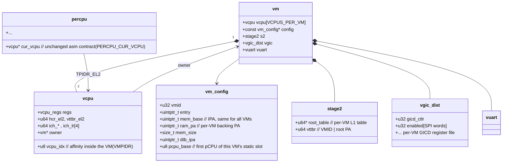
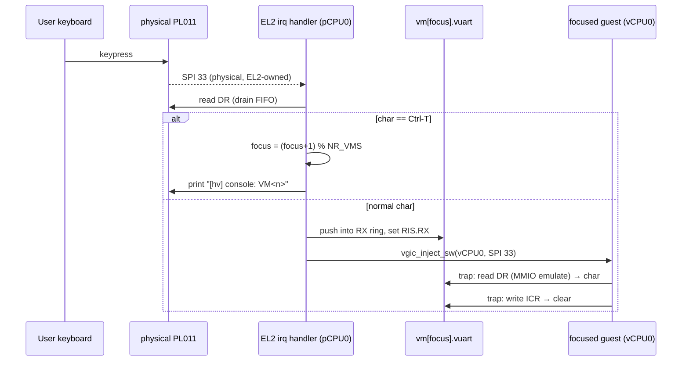

# M5 — Multi-VM Foundation (2 static Linux guests) Design

> **Status:** Draft — decisions accepted in the 2026-07-19 grilling session; not
> yet implemented.
> **Milestone:** M5. First milestone of the revised roadmap (scheduler moved to
> M6, hypercall→HSM→DM chain renumbered M7–M9; see CLAUDE.md "ACRN-model
> strategy", revision 2026-07-19).

## Goal

Boot **two unmodified Linux guests side by side**, statically partitioned:
VM0 on pCPU0/1, VM1 on pCPU2/3, each with 2 vCPUs pinned 1:1 (no scheduler,
unchanged from M3.5 semantics — just twice). Each VM has its own Stage-2
address space (own VMID), its own vGIC state, and its own vuart. The physical
PL011 is **taken back from VM0** and owned by EL2; an escape key on the EL2
console switches which VM receives keyboard input.

**Observable DoD (headline):** on a 4-pCPU `-m 4G` run, both guests boot to an
interactive busybox shell. The console escape key (Ctrl-T) switches input
focus between VM0 and VM1; in **each** VM, `/sys/devices/system/cpu/online`
reports `0-1` and shell commands (`ls`, `uname`) execute interactively.

This milestone is deliberately **mechanism-only**: no hypercalls, no dynamic
VM lifecycle, no virtio, no FP/SIMD saving (static pinning still guarantees a
pCPU never switches vCPUs). Those arrive in M6+.

---

## Decision summary (grilled 2026-07-19)

| # | Decision | Resolution |
|---|---|---|
| 1 | Roadmap order | Scheduler moves up to M6 (learning-density argument); hypercall→HSM→DM keep full scope as M7–M9; RK3588 stays M10; SMMU stays deferred |
| 2 | M5 scope | 2 VMs × 2 vCPUs on 4 pCPUs, static 1:1 pinning, `NR_VMS=2`, `NR_CPUS=4` — all compile-time |
| 3 | Console | EL2 revokes VM0's PL011 passthrough and owns the physical UART; **both** VMs get trap-and-emulate vuarts; Ctrl-T switches RX focus. TX from both VMs passes through (serialized by the printk/UART spinlock) |
| 4 | Guest address map | **Identical for all VMs**: RAM at IPA `0x40000000`, DTB at IPA `0x42000000`, initrd at IPA `0x44000000`. VM1 only differs in `ram_pa = 0xC0000000`. One DTB template serves both VMs. (Corrects the session's interim "identity IPA" choice — the IPA≠PA mechanism and the `mem_base`/`ram_pa` split have been live since M3; identity mapping would *add* a second DTB template for zero gain) |
| 5 | Memory | QEMU `-m 4G`; VM1's 1 GB Stage-2 L1 block at PA `0xC0000000` (1 GB-aligned per ADR-0004); hypervisor + VM0 layout untouched |
| 6 | Bring-up | Each VM's **boot vCPU is hypervisor-driven** (CPU0 issues physical `CPU_ON` for pCPU2 at init); each VM's **secondary vCPU stays guest-driven** via that VM's PSCI `CPU_ON` (ADR-0013 semantics, now VM-scoped) |
| 7 | Slicing | Three serial slices: (1) pure `g_vm`→`vm[]` objectification refactor, (2) UART takeover + VM0 on vuart (still single-VM), (3) VM1 online + focus switching. Every slice ends with `make test` + single-VM Linux SMP boot green |

---

## Roadmap context

The 2026-07-19 grilling re-derived the roadmap from the project's stated goal
(**learning EL2 core technology**):

- The **scheduler** (old M9) is the densest remaining EL2 material — it forces
  per-vCPU state (FP/SIMD, EL1 system registers, vGIC LRs) to become complete
  and save/restorable. It moves to **M6**, immediately after this milestone,
  so the M7–M9 ACRN chain builds on a finished state-switching foundation.
- M6's acceptance reuses M5's guests: 2 VMs × 2 vCPUs **time-sliced onto 2
  pCPUs**, concurrent FP workloads in both VMs uncorrupted. M5 therefore must
  not bake in "vCPU index == pCPU index" assumptions beyond the static config
  table (see object model below).
- HSM/DM (M8/M9) keep full ACRN scope by explicit decision — completeness of
  the ACRN model remains a deliverable.

---

## VM object model (slice 1 refactor)

The single global `g_vm` becomes a static array `vm[NR_VMS]`, and everything
that is currently "the VM's" singleton state moves inside `struct vm`. The
refactor is **behavior-preserving**: with `NR_VMS=1` compiled state after
slice 1, the binary boots the same single Linux guest.

Key points:

- **The asm contract does not change.** Exception entry still reads
  `TPIDR_EL2 → percpu → cur_vcpu` (ADR-0003's two controlled offsets). The
  `&vcpu == &vcpu.regs` zero-offset property is preserved. Slice 1 touches no
  assembly.
- **`vcpu->owner` backpointer** is the new navigation spine: trap handlers
  currently reaching for globals (`g_vm.config`, the vGIC dist state, the
  Stage-2 root) instead go `current_vcpu()->owner->...`.
- **Static pCPU partitioning table:** `vm_id = pcpu / VCPUS_PER_VM`,
  `vcpu_idx = pcpu % VCPUS_PER_VM`, recorded as `config->pcpu_base` rather
  than computed ad hoc, so M6's scheduler can later break the 1:1 identity in
  exactly one place.
- **VMIDs become real:** VM0 keeps VMID 1, VM1 gets VMID 2. `vttbr` carries
  the VMID; TLB invalidation on Stage-2 build uses per-VMID `tlbi vmalls12e1is`
  semantics (tables are still build-once-read-only, so no runtime TLB churn).
- Guest-affinity mapping stays VM-local: `VMPIDR_EL2` gives vCPU0→Aff 0x0,
  vCPU1→Aff 0x1 **within each VM** (both VMs see identical topology).

---

## Memory map

QEMU DRAM with `-m 4G`: `0x4000_0000 .. 0x1_4000_0000`.

| PA range | Owner | Notes |
|---|---|---|
| `0x4008_0000 + …` | hypervisor | load address unchanged |
| `0x8000_0000 .. 0xBFFF_FFFF` | VM0 RAM backing | 1 GB L1 block (existing) |
| `0x8008_0000` / `0x8200_0000` / `0x8400_0000` | VM0 Image / DTB / initrd | existing loader addresses |
| `0xC000_0000 .. 0xFFFF_FFFF` | VM1 RAM backing | new 1 GB L1 block, 1 GB-aligned (ADR-0004) |
| `0xC008_0000` / `0xC200_0000` / `0xC400_0000` | VM1 Image / DTB / initrd | same offsets as VM0, `+0x4000_0000` |

Guest view (both VMs, **identical**): RAM IPA `0x4000_0000` (256 MB per
`BOARD_LINUX_RAM_SIZE`), Image IPA `0x4008_0000`, DTB IPA `0x4200_0000`,
initrd IPA `0x4400_0000`, PL011 IPA `0x0900_0000`, GICD/GICR IPAs unchanged.
`guest/qemu_virt.dts` is compiled **once** and loaded twice.

`scripts/run-qemu.sh` changes: `-smp 4 -m 4G`; add VM1 loader entries
(`LINUX_IMAGE` and `LINUX_INITRD` reused at the `+0x4000_0000` addresses; an
optional `LINUX_IMAGE_VM1` override can come later if ever needed).

Each VM's Stage-2 keeps its own GICD/GICR **punch-holes** (trap-and-emulate,
per the stage2-gic-punch-hole design) and — new in slice 2 — **no mapping at
all for the PL011 page**, so UART accesses data-abort into the vuart.

---

## Console: EL2-owned PL011, two vuarts (slice 2)

The M3 design gave VM0 the physical PL011 via a Stage-2 passthrough mapping;
EL2 `printk` shared the hardware cooperatively. That is revoked:

- **EL2 owns the physical PL011** (ADR-0005 amended for this device). The
  physical UART SPI (INTID 33) is no longer forwarded into a guest; it is
  handled by the EL2 IRQ handler on pCPU0 (routing unchanged).
- **Each VM gets a vuart**: a PL011 model on the MMIO trap bus at IPA
  `0x0900_0000`, backed by a small per-VM RX ring (16 bytes, PL011 FIFO
  depth). Emulated registers: `DR`, `FR` (TXFE/RXFF/RXFE), `IMSC`, `RIS`/`MIS`,
  `ICR`; baud/line registers (`IBRD`/`FBRD`/`LCR_H`, `CR`) are
  write-accepted/read-back only (no modelled effect). This is the minimal set
  the Linux pl011 driver + earlycon touch.
- **TX**: a guest write to vuart `DR` goes straight to the physical UART under
  the existing printk/UART spinlock. Both VMs' output interleaves on the one
  console — accepted for M5 (line-tagging is a possible later nicety); the
  guarantee is character-level atomicity via the lock, same as printk today.
- **RX + focus**: one VM at a time has *input focus* (`console_focus`,
  starts at VM0). Physical RX chars go to the focused VM's ring; **Ctrl-T
  (0x14)** is intercepted in EL2, never delivered, and cycles focus
  VM0→VM1→VM0, printing `[hv] console: VM<n>` so the user knows where keys
  go. (QEMU's own escape stays Ctrl-A; no conflict.)
- vuart RX delivery uses the existing software-injection path: push char,
  raise the vuart's RX interrupt condition, `vgic_inject_sw(SPI 33)` into the
  focused VM's vCPU0.

Slice 2 lands this **while still single-VM** (focus fixed at VM0): the
behavior change "VM0's console now goes through the vuart" is verified in
isolation — interactive shell still works, `/proc/interrupts` still shows
UART interrupts (now virtual) — before VM1 exists.

---

## CPU partitioning and bring-up (slice 3)

`NR_CPUS` goes 2→4 (`percpu[4]`, four EL2 stacks); `VCPUS_PER_VM = 2`;
static map pCPU0/1→VM0, pCPU2/3→VM1.

Bring-up composes the two ADR-0013 modes:

1. **CPU0 (boot)**: global init (both Stage-2 tables, both vm/vm_config,
   GICD, both guests' images already loaded by QEMU loader), then issues a
   physical `smc CPU_ON(pCPU2, secondary_entry, ctx=2)` to start **VM1's boot
   vCPU** — hypervisor-driven, because no guest exists yet to ask for it.
   pCPU2's `secondary_main` does per-CPU EL2 init and enters VM1's vCPU0 at
   the standard arm64 boot protocol state (x0 = DTB IPA), exactly like CPU0
   enters VM0's vCPU0.
2. **Within each VM**: Linux's PSCI `CPU_ON` (HVC) stays guest-driven. The
   handler is now **VM-scoped**: target affinity is looked up among the
   *caller's* VM's vCPUs only; the physical target is
   `config->pcpu_base + vcpu_idx` (VM0's Aff 0x1 → pCPU1, VM1's Aff 0x1 →
   pCPU3). Affinity outside the VM → `PSCI_RET_INVALID_PARAMETERS`.
3. **PSCI scoping generally**: `SYSTEM_OFF`/`SYSTEM_RESET` from a VM affects
   only that VM (its pCPUs park in `wfi`; the other VM keeps running —
   observable check: shut down VM1, VM0's shell stays live). `CPU_OFF`
   likewise VM-local.

Cross-VM isolation invariants (the point of the milestone):

- A pCPU only ever touches its own VM's `vcpu`/vGIC state (per-CPU rule from
  M3.5, now per-VM by construction).
- SGI emulation (`ICC_SGI1R_EL1` trap) resolves target affinities **within
  the sender's VM only**; the physical kick-SGI (INTID 15) now targets any of
  the 4 pCPUs but the pending bitmaps live per-vCPU as today.
- The shared state remains exactly: printk/UART spinlock, per-vCPU SGI
  bitmaps + lock, `console_focus`. Everything else is per-VM or per-CPU.
- vtimer stays per-pCPU private, injected into `current_vcpu()` — already
  VM-agnostic.

---

## Affected files

| File | Change |
|---|---|
| `hypervisor/include/vm.h` | `struct vm` gains `stage2`, `vgic_dist`, `vuart`, `config`; `vcpu` gains `owner`, `vcpu_idx`; `g_vm` → `vm[NR_VMS]` |
| `hypervisor/common/vm/vm.c` | per-VM init loop; boot-vCPU entry state per VM; `NR_VMS` |
| `hypervisor/common/vm/vm_config.h` | second Linux config (`ram_pa = 0xC0000000`, `vmid = 2`, `pcpu_base = 2`); `pcpu_base` field |
| `hypervisor/common/psci/psci.c` | VM-scoped `CPU_ON`/`CPU_OFF`/`SYSTEM_OFF`; affinity→(vm, vcpu) lookup via caller |
| `hypervisor/arch/arm64/mmu/stage2.c` | per-VM root tables + VMIDs; VM1 1 GB block; drop PL011 passthrough mapping (slice 2) |
| `hypervisor/arch/arm64/irq/vgic.c/.h` | dist state global → `vm->vgic`; SGI routing VM-scoped |
| `hypervisor/arch/arm64/irq/irq_handler.c` | SPI 33 branch: guest-inject → EL2 vuart RX + focus switch |
| **new** `hypervisor/dm/vuart.c/.h` | PL011 vuart model on the MMIO trap bus; RX ring; focus. New `dm/` directory, aligned with ACRN's `hypervisor/dm/vuart.c` layout |
| **new** dual-SVM test scenario | fourth SVM guest variant + `tests/run_svm4_test.sh`: two bare-metal guests, one per VM, each prints an identifying banner via its vuart; the script asserts both banners appear and neither VM's output corrupts the other's |
| `hypervisor/arch/arm64/boot/head.S` / `percpu` | `NR_CPUS=4`, 4 stacks; `secondary_entry` ctx carries pcpu id (existing mechanism) |
| `hypervisor/arch/arm64/include/board.h` (qemu_virt) | `BOARD_LINUX2_RAM_PA 0xC0000000` (+ derived Image/DTB/initrd PAs); `NR_VMS` |
| `scripts/run-qemu.sh` | `-smp 4 -m 4G`; VM1 loader entries |
| `guest/qemu_virt.dts` | unchanged (shared template) — verify no VM-specific content creeps in |

---

## Implementation slices

Gate for **every** slice: `make` zero-warning, `make test` green, single-VM
Linux SMP boot to shell (the M3.5 headline) unbroken.

1. **Objectification refactor (pure, no behavior change).**
   `g_vm` → `vm[1]` + `vcpu->owner` + per-VM Stage-2/vGIC/config structure
   moves; asm untouched; `NR_VMS=1`.
   **Verify: byte-identical behavior — Linux SMP to `~ #`, `make test` green.**
2. **EL2 takes the UART; VM0 on vuart (still one VM).**
   Unmap PL011 from Stage-2, add vuart on the MMIO bus, SPI 33 → EL2 handler,
   RX ring + injection; focus fixed to VM0.
   **Verify: interactive shell over the vuart; EL2 printk and guest output
   don't corrupt each other; `/proc/interrupts` shows UART IRQs rising.
   The existing SVM scenarios now exercise the vuart trap path for free
   (their UART writes trap instead of passing through) and must stay green.**
3. **VM1 online + focus switching.**
   `NR_VMS=2`, `NR_CPUS=4`, second config, VM1 Stage-2 block, hypervisor-driven
   pCPU2 start, VM-scoped PSCI, Ctrl-T focus cycle, run-qemu VM1 loader lines.
   **Verify: headline DoD — both VMs to interactive shells, `online: 0-1` in
   each, Ctrl-T switches input; VM1 `poweroff` leaves VM0's shell alive.
   The dual-SVM scenario (`run_svm4_test.sh`) joins `make test` in this slice
   as the permanent automated regression for the multi-VM mechanism.**

---

## Verification

**Build / static:**
- `make` zero warnings; `make test` (offset checks + M1/M2/M2.5 SVM
  scenarios) green after every slice — the SVM test guest also runs through
  the new `vm[]` path.
- From slice 3, `make test` additionally runs the dual-SVM scenario: two
  bare-metal guests, one per VM, whose interleaved vuart banners must both
  appear intact — the automated cross-VM isolation regression.
- `_Static_assert`s for the unchanged asm offsets still compile (ADR-0003).

**Headline run (gates the milestone):**
- `-smp 4 -m 4G`: both guests reach busybox `~ #`.
- In each VM (via Ctrl-T): `/sys/devices/system/cpu/online` = `0-1`,
  interactive commands work.

**Strong verification (non-blocking):**
- `/proc/interrupts` in both VMs shows timer + IPI activity on both CPUs.
- VM1 `poweroff` (PSCI SYSTEM_OFF) parks pCPU2/3; VM0 unaffected — first
  real isolation demonstration.
- Cross-VM memory isolation spot check: VM1's 1 GB block and VM0's don't
  overlap; a guest cannot address the other's RAM by construction (no IPA
  maps to it).

---

## ADR impact

- **New ADR-0014** (to be written at implementation): multi-VM static
  partitioning + EL2 console ownership (vuart + focus switching).
- **Amends** [[../../adr/0005-device-passthrough-vs-emulation]]: PL011 flips
  from the passthrough column to trap-and-emulate; EL2 becomes the UART owner.
- **Amends** [[../../adr/0010-vgic-scope-cpu0-lr0-group1]]: vGIC distributor
  state becomes per-VM; scope now "per-VM GICD + per-vCPU GICR".
- **Extends** [[../../adr/0012-physical-gicv3-ownership]]: EL2 still owns the
  physical GIC; now 4 GICRs enabled, PL011 SPI terminated in EL2.
- **Extends** [[../../adr/0004-stage2-static-1gb-block-mapping]]: second
  1 GB-aligned block at `0xC0000000`; `-m 4G` becomes the required QEMU size.
- **Extends** [[../../adr/0013-smp-per-cpu-tpidr-guest-driven-bringup]]:
  guest-driven bring-up is VM-scoped; each VM's *boot* vCPU is
  hypervisor-driven at init.
