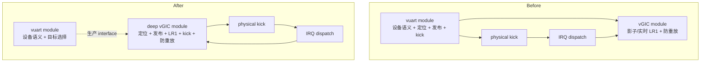
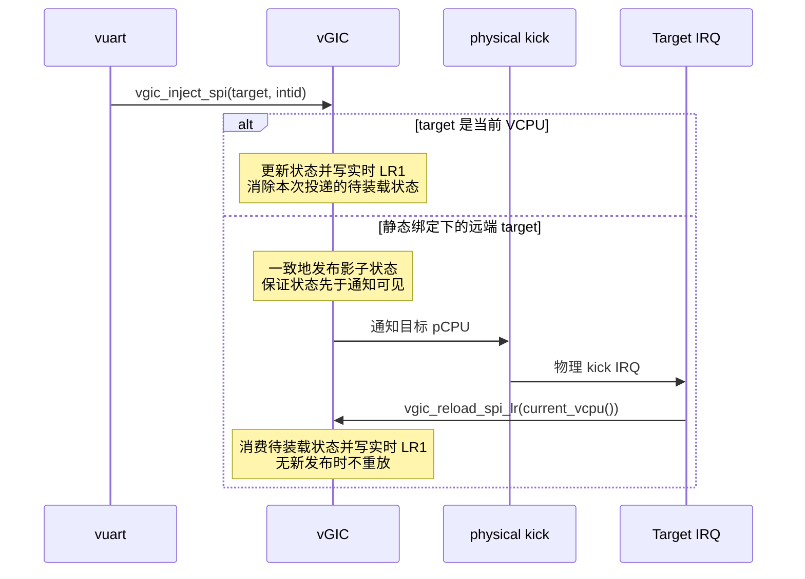
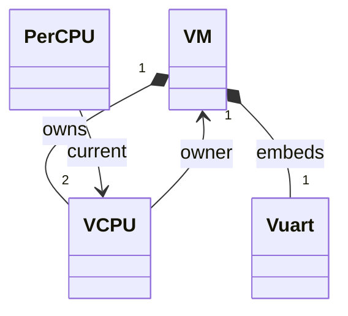

# vGIC 虚拟 SPI 投递：深化现有 module

> **状态：** 已实施职责收拢并通过定向验证；独立同步与旧结构回归门槛已接受。最终职责收拢审查、Standards/Spec 审查及完整验证待完成。
> **基线：** 设计基线 `d29047f`；执行基线 `7cc4e5771ce1d655430fa67643225aef5b7cec47`，当前 M10 的静态 1:1 VCPU/pCPU 绑定。
> **顺序：** 先独立验证同步前置条件，再做保持行为的职责收拢；不替代或重排 M11。

## 1. 已确认的决定

1. 只覆盖当前静态绑定，不引入调度、迁移或非当前 VCPU 的排队机制。
2. 深化现有 `vgic_inject_spi(struct vcpu *, u32)`，不新增 module 或第二个生产入口。
3. vuart 保留缓冲、串口寄存器语义、屏蔽判断和 console VCPU 选择；vGIC 收回投递细节。
4. 目标侧 IRQ 仍调用 `vgic_reload_spi_lr()`；影子状态写入成为内部 implementation。

验收与同步门槛在下文展开，随本文一起审阅；确认上述方向不等于同步问题已解决。

## 2. 问题与收益

重构前，`hypervisor/dm/vuart.c` 的 `vuart_rx()` 不仅处理串口，还理解目标
pCPU、实时 LR1 写入限制、影子状态发布、`dsb ish` 和 physical kick。
与此同时，影子编码、实时写入及防重放已经由 `hypervisor/arch/arm64/irq/vgic.c`
管理。实现后这些投递义务统一由已有 `vgic_inject_spi()` 承担。

这个 interface 对跨核生产者仍然 shallow：调用者必须编排实现顺序。
深化的目标是减少这些调用义务，而非减少行数或声称性能提升。

- **locality：** 投递与中断状态的知识集中在现有 vGIC module。
- **leverage：** 当前一个 vuart 生产者就能受益，不依赖假想的未来设备。
- **depth：** placement、发布顺序和通知成为 interface 后面的 implementation。
- **deletion test：** 删除深化后的 module，投递规则会重新散落到调用者；只删一个转发函数没有这样的收益。

## 3. seam 与职责

seam 位于“设备产生虚拟中断”与“向目标 VCPU 投递中断”之间。

| module | 保留或承担的职责 | 不承担的职责 |
|---|---|---|
| vuart | RX 缓冲、寄存器与中断屏蔽语义、选择 VM 的 console VCPU | pCPU 判断、LR1 写入方式、发布屏障、kick 编排 |
| vGIC | 静态目标定位、实时/影子投递选择、发布顺序、kick、防重放 | 串口 FIFO、console focus、shell 策略 |
| physical kick | 既有物理 SGI 编码与发送 | 串口策略、调度策略 |
| IRQ dispatch | 物理 IRQ 的 ack/drop/deactivate、已有 kick 分流、请求目标侧装载 | 为设备生产者选择实时/影子投递 |

## 4. interface contract

### 生产侧

保留 `vgic_inject_spi(struct vcpu *target, u32 intid)` 的现有参数与返回类型，
改变的是调用义务，不新增一套相似入口。

- 调用发生在已初始化的 EL2 trap/IRQ 上下文；target、owner、config、VCPU index 有效，且静态绑定保持稳定。
- 只承诺本实现支持的 PL011 SPI，保留 LR1、software HW=0、Group 1、优先级 `0xA0`；不是任意 SPI 的通用投递承诺。
- vuart 继续选择 `&m->vcpu[0]`，仅在已有串口屏蔽条件满足时调用；不把这些设备语义移入 vGIC。
- vGIC 按既有 `owner->config->pcpu_base + vcpu_idx` 确定目标 pCPU，不要求调用者提供物理 CPU 编号。
- 只有目标就是当前运行的 VCPU 时才可直接写调用核的实时 LR1；其余受支持情况走跨核投递。
- 返回表示投递动作已发起，不表示客户机已响应；不增加每字符一个 IRQ 或逐次中断计数的保证。
- 远端成功接收要求目标 pCPU 已运行且能处理 kick；不承诺启动前或 offline 期间的投递可靠性。保留 halted VM 的已知行为，不夹带新的生命周期或 console 拒绝策略。

### 目标侧

`vgic_reload_spi_lr()` 仍由目标 pCPU 的 kick IRQ 路径调用，只处理当前
VCPU 的待发布 SPI。调用者无需知道防重放标志的具体实现。

`vgic_set_spi_shadow()` 不再是 vuart 可使用的公开 interface；其必要逻辑
留在 vGIC 内部。保留供其他既有用途使用的 physical kick 机制，不合并
PSCI park 通知、SGI bitmap 和串口 SPI 状态。

状态的归属不变；下图是已有数据关系，不是新增类或对象分配方案。

## 5. 同步前置门槛

M11 S0 已计划处理 vuart 和 vGIC distributor 的跨核竞争，但**不能据此假定
LR1 影子状态与 pending 标志的发布/消费也已经同步正确**。串口缓冲的锁不自动
覆盖目标 pCPU 的 vGIC 装载；`volatile` 与 `dsb` 也不是互斥协议。

本重构实施前，独立的同步修复及验证必须证明：

1. vuart 共享状态及相关 distributor 并发访问已有一致的访问规则。
2. LR1 影子内容、pending 发布/消费、本核完成与远端装载有一致的协议；交错不会因消费清除而丢失新发布、读取不匹配的内容或陈旧地重新置位。
3. 通知不会先于它所通知的状态可见；不把内存屏障当作互斥。
4. vuart、vGIC、SGI、print 路径的锁获取顺序与 IRQ 上下文约束明确；无同核重入、锁环，也不持有目标所需的锁等待目标确认。
5. 明确初始化/重置与运行期访问不会交错；检查所有当前状态写入者，不引入未来调度器 save/restore 并发的假设。

现有 spinlock 本身不屏蔽 IRQ；不能在迁移逻辑时偷偷改变 EL2 的中断屏蔽前提。
S0 的既有测试段未决定采用何种压力证据或同步论证；本次独立同步设计已按
执行裁决提供源码同步论证与有界 guest 压力证据，并通过独立门槛审查。
不能用本次 guest 回归全部通过代替该论证。

若门槛未满足，先完善独立同步设计/修复，不在这次职责收拢中顺手发明锁方案。
S0 的具体实现与验收取舍不由本文代定；S0 的名义完成也不能代替上述证据。

当前的 1:1 绑定让“目标在本 pCPU”与“目标是当前 VCPU”重合。M11 引入切换后
该前提失效，届时必须重审实时投递资格与 pending 状态归属，不能把本次重构
宣称为已经支持非当前 VCPU。

## 6. 验收：interface 是测试面

依赖类别是 **local-substitutable**：沿用 QEMU 执行真实的架构指令。
不新增可注入的寄存器 adapter；单一 adapter 只是 hypothetical seam，
此处没有引入额外间接访问的需求。

现有 `tests/run_shell_test.sh:58–61,116–121` 验证 attachment 与 shell 不再
解释 probe；对应 SVM 客户机不消费 RX，也不配置 UART IRQ，不能用它证明 SPI 投递。

需要能观察真实投递的 SVM fixture，继续沿用现有 QEMU 脚本与构建方式，
不改成 Linux 测试门禁，也不占用 M11 已命名的 `svm5` 状态探测器。

| 场景 | 客户机可观察的验收结果 |
|---|---|
| VM0 console RX | 通过虚拟 UART IRQ 路径消费并报告指定字符，覆盖当前本核投递 |
| VM1 console RX | 切换 focus 后，由 VM1 的虚拟 UART IRQ 路径消费并报告指定字符，覆盖跨核投递 |
| 无新串口输入时的普通 IPI | VM0、VM1 各执行一次：确认 UART 已排空、处理中断完成后，由同 VM 的另一 VCPU 发 IPI 到该 console VCPU；确认 IPI 被处理，观察期内无旧 UART IRQ 重放或重复字符 |
| 持续进展 | 上述过程中定时器继续推进，最终输出明确成功标记；缺少必要阶段标记或超时均失败 |

fixture 必须配置 UART/timer/SGI 的虚拟 IRQ 处理与完成、串口 RX mask 和清除，
周期性重装 timer，并通过 guest PSCI CPU_ON 启动第二 VCPU，准备其栈、vectors
和虚拟中断接收状态。现有 dual-SVM fixture 不提供这些组合行为，不能仅追加 grep。

IPI 必须从同 VM 的 sibling VCPU 发往 console VCPU；self-IPI 不产生所需的
physical kick。探测串行执行，避免固定 LR2 的容量限制干扰结果。
使用有界阶段握手与有 timer 进展的静默观察期；不假设一次 IRQ 对应一个字符，
不把“没有报错”当作成功，也不读取 hypervisor 的影子字段来证明投递。

先在同步前置条件满足的旧结构上建立行为基线，再运行于重构后的结构。
若基线已失败，先区分 fixture 问题和已有缺陷，不混入职责收拢提交。
新 fixture 还需用一次受控的投递抑制或防重放失效实验验证检测能力，实验改动不保留。

既有 `make test` 继续保留。实现涉及头文件时执行 clean build，避免无头文件依赖跟踪
导致旧对象掩盖结果。最初设计讨论未运行 QEMU 或 Linux；执行期已运行下述
QEMU 定向检查，未增加或运行 Linux gate。

## 7. 文件范围与不做的事

预期实现主要涉及：

- `hypervisor/dm/vuart.c`：删除生产者侧投递编排及因此不再需要的 include。
- `hypervisor/arch/arm64/irq/vgic.c`、`vgic.h`：深化生产 interface，内部化影子写入，更新准确的调用 contract。
- `hypervisor/arch/arm64/irq/irq_handler.c`、`vgic_sgi.h`：仅更新必要的交叉引用，保留原有分流、kick 和目标装载路径。
- `tests/`、`Makefile`：实现专用的客户机可观察回归场景；具体任务拆分留给实施计划。

不修改 shell/focus 策略、固定 LR0/LR1/LR2 分工、timer HW-forwarding、Stage-2、
PSCI 生命周期或静态 Board 配置；不新增通用 IRQ 队列、LR allocator、调度器、
寄存器 mock，也不以重构名义承诺新的中断排队语义。

选择深化现有 interface，是因为现有 vGIC 已经拥有 LR1 与防重放规则。
另加转发入口只增加调用层次；新建通用投递 module 则超出当前一个设备生产者的需求。

## 8. 决策兼容性

- [ADR-0014](../../adr/0014-multi-vm-static-partition-el2-console.md)：保留 EL2-owned PL011、静态绑定与 shadow/kick/reload。
- [ADR-0010 及后续修订](../../adr/0010-vgic-scope-cpu0-lr0-group1.md)：保留固定 LR 与 Group 1 范围。
- [ADR-0001](../../adr/0001-vtimer-hardware-forwarding.md)：不改变 timer 的物理中断释放语义。
- [M11 设计](2026-08-10-m11-vcpu-context-switch-design.md)：同步门槛先于重构；不提前引入 S3 以后的切换语义，不提前移动 S8。

不推翻既有 ADR；本次是已有职责的收拢，且容易局部回退，因此不另建 ADR。

## 9. 执行状态与证据

- 同步门槛在 `91712ed` 被独立审查接受（run
  `e5e42319-e0bf-4007-ad86-5dca9886677b`）；旧生产结构回归门槛在
  `857abfc` 被接受（run `e05670d1-a9d2-4aad-9e29-079436768d8a`）。
  执行 supervisor 已核对原生 structured reports，确认允许 Task 3。
- Task 3 保持同一 `spi_lock` 临界区及发布后 `dsb ish`/kick 顺序；
  vuart 仅保留设备锁内快照、解锁后向 `&m->vcpu[0]` 调用一次注入。
  公开 shadow setter 已删除；IRQ reload、SGI bitmap、生命周期 kick、
  初始化/restore 限制和固定 LR 编码未改变。测试与 Makefile 未改动。
- 三个全新 BUILD_DIR 的 normal、SVM single、SVM dual 编译均无警告，
  host/target offsets 均通过：`/tmp/vspi-deep-{normal,single}-build.log`、
  `/tmp/vspi-deep-build.log`。定向 G/S/R 均为 `VSPI ALL PASS`：
  `/tmp/vspi-deep-{gate,stress,regression}.log`，对应 `-run.log` 保存 runner 输出。
- 具体命令、源码论证和目录见 [实施计划](../plans/2026-09-07-vgic-spi-delivery-deepening.md)
  Task 3 evidence；旧结构的 RX 抑制、两 VM replay FAIL 7 实验仍作为检测灵敏度证据。
  本阶段未重跑故障注入，也未执行保留的完整 `make test`。
- 有界 QEMU 调度证据不是形式化 race proof。最终审查/完整 suite 待完成，
  不声称调度、offline/startup 投递可靠性或新生命周期语义。
