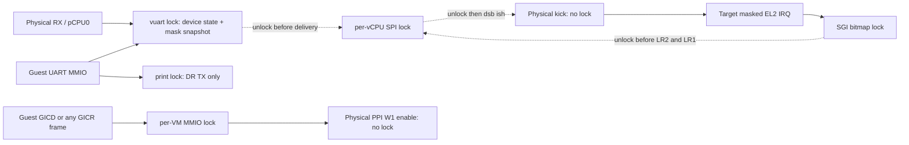
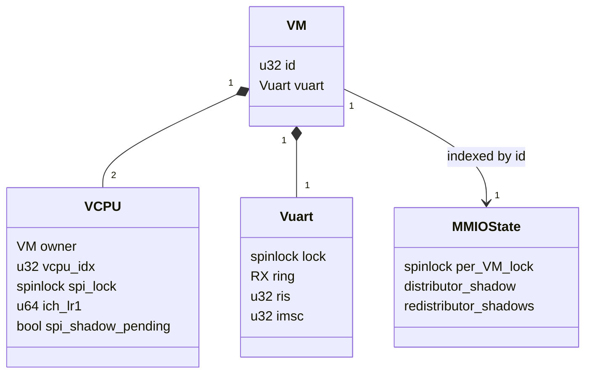

# Static vSPI synchronization prerequisite design

**Status:** Planned, not implemented or runtime-validated. Independent prerequisite to
[the approved delivery design](2026-09-07-vgic-spi-delivery-deepening-design.md).
Execution baseline: `7cc4e5771ce1d655430fa67643225aef5b7cec47`.
The execution ruling requires **both source-level synchronization reasoning and
bounded guest stress**. Green stress is not a formal race proof or a substitute
for reviewing every access. This document does not implement M11 scheduling.

## Scope and source findings

Read alongside ADR-0014, ADR-0010 and its M9/M10 amendments, ADR-0001, and
`2026-08-10-m11-vcpu-context-switch-design.md` (S0 prerequisites only).
Reference consulted before selecting synchronization:
`../bao-hypervisor/src/arch/armv8/aarch64/inc/arch/spinlock.h` (ticket/acquire/release),
and `../bao-hypervisor/src/arch/armv8/vgic.c:968-987` (serialize emulated
GICD accesses and interrupt state). Reuse this repository's ticket lock; do not
copy Bao's allocator, interrupt ownership system, or WFE/event protocol.

The existing producer structure is retained until this prerequisite and its
regression baseline are independently accepted. Relocating code is not a race fix.

| State / actual access paths | Finding and proposed rule |
|---|---|
| `struct vuart`: ring, RIS, IMSC, divisor/control/IFLS registers | Physical UART RX on pCPU0 races with MMIO from either vCPU. One embedded `struct spinlock lock`, initialized by BSS; all mutable reads/writes take it. |
| `vuart_rx_has_room()` | Also takes the vuart lock; change parameter to `struct vm *` because locking mutates the object. It is a snapshot, not a reservation. Only pCPU0 produces; concurrent consumers only free space between check and push. |
| `console_focus`, shell state | Read/written only by the pCPU0 physical UART/shell path. Keep existing behavior and ownership; not moved into the vuart lock. |
| `g_vgicd[vmid]` | Shared by both vCPUs. One file-static `vgic_mmio_lock[NR_VMS]` covers each complete MMIO access including the handler's 64-bit IROUTER fast path and all read paths. |
| `g_vgicr[vmid][frame]` | Also shared: frame is selected by guest IPA offset, **not the accessing vCPU**. The same per-VM MMIO lock covers RD and SGI frames, all reads and writes. No nested per-frame lock. |
| `ich_lr[1]`, `spi_shadow_pending` | Add `struct spinlock spi_lock` after the asm-visible vCPU prefix; ordinary `bool`, not volatile synchronization. Payload, pending, live write, local completion and target reload form one critical section per operation. |
| `ich_lr[0,2,3]`, live LR registers, live VMCR | Still target-PE-owned under static pinning. SGI bitmap uses the existing independent `sgi_lock`; it is released before LR2 injection. No broad vCPU lock. |

### Narrow prerequisite exception: physical PPI target mapping

Source discovery, explicitly authorized by the execution supervisor: in
`vgic_v3_mmio.c`, `vgicr_write_sgi(cpu, ...)` passes a VM-local frame number to
`gic_ppi_set_enable()`, which indexes a **physical** GICR in `gic_v3.c`.
VM1's frame 0/1 currently re-enables physical CPU0/1 instead of CPU2/3.
Correct to `m->config->pcpu_base + cpu`, where `cpu` is the addressed frame,
not `current_vcpu()->vcpu_idx`. Keep the logical index for GICR_TYPER/shadows.
This is a separately identified bugfix, never part of the later SPI relocation.
No change to timer LR0/HW forwarding, EOIR/DIR, ICENABLER guest semantics,
physical timer readiness policy, or lifecycle policy is authorized.

### Physical state is not shadow state

Do **not** add a physical-GICR lock. `gic_ppi_set_enable()` performs one W1S or
W1C write plus `dsb sy; isb`; it does not read-modify-write a C word.
`gic_init()` and `secondary_main()` initially W1-enable PPI27 and the kick SGI;
remote PPI enables commute with these enables. Their other GICR setup writes
(group, priority, WAKER) are PE-local initialization, not runtime shared RMW.
The target cannot handle a gate IRQ during its initialization: EL2 DAIF is
masked through the one-time restore and first guest entry.

Runtime gate ordering in `irq_handler.c` is deliberately narrower than a
virtual timer readiness state machine:

1. The target reads **its own live** `ICH_VMCR_EL2.VENG1`.
2. If false, the target software-injects, drops/deactivates the physical IRQ,
   then masks its physical PPI before returning to EL1.
3. Only the target guest can change that live VENG1. It cannot run during this
   masked EL2 handler; another PE's GICR MMIO changes a shadow/enable register,
   not this target's live VMCR. Thus the false decision cannot become stale
   against a concurrently changed VENG1 before the disable.
4. A remote enable before the target's W1-disable linearizes earlier and may
   be superseded. A remote enable after it re-arms the PPI; if VENG1 is still
   false the target may gate again. This preserves the existing policy, not a
   guarantee that an early remote enable makes an unready target ready.
5. The supported ready sequence is target EL1 `ICC_IGRPEN1_EL1=1; isb`, then
   a virtual PPI enable. Any earlier target false gate has completed before
   this target sequence; subsequent target IRQs see VENG1 enabled. The guest
   test intentionally exercises that sequence after an early expiration.

A lock around only the final hardware write would not establish a different
readiness ordering. Arbitrary remote writes on behalf of an unready target,
future descheduling, or turning VENG1 off again are not new guarantees here.
If implementation finds another live-VMCR writer or target IRQ execution during
initialization, stop: this exclusion argument no longer holds.

## Critical sections and lock graph

`vuart_mmio_handler()` forwards DR writes to `console_putc()` **outside** the
vuart lock. All other emulated register operations execute under the lock;
static AMBA identity reads may harmlessly share this small wrapper. In
`vuart_rx()`, push/check ring, set RIS and snapshot `imsc & RX_MASK` under the
lock, then unlock before the old local/shadow/kick branch. A concurrent IMSC
write linearizes before or after that snapshot; do not add retroactive delivery
on unmask or retract already initiated delivery. A late notification may find
an already-drained FIFO, as in the existing coalescing model.

No new lock is held over console output, debug printing, a kick, PSCI CPU_ON,
or any wait for target/guest acknowledgement. Put GIC debug output before its
MMIO lock. Use a common unlock/return for the IROUTER branch. The GICR physical
W1 enable may remain inside the tiny MMIO critical section: it has no lock or
wait for another PE, and orders the side effect with its shadow access.



All graph dashed edges release the preceding lock, so there are **no new
nested lock-acquisition edges**. Existing print and SGI locks are leaves too.
`spinlock.h` must describe actual shared state and state explicitly that locks
do not mask interrupts. Every current caller runs in boot with DAIF masked or
an EL2 synchronous/IRQ exception with DAIF masked. No path enables EL2 IRQs
inside these sections; `irq_handler_asm.S` deliberately retains masking until
`eret` (its old file-header claim otherwise is stale, not actual code).
No IRQ masking instruction or IRQ routing behavior needs changing.

## Complete LR1 protocol

A private `vgic_set_spi_shadow_locked(vcpu, intid)` encodes the existing
software HW=0, Group1, priority 0xA0, pending LR1 and sets pending. It requires
`spi_lock` and does not touch live hardware. During the prerequisite, public
`vgic_set_spi_shadow()` remains a locking wrapper for the **old** producer.
Local `vgic_inject_spi()` takes the lock once, calls the private locked helper,
writes live LR1, clears pending, unlocks; never calls the locking wrapper from
inside its lock. Target reload locks, conditionally writes live LR1 and clears
pending under that same lock, then unlocks. Never copy payload out and write
hardware after unlocking. Later consolidation changes only who selects these
operations and kicks, not their serialization.

```mermaid
sequenceDiagram
    participant P as Remote producer
    participant L as Target SPI lock / shadow
    participant T as Target PE
    P->>L: lock; payload := encode; pending := true; unlock
    Note over P: dsb ish before kick, outside all locks
    P->>T: physical kick
    T->>L: lock; if pending: live LR1 := payload; pending := false
    T->>L: unlock
    Note over L,T: local injection holds this same lock through live write and completion
    P->>L: subsequent publication (before or after consumer lock)
    T->>L: unrelated kick: no pending means no LR1 write
```

The ticket lock's acquire/release plus compiler memory clobbers make the
payload/pending pair indivisible to producers/consumer. A publication before
consumption is consumed; a publication after consumption leaves pending set
for its kick. No consumer can clear a newer publication inside an unlocked
read/clear/write gap. Two publications may coalesce; there is no IRQ-per-byte
or queued-IRQ guarantee. A local completion cannot clear a later remote
publication because its live write and clear remain under the lock. Delayed
kicks are harmless: the first may consume the newest pending payload, later
ones observe false. Keep the remote producer's `dsb ish` after unlock and
before `vgic_kick_pcpu()`; release is mutual exclusion/publication, the barrier
orders publication before notification, and neither substitutes for the other.

## Initialization / restore exclusions (not assertions of future safety)

- `vm[]` (including vuart locks, IMSC and vCPU SPI locks) is BSS-zeroed once
  in `head.S`, before any secondary starts. File-static MMIO locks/shadows are
  initialized before VM execution. Never reset a lock in `vgic_init()`.
- `vm_init()` initializes each boot vCPU's LR state before booting other PEs;
  `secondary_main()` initializes its own LR state again before restore. Boot
  IMSC is zero. Only guest MMIO can enable IMSC, and that guest cannot execute
  until its target's `vgic_init()` and sole `vgic_restore()` have finished.
- Therefore early routed RX may modify the protected ring/RIS, but cannot
  publish LR1 while initialization/restore is running. The vuart lock's
  IMSC observation also carries the ordering from the guest's enable. In the
  current source only console vCPU0 is an SPI target; sibling init cannot
  reset its state. No new preboot/offline delivery guarantee is inferred.
- `vgic_restore()` has only the two initial-entry call sites in `vm_run()`
  and `secondary_main()`; neither `vcpu_run()` loop restores again.
  `vgic_save()` has **no callers**. Document both exclusions beside these
  functions, replacing the inaccurate anticipated timer-switch comment.
  Do not lock dead save code and call it scheduler-safe: a future save could
  overwrite a remotely published shadow with live state even under a lock.
- Owner/config/index and static pCPU mapping are prepared before entry and
  never change. After consolidation direct live injection requires
  `target == current_vcpu()`; the remote target is computed from its owner
  config plus index. M11 must re-audit all these exclusions.



## Evidence and acceptance limits

The companion [implementation plan](../plans/2026-09-07-vgic-spi-delivery-deepening.md)
provides executable task algorithms and commands. One `vspi` guest fixture
builds into two VM-labelled binaries, using the existing `svm_dual` hypervisor
profile; **svm5 remains reserved for M11**.

1. A focused red/green early-timer test exposes the physical mapping defect:
   expire before VENG1, then enable interface/PPI and require at least five
   periodic IRQ completions on each of all four guest vCPUs. One software
   pending tick cannot satisfy it.
2. Bounded stress: five QEMU runs, each VM receives 4096 ordered bytes in
   bounded batches while its two vCPUs contend on same-word GICD set/clear,
   split IROUTER writes, and cross-vCPU accesses to one GICR frame; exercise
   UART status/mask/config accesses concurrently. Check combined values,
   exact RX data, both-vCPU timers, deadlines and explicit completion.
3. On the synchronized **old producer**, add positive UART/SGI/timer stages:
   each VM drains, completes interrupts, observes quiet, then sibling sends
   a serialized IPI to console vCPU0. Verify IPI arrival and no UART replay
   over a timer-progress window. Repeat after consolidation unchanged.
4. Temporarily suppress delivery and temporarily break pending consumption
   to demonstrate detector failure; restore experiments before commits.

Source review must inventory all access paths again, not merely compare this
text to itself. Stress explores a finite QEMU schedule set, not all races;
fixed LR capacity/coalescing, startup/offline delivery, Linux boot, scheduler
save/restore and lifecycle defects remain outside its claim. Mapping-test
red/green evidence is deterministic bug evidence, not evidence that unlocked
races must fail on every run. No builds or tests were run during planning.
