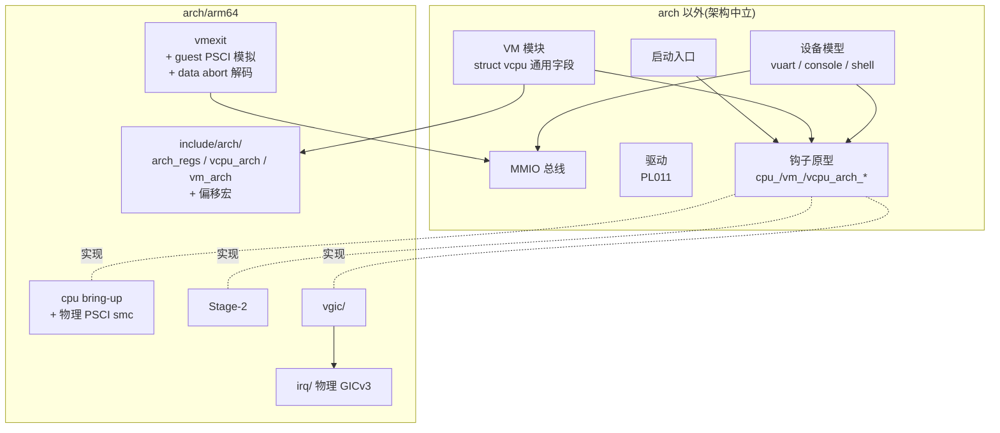

# 多架构边界(arch-boundary)设计

> **状态:** 已定稿,待执行。**定位:** M11 前置重构,不是里程碑——不改变任何
> guest 可见行为。**来源:** 2026-09-29 grilling 会话(Q1–Q15)。
> **参考实现:** bao-hypervisor 的 `src/core/` 与 `src/arch/<arch>/` 划分。

## Problem Statement

项目的目标是多架构:当前做 ARM64(QEMU `virt`,之后 RK3588),将来要能加入 x86
等其它架构。目录布局仿照 ACRN,分成 `arch/`(架构相关)和 `common/`(架构中立)。
但这个划分目前**只是个名字**:

- `common/` 里放着 ARM 专有的 PSCI——guest 的 PSCI 调用模拟和物理 `smc` 固件
  调用都在这里,x86 根本不用 PSCI。
- `common/` 下的 VM 模块直接写 `vmpidr_el2` 系统寄存器,设置 SPSR/HCR 初值,并且
  直接调用 Stage-2 和 vGIC 的函数。
- 通用头文件里,`struct vcpu` 直接包含 EL2/ICH 寄存器字段和汇编偏移;per-CPU 和
  spinlock 头文件内联了 ARM 汇编。
- `arch/` 以外的其它目录也有同样问题:启动入口直接初始化 GIC 和 vtimer,vuart
  直接调用 vGIC 注入并读取板级常量,PL011 物理驱动放在 `debug/`。
- 方向反过来的问题也存在:MMIO 总线本来与架构无关,却放在 `arch/arm64/`,导致
  设备模型只能依赖 arch 头文件。

后果是加入第二个架构时,几乎每个"通用"文件都要改。而且越往后改,代价越大:M11
调度器会大量扩充 `struct vcpu`。没有任何机制能阻止新的架构代码继续流进 `common/`。

## Solution

按 bao 的方式立起一条**由构建检查强制执行**的边界:

- `arch/` 以外的代码只能通过**中性钩子**(`<对象>_arch_<动词>`)和**命名空间头文件**
  (`<arch/xxx.h>`)访问架构层;不能内联汇编,不能出现系统寄存器名,也不能直接
  调用 `stage2_*`、`vgic_*`、`gic_*` 或 PSCI。
- 新增一个 grep 棘轮检查,接进 `make test`。现存违规记入白名单,白名单只减不增。
  新代码一越界,`make test` 就失败。
- 按 11 个小切片逐步迁移。每片只重构、不改语义,每片结束时 `make test` 全绿。
  全部完成时白名单为空。
- M11 从这条干净的边界开工:调度器改的是通用 `struct vcpu`,EL1 系统寄存器块
  则放进 `vcpu_arch`。

## User Stories

1. 作为 hypervisor 开发者,我希望 `common/` 里没有任何 ARM 专有代码,这样目录名才名副其实。
2. 作为将来移植 x86 的开发者,我希望只需新增 `arch/x86/` 并实现一组已命名的钩子,不必修改通用代码。
3. 作为将来移植 x86 的开发者,我希望有一份钩子清单和命名规则可查,这样知道要实现什么。
4. 作为开发者,我希望 `make test` 在新代码越过边界时失败,这样边界不会悄悄退化。
5. 作为开发者,我希望现存违规集中列在一个白名单里,这样一眼能看到迁移还剩多少。
6. 作为开发者,我希望白名单只能缩短,这样每个切片都有可度量的进展,并且不会回退。
7. 作为开发者,我希望边界检查忽略注释,这样在注释里提到 PSCI 或 EL2 不会误报。
8. 作为开发者,我希望 guest PSCI 模拟和物理 PSCI 固件客户端分成两个模块,这样依赖方向清楚(和 irq/vgic 拆分是同一个理由)。
9. 作为开发者,我希望 guest PSCI 模拟紧挨 HVC trap 分发,这样顺着 vmexit 就能找到它。
10. 作为开发者,我希望物理 PSCI 客户端和 CPU bring-up 放在一起,因为它本质上是 pCPU 上电驱动。
11. 作为开发者,我希望通用代码用 `<arch/xxx.h>` 引用架构头文件、由构建系统按 `ARCH` 解析,这样通用头文件和架构头文件不会挤在同一个命名空间。
12. 作为开发者,我希望 `struct vcpu` 分成通用字段、`arch_regs` 和 `vcpu_arch` 三部分,这样 M11 加运行状态时不用碰寄存器布局。
13. 作为开发者,我希望 `struct vm` 通过嵌入 `vm_arch` 来保存架构私有的 VM 状态。
14. 作为开发者,我希望汇编偏移宏和它描述的 arch 结构体放在同一个 arch 头文件里,这样 ADR-0003 的"同一头文件两种视图"约定在新位置依然成立。
15. 作为开发者,我希望 VM 模块通过 `vm_arch_init`、`vcpu_arch_init`、`vcpu_arch_reset`、`vcpu_arch_run` 完成架构相关工作,不再直接调用 Stage-2 和 vGIC。
16. 作为开发者,我希望 VM 模块在给 VM0 预上电其它 pCPU 时调用 `cpu_arch_power_on`,而不是直接发 `smc`。
17. 作为开发者,我希望启动入口只调用一个 `cpu_arch_init`,这样通用启动流程不用知道 GIC 和 vtimer 的存在。
18. 作为开发者,我希望"当前 vCPU / 当前 pCPU"访问器的接口是通用的,`tpidr_el2` 的实现放在 arch 里。
19. 作为开发者,我希望 spinlock 的接口是通用的,独占加载/存储和 `yield` 的实现放在 arch 里。
20. 作为开发者,我希望 MMIO 总线(注册和分发)放在通用层,arch 只负责把 data abort 解码后交给总线,这样 x86 能复用它。
21. 作为开发者,我希望 vuart 通过 `vcpu_arch_inject_irq` 注入中断,这样设备模型不依赖 vGIC。
22. 作为开发者,我希望 vuart 从 VM 配置里读取基地址和 IRQ,不直接读 `BOARD_*` 常量,这样设备模型和板级无关。
23. 作为开发者,我希望 PL011 物理驱动放在驱动目录并由板级配置选择,因为它是设备代码,不是调试代码,也不是架构代码。
24. 作为开发者,我希望每个切片都是一个只重构、不改语义的独立提交,这样出问题时能 bisect,review 也简单。
25. 作为开发者,我希望凡是碰到 PSCI、VM 创建或 vuart 的切片都用真实的 Linux 双 VM 启动验证,因为按项目规则"Done means observed running",静态检查不够。
26. 作为开发者,我希望已知缺陷"`CPU_OFF` 会关掉整个 VM"在迁移中行为保持不变,这样重构 diff 里不混入语义修复,修复留给 M11。
27. 作为 M11 的实现者,我希望开工时 `struct vcpu` 已经拆分好,这样 M11 的 diff 只包含调度语义。
28. 作为 reviewer,我希望 CLAUDE.md 有一节写明边界规则(类似物理 GIC / vGIC 那一节),这样 review 时有据可依。
29. 作为新读者,我希望有一份 ADR 说明为什么选 bao 风格、否决了哪些方案,这样不会有人把代码移回 `common/`。
30. 作为开发者,我希望钩子按需增长:一个切片需要哪个钩子才加哪个,这样接口形状由真实调用点决定,而不是提前猜。
31. 作为开发者,我希望钩子原型由通用头文件声明、不提供 weak 默认实现,这样缺实现会在链接时报错,不会拖到运行时。

## Implementation Decisions

### 边界规则(准入标准)

- **arch 以外**指 `arch/` 之外的所有目录,不只 `common/`,也包括启动入口、设备模型、
  调试、库和通用头文件。
- arch 以外**禁止**:内联汇编;系统寄存器名(`*_EL0..3`、`ICH_*`、`ICC_*` 等);
  直接调用 `stage2_*`、`vgic_*`、`gic_*`;任何 PSCI 符号;`BOARD_*` 常量(板级
  配置表本身除外)。
- arch 以外**允许**:调用 `<对象>_arch_<动词>` 钩子;包含 `<arch/xxx.h>`。
- **依赖方向**:通用层 → 钩子接口 ← arch 实现。arch 可以调用通用层的服务(例如
  MMIO 总线、printk);通用层不能反过来 include arch 私有头文件。
- 设备相关**不等于**架构相关:模拟的设备(vuart = PL011)可以留在设备模型目录,
  只要它不直接接触架构机制。

### 钩子

- 命名采用 bao 风格:`<对象>_arch_<动词>`,对象是 `cpu`、`vm`、`vcpu`。
- 原型由**通用头文件**声明,每个 arch 必须提供实现。**不用 weak 默认实现**,缺实现
  直接链接失败。
- **按需增长**:每个切片只加入它的调用点实际需要的钩子。下面的预估清单只供参考,
  不是一次性交付的接口:

| 钩子 | 取代的现状 | 引入切片 |
|---|---|---|
| `cpu_arch_power_on` | VM 模块直接调用物理 PSCI `smc` | 6 |
| `cpu_arch_init` | 启动入口里的 GIC + vtimer 初始化 | 7 |
| 当前 vCPU / pCPU 访问器 | per-CPU 头文件内联 `mrs tpidr_el2` | 4 |
| `vm_arch_init` | Stage-2 初始化、vGIC MMIO 初始化 | 6 |
| `vcpu_arch_init` / `vcpu_arch_reset` | SPSR/HCR/VMPIDR 初值、vGIC per-vCPU 初始化 | 6 |
| `vcpu_arch_run` | Stage-2 激活 + vGIC 恢复 + 进入 guest | 6 |
| `vcpu_arch_inject_irq` | vuart 直接调用 vGIC SPI 注入 | 9 |

- 预计 M11 会新增 `vcpu_arch_save` / `vcpu_arch_restore`,由 M11 自己引入。

### 数据结构

- `struct vcpu` 拆成三部分:通用字段(owner、vcpu 索引,以及 M11 的运行状态)、
  `struct arch_regs`(guest 通用寄存器上下文)、`struct vcpu_arch`(EL2 控制寄存器
  影子、ICH 状态、SPI 影子和锁)。
- `struct vm` 嵌入 `struct vm_arch`,保存架构私有的 VM 状态。
- 汇编偏移宏跟着对应的 arch 结构体一起移到 arch 头文件。ADR-0003 的约定(结构体
  和偏移宏在同一头文件、由 `check-offsets` 校验)保留不变,只是**位置**变了。新
  ADR 须说明它在这一点上修订了 ADR-0003。
- 暂不动 per-VM 的 `off` 标志和"kick 其它 pCPU"的电源策略,它们随 guest PSCI
  模拟一起移入 arch。把电源策略抽成通用 API 是 M11 的工作。

### 头文件命名空间

- 每个 arch 提供一个 `include/arch/` 子目录,构建系统按 `ARCH` 把它加入 include
  路径。通用代码一律写 `#include <arch/xxx.h>`。
- 通用头文件(per-CPU、spinlock、vm)只定义接口和中性结构,架构实现通过
  `<arch/…>` 引入。

### 模块搬迁

- **PSCI** 拆成两个 arch 模块:物理固件客户端(`smc` CPU_ON)归 CPU bring-up;
  guest PSCI 模拟(`psci_handle` 及其下游)归 vmexit。拆分后删除 `common/psci/`。
- **MMIO 总线**从 arch 移到通用层(方向和其它搬迁相反),arch 只保留 data abort
  ISV 解码。
- **PL011 物理驱动**移到驱动目录,由板级配置决定是否编入。
- **vuart** 留在设备模型目录,只切断它和 vGIC 以及 `BOARD_*` 的耦合。

### 切片顺序

每片是一个独立提交,只重构、不改语义:

| # | 切片 | 完成标准 |
|---|---|---|
| 0 | 文档:本 spec、plan、ADR、CLAUDE.md 规则节、roadmap 注明"M11 前置" | — |
| 1 | 边界检查脚本 + 白名单基线,接入 `make test` | `make test` 全绿 |
| 2 | `<arch/>` 头文件命名空间 | `make test` |
| 3 | PSCI 拆分并移入 arch | `make test` + Linux 双 VM |
| 4 | per-CPU / spinlock 接口与实现分离 | `make test`(含 offset 检查) |
| 5 | `struct vcpu` / `struct vm` 拆分,偏移宏移入 arch | `make test` + Linux 双 VM |
| 6 | VM 模块改走钩子 | `make test` + Linux 双 VM |
| 7 | 启动入口改走 `cpu_arch_init` | `make test` |
| 8 | MMIO 总线移入通用层 | `make test`(含 vSPI、shell 场景) |
| 9 | vuart 解耦 | `make test` + Linux 双 VM 下 console 切换 |
| 10 | PL011 驱动移入驱动目录 | `make test`;**白名单为空** |

## Testing Decisions

- **好测试的标准**:只断言外部可观察行为(串口输出、guest 能否启动、`make test`
  的判定),不断言内部实现。本工作是纯重构,**正确性的定义就是行为不变**:每个
  切片前后,现有测试的期望输出一字不改。
- **测试 seam 一:边界检查(新增,唯一的新 seam)。** 这是整个树的静态检查,位置
  最高,能覆盖所有切片。它先用 `gcc -fpreprocessed -E` 去掉注释,再对 arch 以外的
  源文件 grep 禁用模式,和白名单比对。判定规则:出现白名单外的违规就失败;白名单
  条目已经不再违规却没删,也失败。后一条让棘轮只能向前,防止白名单腐烂。脚本
  自身要验证一次会变红:往 arch 以外临时写一行 `asm`,确认检查失败。
- **测试 seam 二:现有的 `make test`(沿用)。** 包括 `check-offsets` /
  `check-offsets-target`(结构体拆分后仍校验汇编偏移),以及 basic、vtimer、
  dual-VM、EL2 shell、vSPI 这些 QEMU 场景。所有 bare-metal SVM 用例都在
  `tests/svm/`。本工作**不新增 SVM 用例**,因为行为不变,现有期望文件就是回归基准。
- **测试 seam 三:Linux 双 VM 启动(沿用,人工观察)。** 适用于碰到 PSCI、VM 创建
  和 vuart 的切片(3/5/6/9)。要确认:两个 VM 都起到 shell;每个 VM 的
  `/sys/devices/system/cpu/online` 都是 `0-1`;`/proc/interrupts` 两列都有 timer
  和 IPI 计数;`vm_console` 切换正常。按项目规则,没做这一步只能记为 static-only。
- **先例**:`tests/run_svm_test.sh` + `expect/*.txt` 的期望行模式;
  `tests/check_offsets*.c` 的布局断言。
- **构建检查**:每片都必须零 warning(`-Werror`)。改过头文件后先 `make clean`,
  因为 Makefile 不跟踪头文件依赖。

## Out of Scope

- **任何 x86(或其它架构)代码**,包括 `arch/x86` stub 构建。等真正开始移植时,
  再把 stub 构建作为第二道强制检查加入。
- **一次性设计完整的 HAL**:钩子按需增长。
- **修复"`CPU_OFF` 会关掉整个 VM"**,以及把电源策略(`off` 标志、kick)抽成
  通用 API:都由 M11 负责。
- **M11 调度语义**:运行状态、EL1 系统寄存器保存和恢复、`switch_to`。
- **给 Stage-2 / vGIC 起中性名**:它们留在 arch 内部,名字不变,只是通用层不再
  直接调用。
- **ARM 内部变体的抽象**(ARMv9、GICv4、RK3588 板级差异):那是板级和驱动层的
  问题,归 M15。
- 修改历史 spec、plan、ADR 里引用的旧路径:它们是历史记录。

## Further Notes

- 已确认的决策(grilling Q1–Q15):多架构是真实目标,按 bao 做法(Q1);准入标准
  为 bao 标准(Q2/Q4);这次只搬迁、不改语义(Q3);PSCI 按物理/虚拟拆分
  (Q5);现在切换 `<arch/>` 命名空间(Q6);M11 之前分片完成(Q7);范围覆盖
  所有 arch 以外的目录(Q8);grep 棘轮强制执行(Q9);bao 命名、无 weak(Q10);
  钩子按需增长(Q11);vuart 留在设备模型(Q12);MMIO 总线移入通用层(Q13);
  不当作里程碑(Q14)。
- 需要一份新 ADR,记录多架构边界规则并修订 ADR-0003 的偏移宏位置。编号接在
  0014 之后。
- 物理 GIC / vGIC 的拆分规则(CLAUDE.md)继续有效,本边界是它的上一层:
  `vgic/` → `gic_v3.h` 的单向依赖不变,两者都在 arch 内部。

